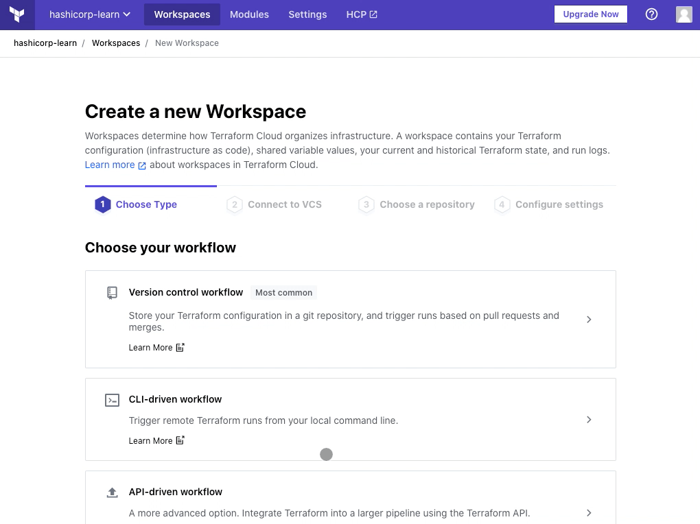
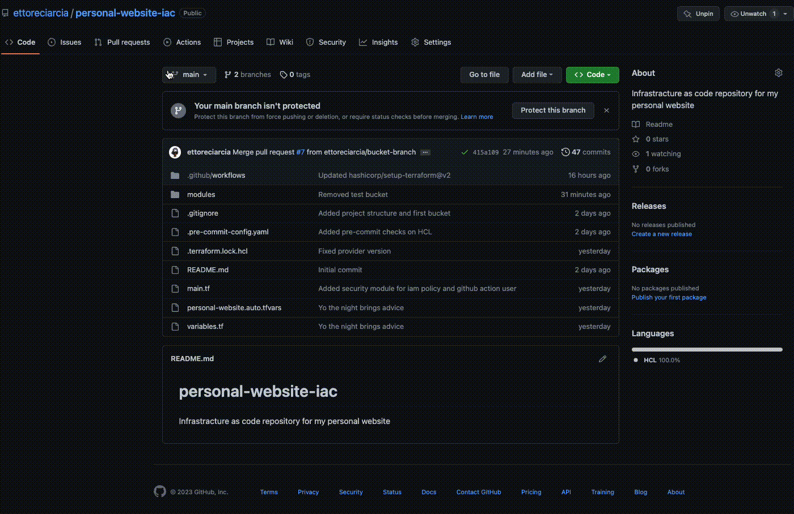

One of my resolutions for 2023 was to write constantly on this blog. I thought a lot about what to bring as my first article.
What better topic than what is behind this site?

In this article we will cover the following topics:

1. Setup the infrastructrue of our website using Terraform, Terraform Cloud and Git Hub Actions 
2. Setup our website using HUGO and configuring GitHub Actions for CI/CD
---
## 1. Prerequisites

- A [Git Hub Account](https://github.com/)
- An [AWS Account](https://aws.amazon.com/it/account/)
- A [Terraform Cloud Account](https://app.terraform.io/session)

Let's begin!

---
## 2. Setup the infrastructrue of our website using Terraform, Terraform Cloud and Git Hub Actions


Why should we use all these tools? Couldn't we just do some *Click Ops* and build what we needed directly from the AWS interface?

The answer is obviously no, although it is a personal project I have tried to immerse myself in a situation as real as possible. So I started imagining what could happen if not just me but a whole team worked on this project and if we needed to handle a bigger workload.

If I wanted to do things wrong I could host my website on a Raspberry Pi.
But we are Cloud Engineers, we like to **scale**. Right?


Let's try to spend a few words to describe the goals I wanted to achieve and the choices I made to achieve them

### 2.1 Infrastructure as Code (IaC) -> Terraform

I needed something that would allow me to describe my infrastructure as code, as I said above I wanted to avoid *Click Ops*. 
Of all the tools available on the market, I chose Terraform to achieve this goal. What the hell is **Terraform** and why should I use it?

Terraform is a tool for building, changing, and versioning infrastructure safely and efficiently. It can manage infrastructure for a variety of cloud providers, including AWS, Azure, Google Cloud, DigitalOcean, and more, as well as on-premises environments.

With Terraform, you can define infrastructure as code (IaC) and use configuration files to create and manage infrastructure resources. This makes it easier to version control your infrastructure and collaborate with others. Terraform also provides a number of helpful features, such as dependency management, resource targeting, and the ability to roll back changes.

Here you will find the repository that contains the Terraform code for this project: [perosonal-website-iac](https://github.com/ettoreciarcia/personal-website-iac.git)

### 2.2 Infrastructure Overview


The repository is public, you can clone it using the command

```shell
git clone https://github.com/ettoreciarcia/personal-website-iac.git
```

The Terraform project has this structure

```shell
.
├── .github/
    ├── workflows/
        ├── terraform.yml <-- For Git Hub Actions 
├── modules/
│   ├── infra/  <--- Create infra resources here
│   └── security/ <-- Create IAM reosurce here
├── main.tf <-- Here we call the infra and security modules for resource creation
├── variables.tf
├── output.tf
├── personal-website.auto.tfvars
├── .pre-commit-config.yaml <-- Pre commit check on HCL (fmt)
├── personal-website.auto.tfvars
├── README.md
├── .gitignore

```

If you want to use this code remember to change the values ​​of the variables inside the file ```personal-website.auto.tfvars```. Specifically, you will need to set the following values

```HCL
region              = "YOUR_REGION"
application_name    = "personal-website"
bucket_suffix       = "<CHANGE WITH A NON COMMON STRING-(YOUR SURNAME SHOULD BE OK)>"
environment         = "prod"
acm_certificate_arn = "<YOUR ACM CERTIFCIATE ARN>"
domain_name         = "YOUR_DOMAIN_NAME"
route53_zone_id     = "YOUR_ROUTE_53_ZONE_ID"
```

This Terraform code does not create the domain name on Route53 and the ACM, I had already created these two resources previously and I limited myself to inserting them into the project as input variables (*route53_zone_id* and *acm_certificate_arn*)

You can make sure the configuration is ok by moving to root path in folder and running 

```terraform init```

```terraform validate```

At this point you might be tempted to set up terraform locally and run a ```terraform apply``` with local state management. 


But why do it? If everyone on a team worked with local state, **chaos would reign**.

### 2.3 Terraform Cloud

In this phase we will go one step further because we will not manage the status of our Terraform project locally, but we will use **Terraform Cloud**, a web-based application that provides collaboration, governance, and automation features for teams using Terraform. It is designed to make it easier to use Terraform in a collaborative environment by providing features such as remote state management, version control, and a private module registry.


If you don't have a Terraform Cloud account yet, you can sign up [here](https://app.terraform.io/session)

Then you can create your first workspace! 



Next, add the following as Environment Variables for your workspace with their respective values from the access credentials file you downloaded from AWS.

1. AWS_ACCESS_KEY_ID
2. AWS_SECRET_ACCESS_KEY

Finally, go to the [Tokens page](https://app.terraform.io/app/settings/tokens?utm_source=learn) in your Terraform Cloud User Settings. Click on "Create an API token" and generate an API token named GitHub Actions.


We're done on Terraform Cloud!

### 2.4 Continuos Integration/Continous Deployment  CI/CD) -> Git Hub Actions

Here the choice was almost forced as my IaC repository is on Git Hub and I have a Premium account which gives me access to free minutes of calculation using GH Actions.
Automating Terraform with CI/CD enforces configuration best practices, promotes collaboration and automates the Terraform workflow.


Maybe the benefits of using Terraform Cloud and Git Hub Actions at the same time aren't apparent in this project because I'm the only one working on it, or if you try to replicate my infrastructure you'll be the only one working on it.

But trust me, in case multiple people from the same team or even different teams are working on the same Terraform project, these additions are almost a must have

At this point you can fork my [repository](https://github.com/ettoreciarcia/personal-website-iac) and import the token created in the previous step


This is what happens when your freshly baked code arrives on this repository


Now you can try working on a new branch and then make a Pull Request and see the flow of Git Hub Actions!

Start by creating a new branch in *personal-website-iac* running

```shell
git checkout -b bucket-branch
```

Assuming you want to create a new bucket, you can add the following code to your repository. in file ```modules/infra/main.tf```

```HCL
resource "aws_s3_bucket" "bucket_gh_actions" {
  bucket = "${local.application_name}-${var.bucket_suffix}-test-gh-actions"
}
```

You can push your code to the newly created branch and open a Pull Request!



As you can see the GitHub Actions were activated when we created the PR and a preliminary check was performed on the code involved in the PR


They performed the following operations

- Code Format and Style
- Run ```Terraform init```
- Run ```Terraform validate```
- Run ```Terraform plan```

At this point we want to check the output of the ```terraform plan``` command, to verify that the test bucket we requested is created as we expect.


These changes will become effective when we merge our PR within the main branch.

The output of the plan is in line with what we expected, so we can proceed with the merge!


Here we are! Our changes have finally arrived on AWS, our bucket has been created!

---
## 3 Setup our website using HUGO and configuring Git Hub Actions for CI/CD

### 3.1 Application Code Repository

Hugo is a fast and modern static site generator written in Go.

You can clone my website code using
```shell
git clone https://github.com/ettoreciarcia/personal-website-hugo.git
```
In this phase we will deploy our website on the infrastructure created in the previous point.
What do we need? The infrastructure is already in place, all that remains is to create the pipeline for automatic deployment.

### 3.2 Authenticate github actions against AWS
The GitHub Actions will make API calls to AWS, in particular on our s3 bucket and on the CDN to invalidate its cache. To carry out this operation they will therefore have to authenticate themselves.

In the previous point, within the security module, we created:
- A user
```HCL
resource "aws_iam_user" "github_actions" {
  name = "github-actions-${local.application_name}-${local.environment}"
}
```
- A policy for this user whuch grants this user all privileges on only the affected bucket and the powers to invalidate the CDN serving this bucket
```HCL
resource "aws_iam_policy" "github_actions_policy" {
  name = "${local.application_name}-${local.environment}-github-actions-policy"

  policy = <<POLICY
{
  "Version": "2012-10-17",
  "Statement": [
    {
      "Effect": "Allow",
      "Resource": [
        "${var.bucket_arn}",
        "${var.bucket_arn}/*"
      ],
      "Action": [
        "s3:*"
      ]
    },
    {
      "Sid": "VisualEditor0",
      "Effect": "Allow",
      "Action": "cloudfront:CreateInvalidation",
      "Resource": "${var.cloudfront_distribution_arn}"
    }
  ]
}
POLICY
}
```

then we attacched this policy to our users
```HCL
resource "aws_iam_user_policy_attachment" "github_actions_policy_attachment" {
  user       = aws_iam_user.github_actions.name
  policy_arn = aws_iam_policy.github_actions_policy.arn
}
```

Now we can generate *AWS_ACCESS_KEY* and *AWS_SECRET_ACCESS_KEY* from AWS console and insert this value in GitHub Action secret in our applicaiton repository.
We also need to configure *BUCKET_NAME* and *DISTRIBUTION*

### 3.3 GitHub Actions Configuration

This is the file that will create our Git Hub Acction:

```yaml
name: GitHub Pages

on:
  push:
    branches:
      - main # Set a branch to deploy
  pull_request:

jobs:
  deploy:
    runs-on: ubuntu-22.04
    concurrency:
      group: ${{ github.workflow }}-${{ github.ref }}
    steps:
      - uses: actions/checkout@v3
        with:
          submodules: true # Fetch Hugo themes (true OR recursive)
          fetch-depth: 0 # Fetch all history for .GitInfo and .Lastmod

      - name: Setup Hugo
        uses: peaceiris/actions-hugo@v2
        with:
          hugo-version: "0.91.2"
          # extended: true

      - name: Build
        run: hugo --minify

      - name: Configure AWS credentials
        uses: aws-actions/configure-aws-credentials@v1-node16
        with:
          aws-access-key-id: ${{ secrets.AWS_ACCESS_KEY_ID }}
          aws-secret-access-key: ${{ secrets.AWS_SECRET_ACCESS_KEY }}
          aws-region: eu-west-1

      - name: Deploy
        run: aws s3 sync ./public s3://${{ secrets.BUCKET_NAME }}

      - name: Invalidate CloudFront
        uses: chetan/invalidate-cloudfront-action@v2
        env:
          DISTRIBUTION: ${{ secrets.DISTRIBUTION }}
          PATHS: "/*"
          AWS_REGION: "us-west-1"
          AWS_ACCESS_KEY_ID: ${{ secrets.AWS_ACCESS_KEY_ID }}
          AWS_SECRET_ACCESS_KEY: ${{ secrets.AWS_SECRET_ACCESS_KEY }}
```


As you can see our pipeline will perform 3 main operations when some code reaches the main branch:

1. Build the code
2. Deploy to S3
3. CDN Invalidation

### 3.4 Let's go for a run

Let's see our pipeline at work, let's push something to the main branch!


Less than 30 seconds after pushing the code our changes are already "in production"!

---
## 4. Costs
The total costs of the infrastructure:
-  $ 0.50 per month 
-  $ 12 per year for the purchase of the *ettoreciarcia.com* domain.

The total annual cost is approximately $18

To these must be added the taxes which bring us to $22.14

I know there are cheaper solutions (Sometimes even free) that allow you to host static websites, but in this case my goal was to have fun with AWS during the Christmas holidays

___
## 5. Conclusion

Today I presented my solution, my Terraform code and some automation.

This is also my first official "technical" article on this blog. I am very excited

If you have followed me here I hope that what you have read has been useful to you!
If you see errors and have more elegant solutions than the one I proposed, don't hesitate to contact me on Linkedin or by mail 

___
## 6. Useful links

[Hosting a static website using Amazon S3](https://docs.aws.amazon.com/AmazonS3/latest/userguide/WebsiteHosting.html)

[Use CloudFront to serve a static website hosted on S3](https://aws.amazon.com/it/premiumsupport/knowledge-center/cloudfront-serve-static-website/)

[Get Started - Terraform Cloud](https://developer.hashicorp.com/terraform/tutorials/cloud-get-started)

[Quickstart for GitHub Actions](https://docs.github.com/en/actions/quickstart)

[Automate Terraform with GitHub Actions](https://developer.hashicorp.com/terraform/tutorials/automation/github-actions)

[Troubleshoot Terraform](https://developer.hashicorp.com/terraform/tutorials/configuration-language/troubleshooting-workflow)

[HUGO](https://gohugo.io/)
[Template of my website](https://github.com/adityatelange/hugo-PaperMod)