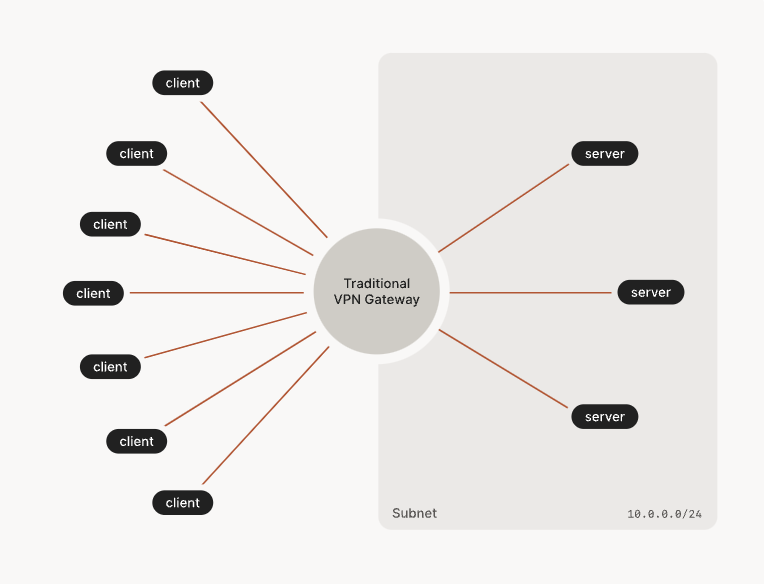
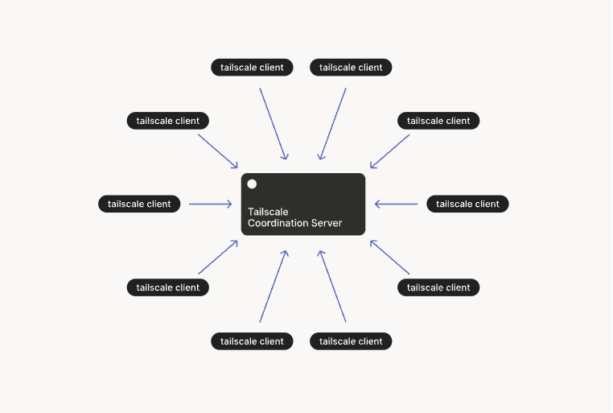

## **0 Updates on homelab journey**


As you may have read in my previous article, I was looking for someone to keep me company on this very long journey.
And guess what? I found someone!
After talking to about twenty people on Reddit and scheduling a few calls, I finally set up the team.

The project officially started on May 9th at 18:10, with this email

>Hello and welcome everyone! Our journey has finally begun.
>You should have access to two Google Docs
>- HERE the guidelines and the code of conduct
>- HERE will put to a vote the messaging platforms that we will use to communicate. Our conversations will continue on the >platform we choose in this document
>You are all editors, you can modify and propose new ideas, I will be happy to discuss them with you.
>This is just a draft, I am not the owner of this project. We would have an equal relationship throughout the duration of >the trip.
>See you on the other side :)


We are spread over 4 different timezones ranging from the east of the USA to Australia, the collaboration mode will therefore be asynchronous.


## **1 Sharing our homelabs: the problem**

As I said, we are in different timezones and the setup of our homelab is not the classic installation of Linux on a couple of VMs at home. 
The initial idea was to share my homelab with others by installing a VPN server in my homelab and giving others access. 
As people joined the project it became apparent that sharing my homelab wasn't going to be enough.
We needed something that would allow us to share all of our homelabs.


Different VPN servers? One in each lab? 
This approach is pure pain. Each of us would have to generate credentials for accessing our VPN for the whole team.


We would get something like this for each of our homelabs using openVPN




Even with Wireguard the complexity was not manageable. this is what we would have achieved with mesh networks


During the PoC with Wireguard we came across [Tailscale](https://tailscale.com/)

What the hell is that?

Tailscale is a virtual private network (VPN) solution designed for secure network connectivity and access. It aims to simplify and improve VPN connectivity for individuals and organizations by providing a secure and easy-to-use networking solution.

Unlike traditional VPNs that often require complex configuration and management of servers, Tailscale operates as a mesh VPN. It leverages existing trusted infrastructure, such as cloud providers and existing networks, to create secure connections between devices and networks. This approach eliminates the need for server infrastructure and allows for simple, scalable, and secure networking.

Tailscale uses WireGuard, a modern and efficient VPN protocol, as its underlying technology. WireGuard is known for its simplicity, performance, and strong security features. Tailscale takes advantage of WireGuard's capabilities to establish encrypted connections between devices and networks.

With Tailscale, users can securely access resources and services across networks, even when they are geographically distributed. It enables remote access to on-premises infrastructure, cloud resources, or even devices within the same network.

Tailscale also provides features like centralized administration, access controls, and identity-based security policies. It offers a user-friendly interface and integrates well with various operating systems and devices, making it easy to deploy and manage.

Overall, Tailscale aims to provide a user-friendly and secure VPN solution that simplifies network connectivity, enhances productivity, and improves the overall network security posture for individuals and organizations.


### **So what the heck is Tailscale in short?**

Tailscale is different from a traditional VPN as it operates on a mesh network approach. It uses the WireGuard protocol to establish encrypted connections between devices, without the need for centralized VPN servers. This simplifies setup and administration, removing reliance on traditional server-based VPNs. Tailscale leverages existing trusted infrastructure, like cloud providers, for secure connectivity between geographically distributed networks. It offers an intuitive interface, easy implementation, and centralized control for secure remote access to network resources.




At this point we felt like we were done. Tailscale gave us everything we needed. We could have considered the case closed. But then...

[TO DO] ADD ZOOM EFFECT ON TAILSCALE'S PRICING

[TO DO] GIF BARBERO SPUTI SULLA CROCE https://www.youtube.com/watch?v=39yk28RlXfw

## 2 The revelation: Headscale


Tailscale has an open source version called [Headscale](https://github.com/juanfont/headscale). Of course, this open-source version requires some elbow grease for self-hosting.

And we are DevOps. Let's dive in

## 3 Setup Headscale on Ec2 instance via Terraform

This part is perhaps the most inflated.
We need a server to run our headscale on.

This server must be publicly accessible.

We could have achieved the goal with any cloud provider. We chose Amazon because of the free tier: for a year we won't have spent, when the term of the year expires we will register a new account and through this terraform code we will have all the infrastructure back up in seconds.


```git clone https://github.com/JustYAMLGuys/infra```

Move into ```/cloud``` and you will find this structure

```
.
├── .pre-commit-config.yaml
├── .terraform.lock.hcl
├── .tool-versions
├── aws
│   ├── headscale-server
│   │   ├── .terraform.lock.hcl
│   │   ├── go-import-ssh-gh.sh
│   │   ├── import-ssh-key-gh.sh
│   │   ├── main.tf
│   │   ├── output.tf
│   │   ├── provider.tf
│   │   ├── security_group.tf
│   │   └── variables.tf
│   └── middleware
│       ├── .terraform.lock.hcl
│       ├── main.tf
│       ├── output.tf
│       ├── provider.tf
│       └── variables.tf
├── main.tf
├── output.tf
├── provider.tf
└── variables.tf
```


We have foreseen that the middleware part will grow in the future, for this we have created a special module. This module will take care of the provisioning of the whole networking stack (VPC, subnet, Internet Gateway etc


We then have the module that creates the ec2 instance on which we will install headscale, the security groups and the elastic ip address associated with the ec2 instance.


This is what you're going to create using this form


### 3.1 A few tools to make our life easier

As you can see from the tree of the previous chapter this project contains some dotfiles

**.tool-versions** : is typically used to specify the versions of different tools or dependencies required for that specific project or environment. It is commonly used in development setups, especially with tools that support version managers. We are using it in combination with [**asdf**](https://asdf-vm.com/)

**.envrc** : we are using it in combination with asdf to create a local environment for this project. 

Follow this article to install asdf and envrc on your client -> [How to manage multiple CLI tool versions with ease: direnv + asdf on macOS (SIGHUP)](https://blog.sighup.io/manage-tools-with-ease-direnv-asdf/)

### 3.2 Setup your Terraform's backend


This time we can't use Terraform Cloud for several reasons:

1. Terraform Cloud in the free version has a limit of users per organization

2. Our workers for the project will need to be local as most of our infrastructure will only be accessible behind VPN

Remember to change these values ​​according to the name of the bucket where you will save the state of the Dynamo table where you will save the state lock

```
terraform {

  backend "s3" {
    bucket         = "terraform-state-jyg"
    key            = "aws/terraform.tfstate"
    region         = "eu-central-1"
    dynamodb_table = "terraform-state-lock-jyg"
  }

  required_providers {
    aws = {
      source  = "hashicorp/aws"
      version = "~> 4.0"
    }
  }

  required_version = ">= 1.0"
}

provider "aws" {
  region = var.region
}
```

### 3.3 Setup your AWS profile

This time we will use a ```.envrc``` file to store our credentials. You can find an example file called envrc-example, 
Change the values ​​it contains according to your aws account credentials and rename the file ```.envrc```

```
export AWS_SECRET_ACCESS_KEY=<YOUR_SECRET_ACCESS_KEY>
export AWS_ACCESS_KEY_ID=<YOUR_ACCESS_KEY_ID>
export region=<YOUR_REGION>
```


### 3.4 Everything is ready, let's provision our infrastructure

Move into ```infra/cloud``` and run 

```
terraform init
```

```
terraform plan
```

```
terraform apply
```

### 3.5 Bonus point: script to copy ssh key of my teammates directly in ec2 during instance's boostrap