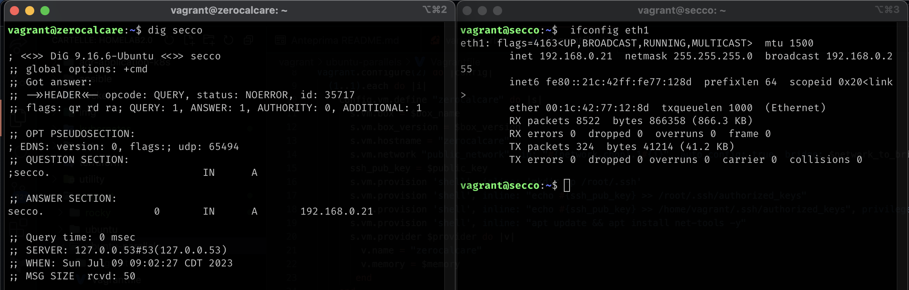
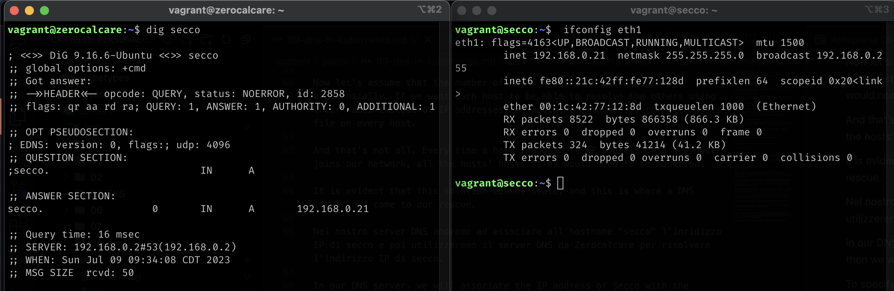

Before diving into how DNS works in Kubernetes, let's try to clarify how DNS works outside of Kubernetes.

## 1. **What is a DNS server?**

`DNS (Domain Name System) is a system that translates human-readable domain names into numerical IP addresses, enabling communication between devices on the internet.`

And what does this mean? Suppose we have two servers:


How can we make Zerocalcare contact Secco?

The most immediate way is to use Secco's IP address.

By pinging Secco's IP address, we can see that we receive a PONG in response.


But do we really want to remember Secco's IP address? IP addresses are difficult for humans to remember. Wouldn't it be easier to use Secco's name to reach him?

To contact Secco using his name instead of his IP address, we need a mechanism that associates Secco's name with his IP address (computers reason only with IP addresses, not hostnames).

How can we achieve this goal?

The answer is the hosts file located in **/etc/hosts**.

### 1.1 hosts file

We can modify this file and insert the following line:

``` 
192.168.0.21 secco
``` 

in Zerocalcare's hosts file.

From now on, Zerocalcare will be able to resolve Secco's hostname with the correct IP address.

Let's verify that name resolution is working with the command

``` dig secco``` 



### 1.2 Nameserver

Now let's assume that the number of hosts within the network grows exponentially. If we want each host to be able to resolve the others using their names instead of IP addresses, we would need to modify the /etc/hosts file on every host.

And that's not all. Every time a host changes its IP address or a new host joins our network, all the hosts' hosts files would need to be modified.

It is evident that this solution cannot scale, and this is where a DNS server can come to our rescue.

Nel nostro server DNS andremo ad associare all'hostname "secco" l'inridizzo IP di secco e poi utilizzeremo il server DNS da Zerocalcare per risolvere l'indirizzo IP di secco.

In our DNS server, we will associate the IP address of Secco with the hostname "secco," and then we will use the DNS server from Zerocalcare to resolve the IP address of Secco.
To specify which DNS server to use for name resolution within a Linux system, you need to refer to the ```/etc/resolv.conf```  file.

Assuming that the IP address of the DNS server is 192.168.0.2, add the following entry to the ```/etc/resolv.conf``` file:

```nameserver 192.168.0.2``` 

NOTE: If you want to ensure that it works, remember to remove the entry added to the ```/etc/hosts```  file. If that entry is present in the hosts file, your Linux system will not attempt to resolve it using the DNS server since the /etc/hosts file takes precedence. To change the order of DNS resolution, we need to do changes into the ``` /etc/nsswitch.conf```  file.

So let's try running the same command as before and see what happened



As you can see in this case the hostname was resolved by the DNS server we set up earlier.

### 1.3 Search domains

The "search domains" entry in the /etc/resolv.conf file is used to specify a list of domain names that the system should automatically append to any unqualified hostname when attempting to resolve it.

When you try to resolve a hostname without a domain suffix, the system will try to resolve it using the configured search domains. This can be helpful in situations where you frequently access hosts within a specific domain without explicitly specifying the domain name each time.

Here's an example to illustrate how the search domains work:

Let's say your /etc/resolv.conf file contains the following entry:

``` search ice-cream.com annamoapijaergelato.com``` 

Now, if you try to resolve the hostname "secco", the system will automatically append the search domains to it, making the resolved names it tries in order:

1. ice-cream.com
2. annamoapijaergelato.com

This allows you to access hosts within the "example.com" and "office.example.com" domains simply by specifying their short hostnames.

NOTE: the order of the search domains is significant, as the system will try to resolve the hostname using each domain in the specified order.

We now know enough to dive into how DNS works in Kubernetes!

## 2. DNS in Kubernetes

