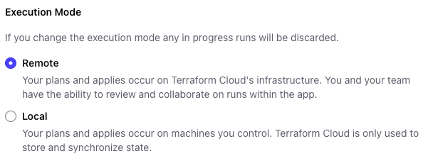
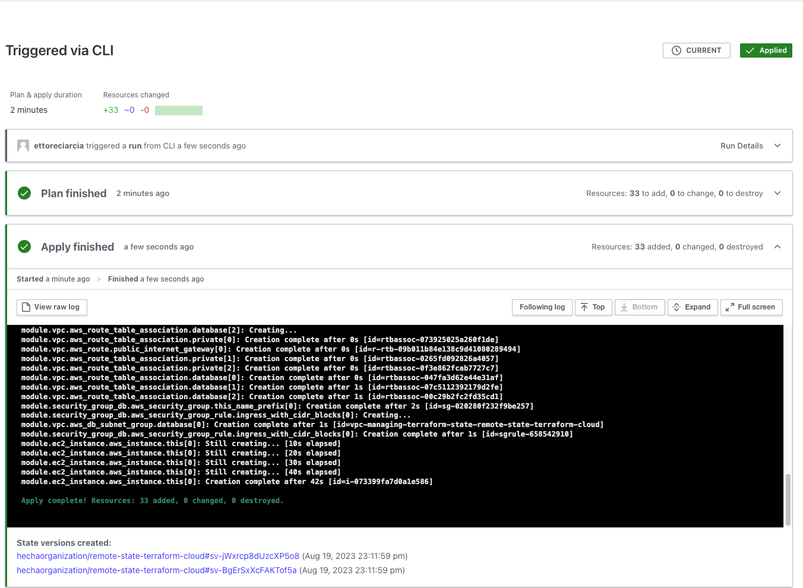

## 0 Introduction

If you've been working with Terraform recently, you know how delicate the file where the state is stored can be. In this tutorial, we will explore three different ways to manage Terraform state, discussing their respective advantages and disadvantages for each.

We will also introduce useful tools for managing a Terraform project! Let's get started! 

### Prerequisites

We will use the following tools:

- [asdf](https://asdf-vm.com/guide/getting-started.html) for version management
- [direnv](https://direnv.net/docs/installation.html) for managing environment variables within our repository
- [terraform cli](https://developer.hashicorp.com/terraform/tutorials/aws-get-started/install-cli) in order to interact with Terraform
- An AWS account where we will create our test resources and the bucket for our remote state
- [Terraform Cloud Account](https://app.terraform.io/) where we will create an organization and a workspace to contain our Terraform project.

### Why is Terraform state so important?

The Terraform state file is an essential aspect of Terraform’s functionality. It is a JSON file that stores information about the resources that Terraform manages, as well as their current state and dependencies.

Terraform utilizes the state file to determine the changes that need to be made to the infrastructure when a new configuration is applied. It also ensures that resources are not unnecessarily recreated across multiple runs of Terraform. 

Terraform logs information about the resources it has created in a state file. This enables Terraform to know which resources are under its control and when to update and destroy them. The terraform state file, by default, is named terraform.tfstate and is held in the same directory where Terraform is run. It is created after running terraform apply.

[Useful links](https://spacelift.io/blog/terraform-architecture)

### A few words about the Terraform modules we will using

We will create the same infrastructure three times, using four different strategies for managing the state. You will find the code examples inside these folders.

```
.
├── local-state
├── remote-state-s3
└── remote-state-terraform-cloud

```

You can find the repository [HERE](https://github.com/ettoreciarcia/blog-example/tree/main/managing-terraform-state)


### Environment Configuration

Let's install the Terraform version with asdf:

```asdf install terraform 1.5.5``` 

As of the time of writing this article, version 1.5.5 is the latest stable version

### Creating the Infrastructure

Our goal is to create a three-tier network where we will place an EC2 instance and a PostgreSQL database to see how our secrets are stored.

Each module will contain the following files:

```bash
.
├── README.md
├── main.tf
├── Makefile
├── outputs.tf
├── provider.tf
├── variables.tf
```

## 1. Local state

Let's move to the ```local-state``` folder.

In this example, we are not using any techniques to manage secrets within Git. This repository is public. To avoid committing AWS credentials, I have previously created a user via AWS Identity and Access Management (IAM) and configured a local profile.

If you want to learn more about configuring AWS credentials locally, follow the [official AWS guide](https://docs.aws.amazon.com/cli/latest/userguide/cli-configure-files.html)

What we are doing now is using ```direnv```, which we installed earlier, to load the necessary environment variables to interact with our AWS account. We will have a ```.envrc``` file like this:

```bash
export AWS_PROFILE=article-terraform
export AWS_DEFAULT_REGION=eu-west-1
```

You can verify that everything is configured correctly by moving to the folder of our project and running the command:

```bash
aws sts get-caller-identity
```

You will receive a response with information about the credential you are using

```json
{
    "UserId": "AIDA4QVTQRAGBWQ75JAWR",
    "Account": "860443674636",
    "Arn": "arn:aws:iam::860443674636:user/ettore-terraform"
}
```

Now we can run the command:

```terraform init```

and check which files Terraform creates.

We have the ```.terraform.lock.hcl``` file and the ```.terraform``` folder where the modules we are using (in this case, VPC, Instance and DB module) and the providers defined in our configuration file (in this case, only the AWS provider) will be downloaded.

Now is the time to get an overview of the resources we will create

```terraform fmt && terraform validate && terraform plan -out=terraform.plan```

Some explanations about this command:
- ```fmt``` Formats our Terraform code for readability.
- ```validate``` ensures that what we've written is syntactically correct
- ```-out=terraforn.plan``` ensures that what we are going to apply is exactly what we saw during the plan.

During the plan and apply operations, you will see a file called  ```.terraform.tfstate.lock.info```

```json
{"ID":"11e34ba5-91a8-fe56-0c0d-1f7fc212d1b2","Operation":"OperationTypeApply","Info":"","Who":"vagrant@terraform-article","Version":"1.5.5","Created":"2023-08-19T10:33:49.743801Z","Path":"terraform.tfstate"}
```

The Terraform lock file, is used to manage concurrent access and prevent conflicts when multiple users or processes attempt to modify the Terraform state simultaneously. This file contains information about the state lock and helps ensure that state operations (like terraform apply, terraform destroy, etc.) can be safely executed without conflicts.

It's important to note that while Terraform manages state locking, it does not provide distributed locking across multiple machines or environments.

It's all set up, and our infrastructure is up and running.

But we have some security issues:

1. **Secrets are stored in plain text in the Terraform state**. This means that if you create a password for an Amazon database using Terraform, it will save that database's password in plain text within the state.
2. **A local Terraform state is impossible to share**, exposing your infrastructure to the risks of unintentional overwriting and deletion (you cannot lock the state with this bad practice).
3. **No versioning**: ff the state is not in a repository, it will be overwritten after each apply, and you have no way to recover previous versions. If you push it to Git, you expose yourself to the risk of plain text secrets in the repository.

## 2 Remote state using S3 bucket

In this case, we are going to create the infrastructure we've seen previously, but we will change how we manage its state.

We will use an S3 bucket to manage the state and a DynamoDB table to handle the lock.

Amazon DynamoDB, a NoSQL database service, is an excellent choice for state locking due to its high availability and scalability. It provides a locking mechanism that ensures only one Terraform operation can modify the state at a time.

```bash
aws dynamodb create-table \
    --table-name terraform_locks \
    --attribute-definitions AttributeName=LockID,AttributeType=S \
    --key-schema AttributeName=LockID,KeyType=HASH \
    --provisioned-throughput ReadCapacityUnits=5,WriteCapacityUnits=5
```

To the code we've seen before, we need to add:

```
terraform {
  backend "s3" {
    bucket         = "terraform-state-remote-s3-sdf2"
    key            = "terraform.tfstate"
    region         = "eu-west-1"
    dynamodb_table = "terraform_locks"
    encrypt        = true
  }
  required_providers {
    aws = {
      source  = "hashicorp/aws"
      version = "~> 5.0"
    }
  }

  required_version = "~> 1.5.5"
}
```

In this code, the ```bucket``` attribute refers to the S3 bucket where we will store the state, and ```resources``` is the name of the object.

Let's initialize our project as usual:

```terraform init```

and proceed with the plan

```terraform fmt && terraform validate && terraform plan -out=terraform.plan```

Then apply our changes

```terraform apply terraform.plan```

You'll notice that our ```terraform.tfstate``` file is no longer located locally.

You can find it in our S3 bucket using the command

```aws s3 ls [BUCKET_NAME]```

Alternatively, by navigating the AWS interface:


What has changed compared to the previous configuration?

1. In this case, the state is no longer local, so secrets are stored in a remote backend.
2. It allows the state to be shared as it is no longer tied to the repository where it resides (conflicts could arise if two engineers work on the same project).
3. State locking is now handled through DynamoDB, resolving the concurrency issue that existed with local locking.
4. The bucket where the state is saved is versioned, so we could recover the state for a specific change if something were to go wrong.

## 3 Remote state using Terraform Cloud

Terraform Cloud is a managed service offered by HashiCorp that provides a cloud-based environment for collaborating on and managing infrastructure as code (IAC) with Terraform. It serves as a centralized platform for teams to plan, provision, and maintain infrastructure using Terraform. 


To use Terraform Cloud as the backend for your infrastructure, you need to update the backend configuration as follows:

```
terraform {
  backend "remote" {
    hostname     = "app.terraform.io"
    organization = "hechaorganization"
    workspaces {
      name = "remote-state-terraform-cloud"
    }
  }
  required_providers {
    aws = {
      source  = "hashicorp/aws"
      version = "~> 5.0"
    }
  }

  required_version = "~> 1.5.5"
}
```

To interact with Terraform Cloud, you need to perform a login:

```terraform login```

This command will provide you a token required for authentication.

Let's analyze our new backend configuration:
- **hostname**: specifies the host to connect to for the remote backend. In this case, we are targeting Terraform Cloud.
- **organization**: specifies the name of the organization on Terraform Cloud. This is the organization to which your project belongs
- **workspace**: this section defines the Terraform Cloud workspace where the remote state will be managed

For more information on configuring Terraform Cloud, you can refer to my previous article: https://[How to deploy your own website on AWS with Terraform and Git Hub Actions!](ettoreciarcia.com/posts/01-iac-and-pipeline-my-personal-website/#23-terraform-cloud)


Now, you can proceed as before to initialize your Terraform project

```terraform init```

This time, during the initialization, not only will the required modules be downloaded locally, but your project will also be initialized on Terraform Cloud.


Proceed to verify the resources that will be created

```terraform plan```

In this case, there is a subtle difference compared to previous configurations:

```
Running plan in the remote backend. Output will stream here. Pressing Ctrl-C
will stop streaming the logs, but will not stop the plan running remotely.

Preparing the remote plan...

To view this run in a browser, visit:
https://app.terraform.io/app/hechaorganization/remote-state-terraform-cloud/runs/run-s2Vvcry5yUfccTKV
```

When using Terraform Cloud, your worker (the one executing the plan) is no longer local but remote. You can change this configuration by modifying the execution mode from "Remote" to "Local" directly from the Terraform Cloud GUI.



Proceed with applying your changes:

```terraform apply```

And take a look at the Terraform Cloud GUI to see what's happening:



What happened to our Terraform state?

Now it's on Terraform Cloud!


Terraform Cloud Free Tier can be used with some limitations compared to its Enterprise version:

1. Limited computing power: If, until yesterday, you were using local workers to interact with your infrastructure, you might notice a slower performance when using Terraform Cloud's remote workers. In the Free version of Terraform Cloud, we have only one worker.
2. The number of users you can create within an organization is limited.
3. t does not allow the creation of teams.
4. Since it doesn't support multiple organizations, it lacks features for cross-organization registry sharing.
5. In terms of logging, the Free version has significantly fewer features compared to the Enterprise version.

## 4 Conclusions

When we use tools like Terraform for "home" purposes, the main strength of Terraform Cloud's free tier compared to an S3 bucket lies in the user interface. The output in Terraform Cloud is much more visually appealing and perhaps more user-friendly for those who are new to Infrastructure as Code (IaC).

Even if we are a company with a few moderately sized projects, and we don't use other tools from HashiCorp's ecosystem (such as Sentinel, for example), we can consider using both an S3 bucket and Terraform Cloud Free Tier.

On the contrary, if we have many projects to manage collaboratively (involving more than one team and more than one organization), a tool like Terraform Cloud Enterprise can assist us in the creation and management of our infrastructure.

## 5 Useful links

- [Backend Configuration](https://developer.hashicorp.com/terraform/language/settings/backends/configuration)

- [Terraform Pricing](https://www.hashicorp.com/products/terraform/pricing)

- [Managing Terraform State - Spacelift](https://spacelift.io/blog/terraform-state)

- [What is Terraform Cloud](https://www.hashicorp.com/products/terraform)