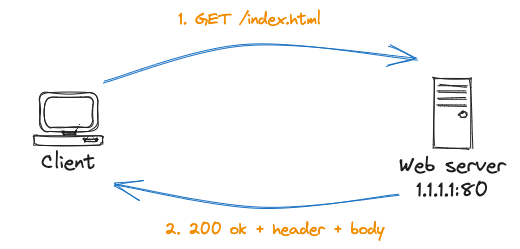

## Day 1: basi di HTML

Ci siamo.

Sono i primi anni 2000s. Stai ascoltando [Super Bon Bon](https://www.youtube.com/watch?v=TRqP52c0OLU) sparata al massimo volume dai tuoi altoparlanti.

I social non esistono, nessun reel, shorts o stronzate simili. Ti stai annoiando.

Accendi il tuo client con Debian 2.2, versione Potato. Quel client fa un rumore assordante, decidi quindi di alzare la musica.

Ma gli altoparlanti sono già al massimo. Lo shopping compulsivo da Amazon ancora non esiste, non puoi andare su quel sito e comprare degli altoparlanti più potenti.

Dopo 5 minuti il bootstrap del tuo sistema Debian è finito, puoi cominciare.

Cominciare a fare cosa? Non hai un'obiettivo.

Digiti semplicementi nel terminale 

``` vi index.html ```

e cominci a scrivere qualcosa di te all'interno di quella pagina.

YouTube non esiste, il web non è pieno di documentazione. Cercare informazioni è una sofferenza.
Dopo ore passate ad editare quel file, ottieni finalmente la home del tuo sito web.

Un semplice file HTML, qualcosa del genere:

```
<!DOCTYPE html>
<html lang="en">
<head>
    <meta charset="UTF-8">
    <meta name="viewport" content="width=device-width, initial-scale=1.0">
    <title>My Awesome 2000s Webpage</title>
    <style>
        body {
            background-color: #000;
            color: #00FF00;
            font-family: 'Comic Sans MS', cursive, sans-serif;
            text-align: center;
            margin: 0;
            padding: 0;
        }

        #header {
            background-color: #000;
            color: #00FF00;
            padding: 20px;
        }

        .container {
            background-color: #000;
            color: #00FF00;
            text-align: left;
            padding: 20px;
            border: 2px solid #00FF00;
            border-radius: 10px;
            margin: 10px;
        }

        h1 {
            color: #FF6600;
            font-size: 24px;
        }

        p {
            font-size: 18px;
        }

        .button {
            background-color: #FF6600;
            color: #FFF;
            padding: 10px 20px;
            text-decoration: none;
            border-radius: 5px;
            font-weight: bold;
        }

        .button:hover {
            background-color: #FF3300;
        }

        .footer {
            background-color: #000;
            color: #00FF00;
            padding: 10px;
            text-align: center;
        }
    </style>
</head>
<body>
    <div id="header">
        <h1>Welcome to My Awesome Webpage!</h1>
    </div>
    <div class="container">
        <h1>About Me</h1>
        <p>Hey there! I'm a total nerd who loves everything tech and sci-fi. This is my corner of the internet where I share my nerdy adventures.</p>
        <p>Check out my cool stuff:</p>
        <ul>
            <li><a href="#">My PC Build</a></li>
            <li><a href="#">About me</a></li>
            <li><a href="#">Programming Projects</a></li>
        </ul>
        <a href="#" class="button">Explore More</a>
    </div>
    <div class="container">
        <h1>Contact Me</h1>
        <p>Want to chat about the latest Star Trek episode or discuss coding? Feel free to reach out!</p>
        <p>Email: nerdy@example.com</p>
    </div>
    <div class="footer">
        <p>&copy; 2000-2023 My Awesome Webpage</p>
    </div>
</body>
</html>
```

riesci a visualizzarla dal tuo computer, ti è costata quasi tutto il pomeriggio.

Questo è semplicemente un file sul tuo hard disk, non esistono VCS su cui pusharlo. Vive lì, in locale. 

Sei felicissimo e la FOMO non ti sta divorando. La FOMO neanche esiste. Chiudi tutto.

___

## Day 2: Cercando di capire cos'è un webserver

È pasata una settimana da quando hai editato quel file con estensione .html. In un negozio acconto casa tua hai comprato una rivista in cui viene spiegato come far vedere il proprio sito web ai propri amici, da qualsiasi parte del mondo.

Quella guida dice che hai bisogno di un webserver, ne esiste uno chiamato Apache. Hai le idee confuse e non sai che pesci prendere. Continui a leggere ma non capisci a cosa serva tutta quella roba. Giornata improduttiva, lasci stare.

___

## Day 3: Webserver I got you!

Mentre parli con un tuo amico della pagina html che hai scritto scopri che anche lui ne ha scritta una. Chiacchierando viene fuori che lui ha capito meglio di te cosa sia un webserver e quel pomeriggio viene a spiegartelo a casa tua.

He said:

" Un web server è un software che gestisce le richieste e le risposte tra client e server su Internet. La sua funzione principale è quella di distribuire pagine web e altri contenuti web agli utenti che ne fanno richiesta attraverso i loro browser web. Ecco come funziona un web server:

1. Ricezione delle richieste: Quando un utente digita un URL (Uniform Resource Locator) nel suo browser web e preme Invio, il browser invia una richiesta HTTP (Hypertext Transfer Protocol) al web server corrispondente per ottenere la pagina web associata all'URL. La richiesta HTTP contiene informazioni su cosa l'utente sta cercando e come il server dovrebbe rispondere.

2. Elaborazione della richiesta: Il web server riceve la richiesta HTTP e inizia a elaborarla. Questo può includere il controllo dell'URL richiesto, la verifica dei permessi di accesso, la gestione delle sessioni degli utenti e altre operazioni necessarie per soddisfare la richiesta.

3. Recupero dei dati: Se la richiesta richiede l'accesso a file, come pagine HTML, immagini, fogli di stile o altri contenuti multimediali, il web server recupera questi dati dai suoi archivi o dai file system del server.

4. Generazione di risposta: Una volta ottenuti i dati richiesti, il web server genera una risposta HTTP che include i dati e le informazioni di intestazione. Le informazioni di intestazione contengono metadati sulla risposta, come il tipo di contenuto, la data di creazione, la lunghezza del contenuto e altro ancora.

5. Invio della risposta: Il web server invia la risposta HTTP al browser dell'utente attraverso Internet. Il browser riceve la risposta e la interpreta per visualizzare la pagina web o il contenuto richiesto."


Ora le cose ti sembrano molto più chiare. Il tuo amico butta già anche un disegno:



Le idee cominciano a riordinarsi, stai capendo come mettere in piedi il tuo primo sito web. 

Sia tu che il tuo amico volete approfondire come un webserver funziona e cominciate a leggere insieme quella rivista

Cosa succede esattamente quando fate una richiesta ad un webserver?

Scoprite che quando effettuate una richiesta di tipo GET al server state utilizzando il protocollo HTTP e che oltre alla GET esistono altre chiamate dette metodi: DELETE, POST, PUT, HEAD, CONNECT, PATCH, TRACE, OPTIONS. Avete le idee un po' confuse al riguardo ma vi p chiaro che i metodo di cui farete uso voi saranno GET E POST.

Scoprite che il protocollo HTTP funziona "on top" ad un altro protocollo chiamato TCP (Transmission Control Protocol). 
A quanto pare il TCP permette a client e server di stabilire una connessione bidirezionale.

Quindi la prima cosa che succede quando effettuamo la chiamata GET per avere la nostra index non è la risposta immediata del server, viene prima stabilita una connessione TCP tra client e server. E quando questa connessione TCP viene stabilita il server riserva un piccolissima parte della sua memoria per creare una socket TCP per il client che ha effettuato la richiesta.

Una volta ottenuta una socket sul server abbiamo un thread e sarà questo thread ad evadere la nostra richiesta. E le richieste possono essere evase una alla volta.

Se entrambi gli amici si collegassero allo stesso server facendo la stessa richiesta, il webserver riserverebbe loro due socket TCP che evaderebbero le richieste una alla volta ma non contemporanemante.

Ok, per far vedere il tuo sito al mondo hai bisogno di un webserver e hai capito a grandi linee come funziona. È il momento di installarlo!

Trovi una guida su come installare Apache, sembra una buona soluzione al tuo problema.

Finalmente hai il tuo web server up & running.

Non ti resta che configurarlo.

Questo è il file di configurazione

```
DefaultRuntimeDir ${APACHE_RUN_DIR}
PidFile ${APACHE_PID_FILE}
Timeout 300
KeepAlive On
MaxKeepAliveRequests 100
KeepAliveTimeout 5
User ${APACHE_RUN_USER}
Group ${APACHE_RUN_GROUP}
HostnameLookups Off
ErrorLog ${APACHE_LOG_DIR}/error.log
LogLevel warn
IncludeOptional mods-enabled/*.load
IncludeOptional mods-enabled/*.conf
Include ports.conf
<Directory />
        Options FollowSymLinks
        AllowOverride None
        Require all denied
</Directory>

<Directory /usr/share>
        AllowOverride None
        Require all granted
</Directory>

<Directory /var/www/>
        Options Indexes FollowSymLinks
        AllowOverride None
        Require all granted
</Directory>
AccessFileName .htaccess
<FilesMatch "^\.ht">
        Require all denied
</FilesMatch>

LogFormat "%v:%p %h %l %u %t "%r" %>s %O "%{Referer}i" "%{User-Agent}i"" vhost_combined
LogFormat "%h %l %u %t "%r" %>s %O "%{Referer}i" "%{User-Agent}i"" combined
LogFormat "%h %l %u %t "%r" %>s %O" common
LogFormat "%{Referer}i -> %U" referer
LogFormat "%{User-agent}i" agent

IncludeOptional conf-enabled/*.conf
IncludeOptional sites-enabled/*.conf
```

Ora non ti resta che effettuare la prima chiamata GET sul tuo sito web. Ma a chi dovresti farla? Non hai ancora una DNS.

Scopri dell'esistenza di **localhost** .The loopback interface is associated with the IP address 127.0.0.1. This IP address is reserved for loopback testing and is commonly used to access services running on the local machine.

Ci siamo, digiti nella barra di ricerca del tuo browser

http://localhost:80

sì, ci aggiungi anche la porta perché non sai che di default la chiamata sarebbe stata fatta alla porta 80 in HTPP.

Lo vedi.

[TO DO, INSERIRE FOTO SITO]


A questo punto il sito potete vederlo solo voi e il vostro amico, ma volete conndividere il lavoro fatto con altri.

___

## Day 4 Primo incontro con FTP

Parli di quanto fatto con un amico più grande che frequenta l'università. Lui ha accesso ad hardware più performante e conosce le reti di calcolatori meglio di te

Ti spiega che per rendere accessibile quel sito all'esterno hai bisogno di esporlo su Internet e per essere visto su Internet hai bisogno di un indirizzo IP pubblico.

Nella sua facoltà lui ha qualcosa che può fare al caso tuo. Un server FTP che fa anche da webserver.

Ti spiega che puoi caricare la index.html sul server dell'università tramite FTP e poi penserà lui ad esporla su Internt con il Webserver e uno degli indirizzi IP pubblici appartenenti all'università.

FTP? Indirizzi IP pubblici? Di cosa sta parlando?

Ti dice di non preuccuparti e che l'unica cosa di cui ha bisogno è il tuo file index all'interno del server dell'università.

Ti fornisce delle credenziali pr accedere in FTP al server e ti spiega come caricare quel file tramite FTP.

Sembra semplice, hai solo bisogno di un client FTP sul tuo client e di digitare

```ftp 1.1.1.1``` 

all'interno del tuo terminale e

```put index.html``` 

per caricare il tuo file all'interno del server.

In un paio di giorni puoi visitare l'indirizzo IP pubblico che ti ha fornito per visualizzare la tua pagina web da casa tua

## DAY 6: scopri il TCP/IP

Carico di speranza effettui una chiamata GET all'indirizzo IP pubblico del server FTP che ti ha fornito. Non ricevi nesssuna risposta, pensi di aver sbagliato qualcosa.
Effettuoi novamente il login in FTP e vedi che il tuo file index.html è ancora dove lo hai lasciato.

Nel frattempo hai comprato un'altra rivista in  cui si toccano argomenti di reti di calcolaori e trovi delle note che subito catturano la tua attenzione: "FTP e HTTP sono protocolli di livello applicativo".
FTP e HTTP sono i protocolli che hai incontrato anche tu durante l'avventuroso viaggio per esporre il tuo webserver! Decidi di andare più a fondo e continui con la lettura

Scopri che esitono due modelli di riferimento per le reti di calcolatori:

- ISO/OSI composto da 7 livelli, più teorico

- TCP/IP composto da 4 livelli, più pratico

Decidi di approfondire la lettura del modello TCP/IP

I livelli coinvolti sono (dal basso verso l'alto):

- L1 Fisico: gestisce l'infrastruttura fisica che consente ai computer di comunicare tra loro in Internet. Si applica a cavi Ethernet, reti wireless, schede di interfaccia di rete, driver nel computer e così via. Il livello di accesso alla rete include anche l'infrastruttura tecnica, come il codice che converte i dati digitali in segnali trasmissibili, che rende possibile la connessione di rete. Pensi a qualcosa riconducibile a questo livello, il cavo Ethernet per esempio

- L2 Rete: controlla il flusso e l'instradamento del traffico per garantire che i dati vengano inviati in modo rapido e accurato. Questo livello è anche responsabile del riassemblaggio dei pacchetti di dati a destinazione. In caso di traffico intenso, il livello Internet potrebbe impiegare più tempo per inviare un file, ma con minori possibilità che un errore lo danneggi.

- L3 Trasporto: Il livello di trasporto consente una connessione dati affidabile tra due dispositivi comunicanti. È come spedire un pacco assicurato: il livello di trasporto suddivide i dati in pacchetti, riconosce i pacchetti ricevuti dal mittente e garantisce che il destinatario riconosca i pacchetti ricevuti.

- L4 Applicazione:  consiste nel gruppo di applicazioni che consentono all'utente di accedere alla rete. Per la maggior parte questo si traduce in email, app di messaggistica e programmi di archiviazione cloud. Si tratta sostanzialmente di quel che l'utente finale vede e con cui interagisce durante l'invio e la ricezione dei dati.

C'è anche un bel disegno che rende più semplice capire quali sono gli attori coinvolti nel modello TCP/IP:


## DAY 7: your website is online!

Effettui di nuovo una chiamata GET all'indirizzo IP pubblico che ti ha fornito il tuo amico. Questa richiesta rimbalza da router a router finchè non ti arriva una risposta.

Eccolo. È il tuo sito web. 


Ci è voluta una settimana. Sono state coinvolte 3 persone, 2 riviste e un po' di hardware dell'università ma ne è assolutamente valsa la pena. Non hai ancora un dominio tutto tuo, ma su questo ci lavorerai. Per ora va bene così

Riordini le idee su tutte le nozioni che hai acquisito con un semplice progetto che ti ha visto selfhostare il tuo sito web. Hai imparato molto e pensi che sarebbe proprio figo fare questo per lavoro quando sarai grande.


