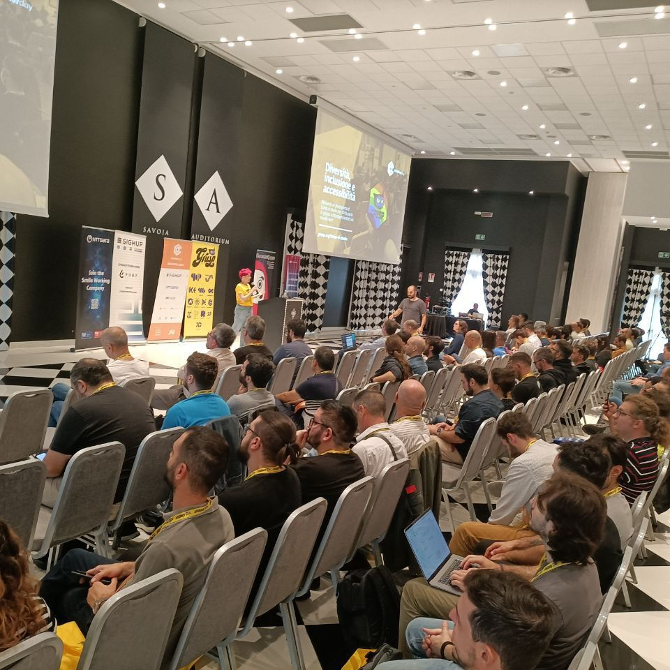

## Intro

Thanks to SIGHUP, this year I had the opportunity to participate in Container Day and DevSecOps Day in Bologna on October 12th and 13th, respectively. Both events were organized by Grusp.
Working fully remote, this was one of those occasions when I had the chance to meet my colleagues in person, and I'm always happy when that happens. 

In the same month, I also had the opportunity to speak at the Linux Day in Benevento on October 28th. In this article, I'll try to summarize these days, discussing some of the talks I attended and what I was able to take away from the

## Container Day

About 250 participants, including both in-person and online attendees.

I had very high expectations for Container Day. In recent years, I've followed it by watching the event's videos that Grusp uploaded to their YouTube channel. Some of the knowledge I've acquired has come from watching those videos.

It's definitely a niche event, even though containers seem to be a standard in Italy, they are not yet widespread in all environments. Sometimes, when working in highly innovative sectors, we tend to forget this.

What Container Day left me with are some considerations regarding the use of Kubernetes that I want to share in the following lines.

Kubernetes is still the elephant in the room. I can't see any production-grade alternatives for those who want to orchestrate containers in production environments.

But are we overdoing it? Kubernetes is a fantastic tool and solves a real problem, which is container orchestration, BUT it can't solve your process problems. In fact, it might amplify them.

Taking a step back and looking at the Italian reality, very few companies are truly ready to adopt Kubernetes. Kubernetes is not just taking a Dockerfile, building it, and deploying the image in a pod; there's a whole world behind it.

A few days ago, I read about someone who wanted to know how to connect to a pod via FTP for deployment.

Yes, you read that right.

If your company is still deploying updates via FTP, believe me, you're not ready to use Kubernetes.

**One Man Show**: I often read about very small companies that entrust the administration of their production Kubernetes clusters to the one "Jack-of-all-trades Engineer" in the company. Thinking of leaving the management of your cluster in the hands of a one-man show is a very irresponsible behavior. That would be the only person with the know-how on how to tame a Kubernetes cluster and interact with it. What if they get sick? Or if they leave the company? It would be a disaster.

**How to Overengineer**: these are typically much larger companies compared to the first ones, maybe with a dedicated platform team. It happens that they start working with Kubernetes and, carried away by the excitement of the moment, begin to migrate all their applications into the cluster, including critical services like databases. Typically, at this stage, they discover operators and start to abuse them.
But every operator adds a complexity factor, and all these complexity factors multiply within the cluster.
Great, you've set up a Postgres DB using the Zalando operator! You can do it by passing just a few variables to a Helm chart. But do you have the skills to troubleshoot in case something goes wrong?
Perhaps deploying something like operators for Stateful services in production should not be underestimated.

One of the things I like most about these events is being able to see people live whom I can usually only watch on YouTube channels.

This time, I saw Paolo Carta live, the creator of the first Kubernetes course in Italian that I followed. It was 2020, and I purchased his course on Udemy. I've launched so many kubectl commands since that day.

I was also able to shake hands with Alessandro Franceschi, the creator of [BGE La Brigata dei Geek Estinti](https://www.youtube.com/@laBrigatadeiGeekEstinti), a YouTube channel that often does live streams, which I follow with great enthusiasm.

___

## DevSecOps Day

This event gathered slightly fewer participants compared to Container Day, but for its first edition, the numbers were still impressive.

___

## Linux Day Benevento

On October 29th, I participated as a speaker at the Linux Day in Benevento. It's fantastic that in a small community like the one where I live, organizations like LILiS (Laboratory for Libre Informatics Sannita) have survived and continue to organize events like these.

The talk I presented was titled "Kubernetes, Kubernauts, and Kubeinvaders."

The purpose of the talk was to introduce basic Kubernetes functionalities with a gaming experience using a tool created for chaos engineering within a Kubernetes cluster called Kubeinvaders.

So, I did something that should never be done during a presentation: I brought a live demo.

I immediately encountered issues in running the demo due to a poor internet connection. During the live session, minikube overwrote my /etc/hosts file, causing me to lose 2 minutes and 30 seconds to identify the problem and fix it.

In the end, everything worked out for the best, and I hope the viewers enjoyed the Kubeinvaders demo.

At the event, I had the opportunity to meet some of the old guard of the Open Source world and some young YAML enthusiasts like myself who enjoy working with Kubernetes.

I hope to be more active in supporting local events like this in the future, perhaps by actively assisting the organizers of groups like Lilis.

Of course, as usual, I collected a bunch of stickers at this event. And as a speaker, I also received the organization's t-shirt!

If you're interested in watching my presentation, you can find it at this link -> [Kubernetes, Kubernauts, and Kubeinvaders - Linux Day Benevento 2023](https://www.youtube.com/watch?t=2142&v=1tHkEfbGjgE&feature=youtu.be)

As always, any feedback is much appreciated!