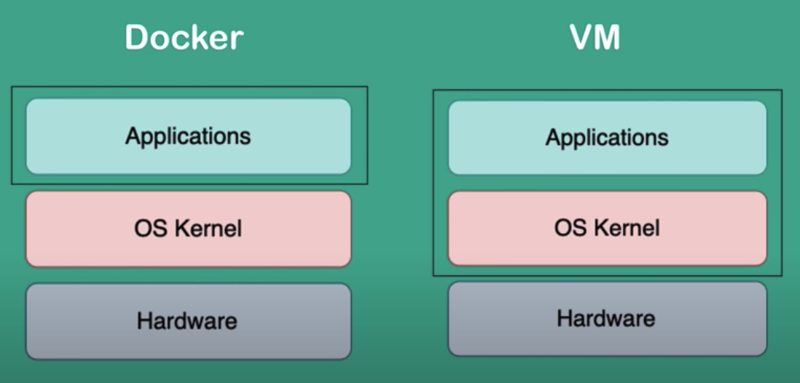

## Day 1 Playing with Docker

It's 2015, and you're listening to [Take Me to Church](https://www.youtube.com/watch?v=MYSVMgRr6pw) by Hozier.

Many technologies are gaining ground. Virtual machines have become a standard and are everywhere. There are many hypervisors to choose from, and nerds are starting to have their first homelabs at reasonable prices.

Amidst this sea of possibilities and new technologies, you also have the opportunity to play with Virtual Private Servers (VPS) somewhere. It's awesome – these are virtual machines hosted on some cloud provider. You no longer have to worry about creating the virtual machine on your hardware or installing the operating system. Now you can choose a VPS of the size you need, and with a couple of clicks, everything is up and running, ready to have fun.

In these years, the first tools for Infrastructure as Code (IaC) are also emerging. Everything seems automatable and writable in a handful of minutes.

But the technology that fascinates you the most is the one with the blue whale: Docker.

Your friends are hesitant to learn it, but to you, it seems incredibly cool for the goals that Docker sets



What's the difference between a container and a virtual machine?

Containers are lighter than virtual machines because they share the host operating system's kernel. In contrast, virtual machines carry their own kernel. This difference in overhead allows containers to start in seconds, whereas virtual machines may take several minutes to complete the startup phase.

But what on earth are these containers?

Containers are abstractions that enable us to isolate and make our applications portable.

At the core of virtualization technologies are two features of the Linux kernel:

Control Groups: to limit the resources a single process can consume. Through this feature, we can restrict the RAM, CPU, or disk write that a process uses.
Network Namespace: through namespaces, it's possible to isolate a process within an operating system, limiting its visibility. There are different types of namespaces: User, PID, Network, Mount, IPC, UTS.
Too much theory, do you want to get your hands dirty?

You install Docker on your Linux machine and start playing.

Run your first Nginx container:

```docker run -d -p 80:80 --name first-nginx nginx```


And with this command, a whole new world opens up for you. Notice that upon the first execution, the Docker daemon pulls the Nginx image from Docker Hub, and within a few seconds, your container is ready. You've mapped the container's port 80 to the host's port 80.

Does it mean I have a web server listening on port 80 of my host?

You decide to perform a curl

```curl locahost```

And you receive as a response that of your newly created web server

```html
<!DOCTYPE html>
<html>
<head>
<title>Welcome to nginx!</title>
<style>
html { color-scheme: light dark; }
body { width: 35em; margin: 0 auto;
font-family: Tahoma, Verdana, Arial, sans-serif; }
</style>
</head>
<body>
<h1>Welcome to nginx!</h1>
<p>If you see this page, the nginx web server is successfully installed and
working. Further configuration is required.</p>

<p>For online documentation and support please refer to
<a href="http://nginx.org/">nginx.org</a>.<br/>
Commercial support is available at
<a href="http://nginx.com/">nginx.com</a>.</p>

<p><em>Thank you for using nginx.</em></p>
</body>
</html>
```

Indeed, it's that easy. What used to involve creating a virtual machine, installing Nginx, and downloading all the necessary packages can now be accomplished so easily. The use of containers, facilitated by tools like Docker, has significantly simplified and streamlined the process, making it more accessible and efficient.


You discover that you could achieve the same result using Docker Compose, a tool that, using the YAML format, allows you to configure your containers.

The previously executed command could be converted into something like

```yaml
version: '3'

services:
  first-nginx:
    image: nginx
    ports:
      - "80:80"
    container_name: first-nginx
    restart: always
```

Absolutely! Your friends definitely need to give it a try! Docker and Docker Compose can revolutionize the way applications are developed, deployed, and managed. It's a game-changer in terms of simplicity and efficiency in the world of containerization

## Day 2 Containerizing your Website


You're a hands-on person, and when you want to learn a new technology, you create a little project to understand how it works.

You ponder and rethink: what's a use case where you can employ a technology like Docker?

Finally, the lightbulb moment: hosting your website! Currently, it's on a virtual machine, served to the world through Nginx. The goal is to take that architecture and convert it into something that allows you to use Docker.

The architecture serving your website and those of your friends currently looks like this:

[TO DO: insert architecture]

Your website is on a virtual machine.

The Dockerfile for your application:

```Dockerfile
FROM klakegg/hugo:0.107.0-ubuntu as build-step
WORKDIR /app
COPY . .
RUN hugo

FROM nginx:alpine-slim
COPY --from=build-step /app/public /usr/share/nginx/html
EXPOSE 80
```

This Dockerfile will be placed in the [Git repository](https://github.com/ettoreciarcia/personal-website-hugo) where your website's code is located.

And then proceed to build your Docker image with the command:

```docker build -t personal-website:1.0 .```

We're good to go, the build is ready. You can view your new image by running the command:

```docker image ls```

Let's try it right away!

## Day 3 Push your image to a registry

For now, your image is local. For convenience, you decide to push it to the Docker Hub registry.

Use the following command to log in to your Docker Hub account from the command line. Replace <your-username> with your Docker Hub username.

```docker login --username hecha00```

Before pushing the image, you need to tag it with your Docker Hub username and the repository name. The general format is <username>/<repository>:<tag>. Here's an example:

```docker tag local-image:tag <your-username>/<repository>:tag```

in our case:

```docker tag personal-website:1.0 hecha00/personal-webiste:1.0```

Once you've tagged the image, use the following command to push it to Docker Hub:

```docker push hecha00/personal-webiste:1.0```

## Day 4 Deploying your Website with Docker


Let's run a new container based on this image. However, this time, bind port 81 on our host to port 80 on our container.

```docker run -dit -p 81:80 --name website hecha00/personal-website:1.0```

Our website is up and running in a container, and we're accessing it on port 81 of our host!

```yaml
version: '3'

services:
  website:
    image: hecha00/personal-website:1.0
    ports:
      - "81:80"
    container_name: website
    restart: always
```

Certainly, for now, we haven't enabled HTTPS, but we're getting closer to the target architecture we wanted to create—the first piece of the puzzle is ready! The SSL termination, just like in the target architecture, will be handled by our reverse proxy.

## Day 5 Reverse Proxy

Perfect, the first step to replicate your old architecture set up with virtual machines has been successful, you've managed to containerize your website.

At this point, we can proceed with containerizing the reverse proxy you used to reach your website.

Your VM acting as a reverse proxy will be replaced once again by a container. All you need is an image of a container serving as a reverse proxy and a valid configuration file for that reverse proxy!

You can easily achieve this goal by adding to the Docker Compose seen earlier a reverse proxy that points to your web server

```yaml
version: '3'

services:
  website:
    image: personal-website:1.0
    container_name: website
    restart: always

  nginx-proxy:
    image: nginx
    container_name: nginx-proxy
    ports:
      - "80:80"
      - "443:443"
    volumes:
      - ./nginx.conf:/etc/nginx/nginx.conf
    depends_on:
      - website
    restart: always
```

At this point, you just need to mount the configuration file capable of replicating the setup you had on your old VM, with the only difference being that what used to happen at the network level of your LAN now occurs within Docker's internal network.

```
worker_processes 1;

events {
    worker_connections 1024;
}

http {
    sendfile on;
    tcp_nopush on;
    tcp_nodelay on;
    keepalive_timeout 65;
    types_hash_max_size 2048;

    include /etc/nginx/mime.types;
    default_type application/octet-stream;

    server {
        listen 80;
        server_name test.ettoreciarcia.com;


        location / {
            proxy_pass http://website:80;
            proxy_set_header Host $host;
            proxy_set_header X-Real-IP $remote_addr;
            proxy_set_header X-Forwarded-For $proxy_add_x_forwarded_for;
            proxy_set_header X-Forwarded-Proto $scheme;
        }
    }
}
```


It's all set, you're one command away from finishing – just a

```
docker-compose up -d
```

and the magic is done!

## Conclusions


In this article, we didn't delve into the details as there were many topics we could have explored (such as dissecting the differences between containers and VMs, crafting a Dockerfile and optimizing it for minimalism, enabling HTTPS with Certbot and http/dns challenges, exposing our application to the world). Perhaps we'll tackle some of these topics in the future.

The purpose of this article was to elucidate the "flow" from virtual machines to containers with a tangible example. I hope it has been helpful! See you around!


