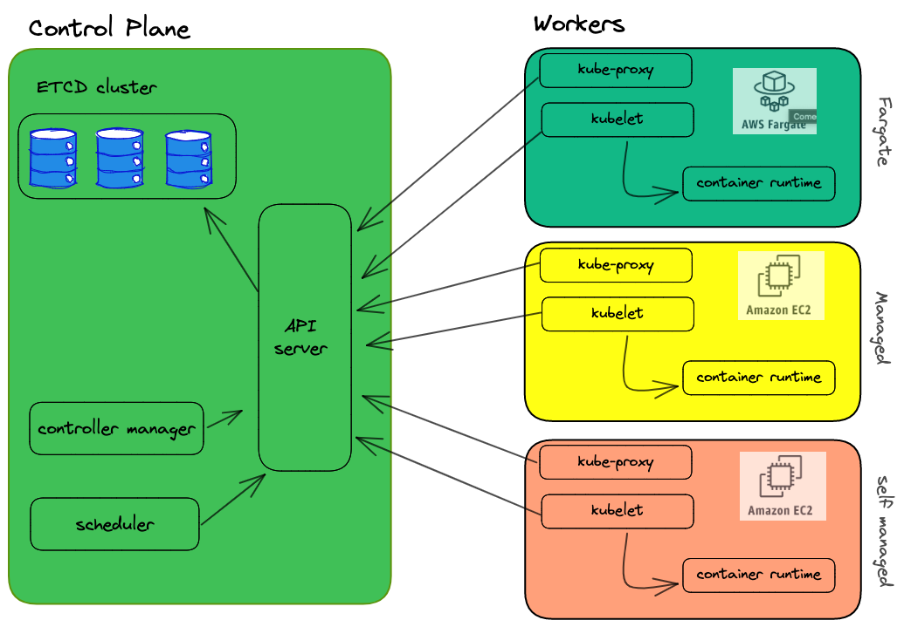

## 0. Brief introduction to Kubernetes

Kubernetes, also known as K8s, is an open-source container orchestration platform that automates the deployment, scaling, and management of containerized applications. It was originally developed by Google and is now maintained by the Cloud Native Computing Foundation (CNCF). Kubernetes provides a powerful and flexible infrastructure for managing containers, making it easier to deploy and manage complex applications in a cloud-native environment. It is used by organizations of all sizes to improve the reliability, scalability, and agility of their applications, and has become one of the most popular tools for building and running modern, cloud-native applications.

This is typical Kubernetes architecture

A few words about the core components of Kubernetes in case this is your first time hearing about it:

1. **API Server**: It allows us to interact with the cluster via API calls. It is the only component who writes on etcd and to which others turn when they have done their job

2. **Scheduler**: it checks for newly created pods that do not have a node assigned and, after identifying it, assigns it. The factors taken into consideration in identifying a node to which to assign the execution of a Pod include the request for resources of the Pod itself and of the other workloads present in the system, the constraints of the hardware/software/policies, the indications of affinity and anti-affinity, data/volume availability requirements, interference between different workloads and deadlines

3. **Controller Manager**: It performs several control loops, one for each type of resource that can be created within the cluster. It takes care of keeping the etcd status aligned with that of the resources located within the cluster. In the event that these two states do not match, the scheduler will be responsible for converging the cluster state to the one desired by the user.

4. **etcd**: a key-value storage. It keeps cluster’s state

5. **Kubelet**: an agent that runs on every node of the cluster. It makes sure that the containers are running in a pod and communicates directly with the API-server

6. **Kube-proxy** It acts as a network proxy and load balancer, routing traffic between pods and services based on network policies and rules defined by the Kubernetes API.

Using Kubernetes on-premises can provide many benefits, such as improved security and data sovereignty, greater control over infrastructure resources, and increased performance and reliability. However, managing a Kubernetes cluster on-premises can be complex and time-consuming, requiring specialized skills and resources.

That's why many organizations are turning to cloud-based Kubernetes solutions like managed Kubernetes services, which offer the flexibility and scalability of Kubernetes without the burden of managing it on-premises. With managed Kubernetes services like Amazon EKS, organizations can easily deploy and manage Kubernetes clusters in the cloud, taking advantage of built-in security features, automatic scaling, and seamless integration with other AWS services.

By adopting a managed Kubernetes service like EKS, organizations can accelerate their adoption of cloud-native technologies, reduce operational overhead, and focus on building and deploying innovative applications that drive business value.

## 1. Managed Kubernetes in Cloud: Amazon Elastic Kubernetes Services

Amazon Elastic Kubernetes Service (EKS) is a fully managed Kubernetes service offered by Amazon Web Services (AWS). It simplifies the process of deploying, managing, and scaling Kubernetes clusters on the AWS cloud, making it easier for developers to build and deploy cloud-native applications.

With EKS, AWS manages the underlying infrastructure and Kubernetes control plane, allowing developers to focus on building and deploying their applications. EKS integrates with other AWS services, such as Elastic Load Balancing, Auto Scaling, and Amazon S3, to provide a seamless and scalable platform for running containerized applications.

EKS also offers several security features, including role-based access control (RBAC), network isolation, and encryption, to ensure that applications are secure and compliant with industry standards.

Overall, EKS is an ideal choice for organizations looking to adopt Kubernetes and modernize their application infrastructure. It provides a reliable and scalable platform for running containerized applications, backed by the expertise and experience of AWS

## 2. Main differences between Kubernetes on premise and EKS

## 3. EKS integration with AWS services

## 4. AWS VPC CNI

## 5. Monitoring 
