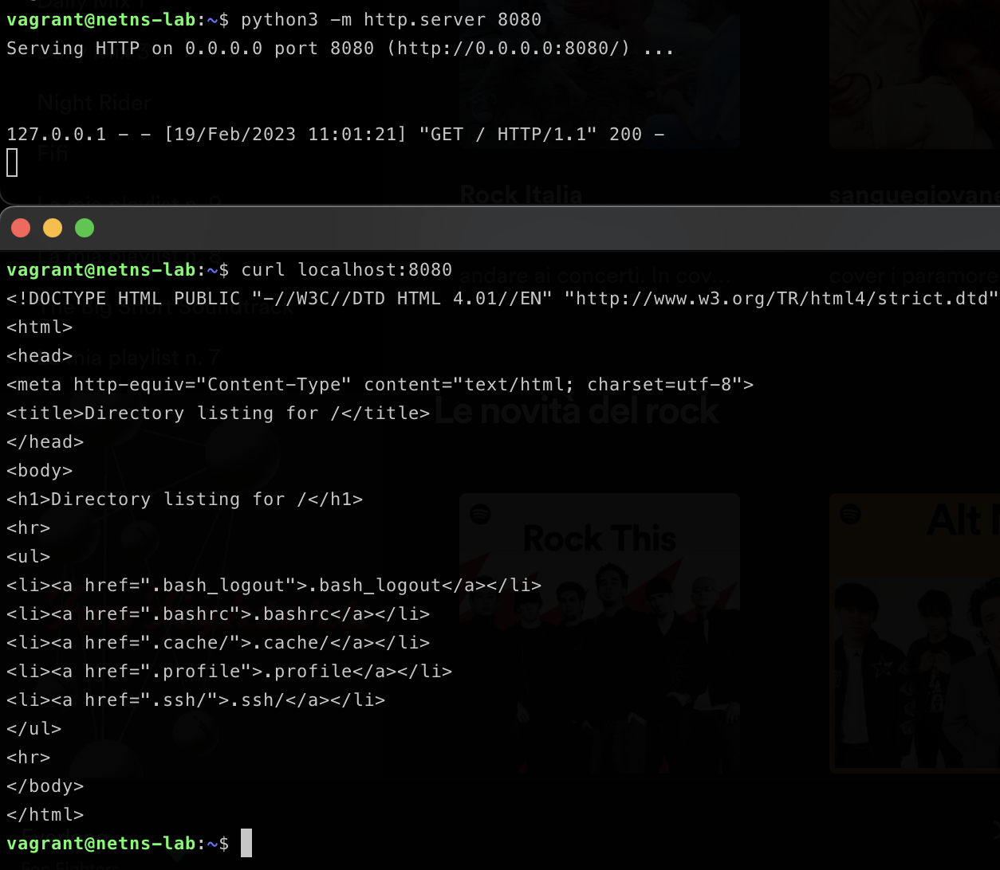
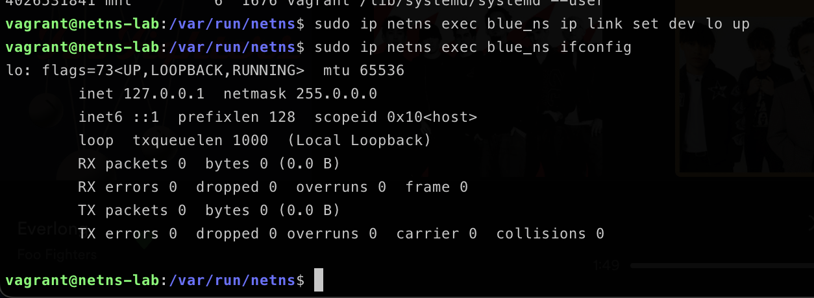
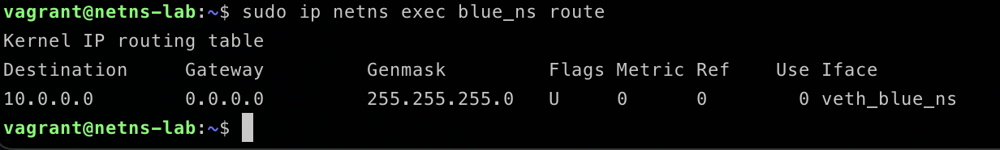
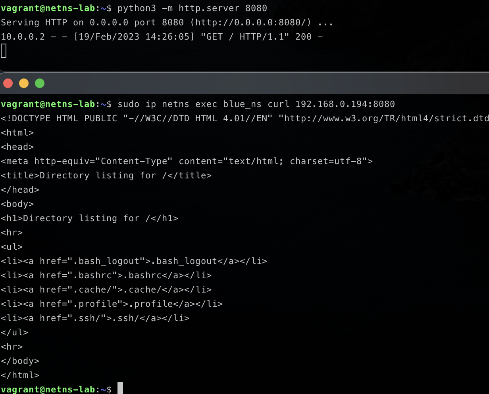

## 0. Introduction and goals

The first time I started a container I wondered how the assignment of container IP addresses worked. This led me to delve into containerization technologies, especially **cgroups** and **network namespaces**.
In today's article we will see how network namespaces achieve that degree of "isolation" at the network level and how addresses are assigned

## 1. Setup our virtual environment

Let's start with the setup of our virtual environment, so we don't compromise the network namespace root of our host machine.
We will use Vagrant, a tool for working with virtual environments. In simple words: Virtual Machina as a code!

- OSX

```shell
brew cask install virtualbox
brew cask install vagrant
vagrant plugin install vagrant-vbguest
```

- Linux

```shell
sudo apt-get install virtualbox
sudo apt-get install vagrant
vagrant plugin install vagrant-vbguest
```

- Windows

```shell
Go buy a USB drive.
Prepare the newly purchased USB drive as a bootable device for your favorite Linux distribution.
Remove Windows and install Linux  :heart:
```

Now we can provision the virtual machine we're going to work on.
I have already written a Vagrantfile for you

```Vagrantfile
Vagrant.configure("2") do |config|
    config.vm.define "netns-lab" do |worker|
      worker.vm.hostname = "netns-lab"
      worker.vm.box = "ubuntu/lunar64"
      worker.vm.network "public_network"
      worker.vm.provider "virtualbox" do |vb|
        vb.memory = 1024
      end
      worker.vm.provision "shell", inline: <<-SHELL
        apt-get update && apt-get install -y net-tools && apt-get install -y docker-ce
      SHELL
  end
end
```

Copy this file to a directory and from that directory run the command ```vagrant up```.
On first run it takes some time to download the image used for the virtual machine, you can use this time to react to my Kubernetes memes on Linkedin

We can finally ssh into our lab!

```vagrant status``` To see which virtual machines are active
```vagrant ssh [VM_NAME]``` for our scenario ```vagrant ssh netns-lab```

Once inside, we can take a look at the network interfaces present on our VM


This VM also has an IP address that belongs to our host machine (192.168.0.194), these two instances can communicate.

We can launch a simple web server with this command ```python3 -m http.server 8080```and try to reach it!



Everything ok until now we can reach because our web server because we are in the root network namesapce

## 2. What is a network namespace

A network namespace is a logical copy of the network stack from the host system. Network namespaces are useful for setting up containers or virtual environments. Each namespace has its own IP addresses, network interfaces, routing tables, and so forth. The default or global namespace is the one in which the host system physical interfaces exist.

Let's a new network namespace

```sudo ip netns add blue_ns```

And we check that the creation was successful

```sudo ip netns list```

We can take a look inside *blue_ns*

```sudo ip netns exec blue_ns ifconfig```

and we realize that this network namespace is empty! Let's at least create the loopback interface to ping itself

```sudo ip netns exec blue_ns ip link set dev lo up```



We can even ping the loopback interface from our network namespace!

```sudo ip netns exec blues_ns ping 127.0.0.1```


And we can of course create our webserver inside the **blue_ns** namespace

```sudo ip netns exec blue_ns python3 -m http.server 8080```

and check that our Python web server is up & running

```sudo ip netns exec blue_ns curl localhost:8080```


But how could we reach our new network namesapce from the root namespace of our virtual machine?
The answer is **Virtual Ethernet devices!**

## 3. What is a Virtual Ethernet device (veth) and why we need it

The VETH (virtual Ethernet) device is a local Ethernet tunnel. Devices are created in pairs, as shown in the diagram below

Packets transmitted on one device in the pair are immediately received on the other device. When either device is down, the link state of the pair is down.


Veth device pairs are useful for combining the network facilities of the kernel together in interesting ways. A particularly interesting use case is to place one end of a veth pair in one network namespace and the other end in another network namespace, thus allowing communication between network namespaces
## 4. Communications between root namespace and blue_ns

Let's try to connect our host namespace to the *blue_ns* we just created using a veth pair!

```sudo ip link add dev veth_root type veth peer name veth_ns_blue```

And we can list our veth 

```ip link list```


As you can see our veth pair is down.

Start up the veth *root_rs* 

```sudo ip link set dev veth_root_ns up```

And we can then start up and move the other termination of veth to *blue_ns* 

```sudo ip link set veth_blue_ns netns blue_ns```


```sudo ip netns exec blue_ns ip link set dev veth_blue_ns up```

We can finally see our veth in *blue_ns*.


Well! Now we just have to assign virtual IP addresses to the terminations of our veth pair to enable communication between the two namespaces

```sudo ip address add 10.0.0.1/24 dev veth_root_ns```

```sudo ip netns exec blue_ns ip addredd add 10.0.0.2/24 dev veth_blue_ns```

This is our scenario:


We can finally reach the web server in the root namespace from blue_ns and vice versa!


## 5. Communication between blue namespace and host (via host's ip)

If from the *blue_ns* we try to reach the web server running in the root namespace using the host's ip address as an endpoint, we will not be able to reach it.

This happens because the *blue_ns* doesn't know how to reach the subnet where the ip address of our host is located.

We need to add a route to *blue_ns*! 

First let's look at the route table of our *blue_ns*

```sudo ip netns exec blue_ns route```



Our host's ip 192.168.0.194

```sudo ip netns exec blue_ns ip route add default via 10.0.0.1```



## 6 What is a bridge

A Linux bridge behaves like a network switch. It forwards packets between interfaces that are connected to it. It's usually used for forwarding packets on routers, on gateways, or between VMs and network namespaces on a host. It also supports STP, VLAN filter, and multicast snooping


## 7. Useful links

[Linux Interfaces](https://developers.redhat.com/blog/2018/10/22/introduction-to-linux-interfaces-for-virtual-networking)

[Network namespaces](https://www.youtube.com/watch?v=_WgUwUf1d34&t=1183s)

[What is a veth](https://man7.org/linux/man-pages/man4/veth.4.html#:~:text=The%20veth%20devices%20are%20virtual,always%20created%20in%20interconnected%20pairs.)

[What is a bridge](https://developers.redhat.com/articles/2022/04/06/introduction-linux-bridging-commands-and-features#)