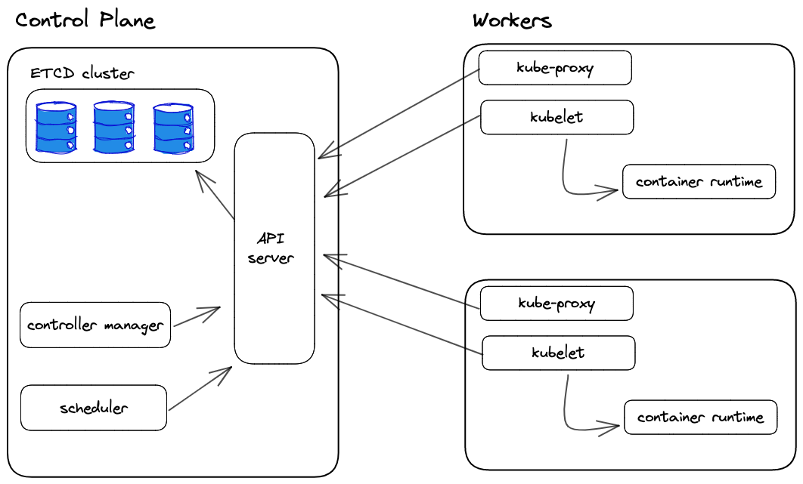
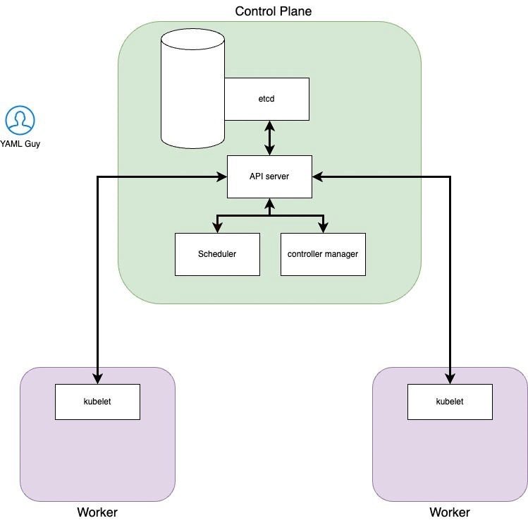

## 0. Introduction

Anyone who has followed a tutorial on Kubernetes ran the command

```kubectl create deployment my-first-deployment --image=nginx --replicas=3```

And then he looked at the pod running within the Kubernetes cluster. Feels good man.

What are we saying to the cluster by running this command?

“Yo K8s, I would like a **deployment** called my-first-deployment, inside which there is a **pod** with three **replicas** and that containers inside the pod start from the nginx official image . “

At this point some have changed the description of their Linkedin profile to “Kubernetes Tech Lead Engineer”, others have begun to deepen this tool. Probably, those who have not stopped on the surface are still digging.

What’s behind Kubernetes? What “magic” did that pod land on that node? And why that node? In this article we will give an overview of who are the actors involved in making the “magic” work.


## 1. Components involved

- **Api Server** which allows us to interact with the cluster via API calls. It is the only component who writes on etcd and to which others turn when they have done their job

- **Scheduler** Checks for newly created pods that do not have a node assigned and, after identifying it, assigns it. The factors taken into consideration in identifying a node to which to assign the execution of a Pod include the request for resources of the Pod itself and of the other workloads present in the system, the constraints of the hardware/software/policies, the indications of affinity and anti-affinity, data/volume availability requirements, interference between different workloads and deadlines

- **Controller Manager** Performs several control loops, one for each type of resource that can be created within the cluster. It takes care of keeping the etcd status aligned with that of the resources located within the cluster. In the event that these two states do not match, the scheduler will be responsible for converging the cluster state to the one desired by the user.

- **etcd** is a key-value storage. It keeps cluster’s state

- **Kubelet** an agent that runs on every node of the cluster. It makes sure that the containers are running in a pod and communicates directly with the API-server

- **Kubectl** is the main tool used to interact with the Kubernetes cluster. It does this by authenticating on the control plane and making API calls of various types.





## 2. Resources we will create

- **Pods** The pod is the atomic unit of Kubernetes. We can see it as a collection of one or more containers. It is an ephemeral unit that can be destroyed and recreated based on the state that is declared.

- **Replica Set** Aims to keep a stable set of pods running at all times. It is used to ensure the availability of a specific number of identical Pods.

- **Deployment**  Object that provides declarative updates to applications. Describes the life cycle of an application, such as which images to use for the app, the number of pods present, and how they need to be updated.

Let’s now try to retrace the steps that lead us from the execution of our command to the actual start of the container within the cluster

## Steps from kubectl command to running pods
```kubectl create deployment epsilon-bootcamp --image=nginx --replicas=3```

###  Step 0: Kubectl authenticates on the cluster

You know the file stored in ```.kube/config?``` Here, that's the file where the context is located.

In Kubernetes, a context is the set of access parameters that contains information about the Kubernetes cluster, user and namespace. We can see the context as the configuration we use to access a cluster.

### Step 1: Kubectl makes the API call to the API Server

At this stage the kubectl tool will translate our command into a Kubernetes API. A key concept to understand when working with Kubernetes is that everything is an API. Even when we apply a manifest kubectl translates it into an API call and contacts the api-server.

For example, supposing we want to have a list of all the namespaces present within the cluster, we can run the command

```kubectl get namespaces```

or query the API server directly with the call

```curl http://[control-plane-ip]:[PORT]/api/v1/namespaces```

(in reality this API returns more detailed information than we would have by running only the kubectl command to get the list of namespaces)

You can find more detailed information on the APIs made available by Kubernetes at this [link](https://kubernetes.io/docs/concepts/overview/kubernetes-api/)

### Step 2: Api server updated etcd status

After logging on to the API server it will validate the manifest we sent him. The resource we are creating may already be present on the cluster and in this case our YAML Guy will receive an error message, otherwise go to the next step

### Step 3: Controller manager, it's show time!

The controller manager has a series of loops (one for each resource that can be created in the cluster) and the one used to control the deployments notes that the state desired by the user who has just added a deployment does not match the current state of the cluster. In this specific case, the deployment control manager will create a Replica Set resource. To do this, it will communicate with the server API and the latter will update the etcd status by adding what is requested by the controll manager. The state of ectd has been updated again and the Replica Sets controller notices that the state of ectd does not match the current one of the cluster. It will then tell the server API to add the pods required by the replica set and the server api will update the etcd status again with the 3 pods.

Have you ever seen “Pending” in the state when you were looking for pods? Here, when a pod is pending it is because the status of ectd has been updated so the cluster knows it has to create that pod.

### Step 4: Scheduler

At this point the scheduler notices that there are pods with status pending and, based on their characteristics, will assign them to certain nodes. In our case we know for sure that those nodes cannot be scheduled on the control plane. What the scheduler will do is try to keep the load on the nodes balanced

### Step 5: Kubelet

Once a pod is assigned to a node, the task of getting it running goes to the kubelet of the node to which it was assigned. Kubelet, the agent installed on each node, knows it has to create the pods required by the scheduler. It will then notify the server API that the pods are about to be created. In reality, Kubelet does a lot more than that. But we will see this in the next articles 

## 4 Bonus GIF!

Take a look at the GIF I made to clarify what happens inside the cluster

