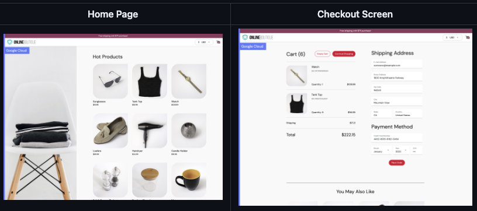
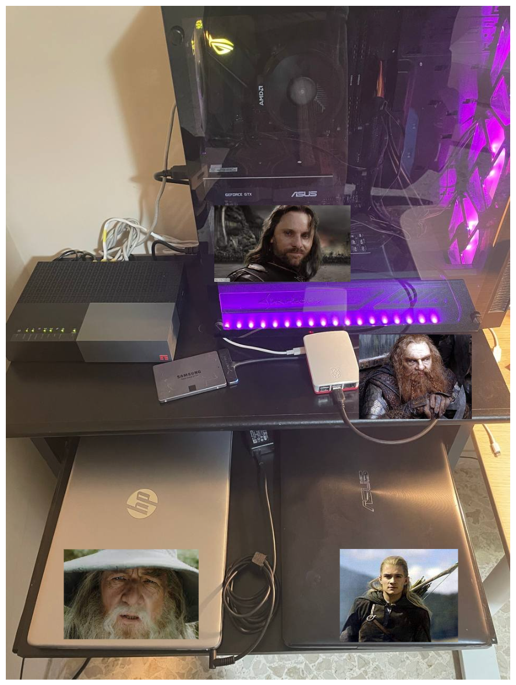

## **0 Kubernetes journey**

This article was born with the pretension of being the first article of a (hopefully) long series in which I will set up several Kubernetes clusters and services in my homelab and manage them in the most real way possible.

Could I get the same result by running this stuff inside a Cluster Kind or Minikube? ABSOLUTELY YES!

## **1 Then why am I doing this?**

Because I think problems with Kubernetes don't start on Day 0 (Cluster Provisioning) or Day 1 (Application Setup), but everything after that:

- Daily administration of the cluster
- Backups
- Security
- Access Management
- Logging
- Monitoring
- Upgrades
- Upgrades
- Upgrades

We'll self-host, we'll disassemble, we'll break.

## **2 What do we have right now**

|  Name	|  IP	|  RAM	|  vCPU	| Disk Size | CPU Model	|
|---	|---	|---	|---	|---	|---	|
| Gimli     |  192.168.0.2 |  4 GB  |  4 vCPU  |  250 GB   |  ARM Cortex-A72       | 
| Gandalf	|  192.168.0.10	|  8 GB	 |  8 vCPU	|  250 GB   |  i5 1135G7	        | 
| Aragorn 	|  192.168.0.20	|  16 GB | 12 vCPU 	|  250 GB	|  AMD Ryzen 5 2600X	|  
| Legolas	|  192.168.0.30	|  4 GB	 |  4 vCPU  |  250 GB	|  i5-3337U 	        |  

I'm planning to extend Aragorn's RAM with 2x32 GB and SSD storage to 2TB

## **3 I'm looking for a partner in this journey**

I firmly believe that comparison with others is the best way to grow, the idea of ​​sharing this journey with someone comes from the need to want to design solutions and talk about what we are doing to enrich each other.

What I'm looking for are one or two people to whom I will grant VPN access to my homelab (as if it were a private cloud) to start setting up the first architectures.

Working in groups will push us to make better use of code versioning systems and to manage access in a more granular way.

I posted something on Reddit to find people who share the same goal as me

I received more than 15 homelab sharing requests in less than 24 hours.

It seems that Kubernetes is a very hot topic right now!

## **4 The application we will manage**

The idea is to run the application [Testing Microservices by Google](https://github.com/GoogleCloudPlatform/microservices-demo) within several Kubernetes alpha, beta and production clusters.

Of course, we don't just bring this project into our cluster.

My idea is to manage the entire microservices lifecycle from the time the developer commits the code to the time the user uses the platform

So what are we going to do?

We will set up pipelines, we will segment the networks, we will manage the backups, we will expose the application to the world, we will scale (in our small way) and we will try to do everything with CNCF technologies.

We will have fun and learn together!

## **5 How to apply**

At the moment I'm in contact with other homelab lovers on Reddit, if you want to share part of this journey with me you can contact me on Linkedin or send an email to ettoreciarcia.tech@gmail.com with "KUBERNELLO È TROPPO BELLO " as subject :)

I hope to find someone, this homelab is waiting for you!

