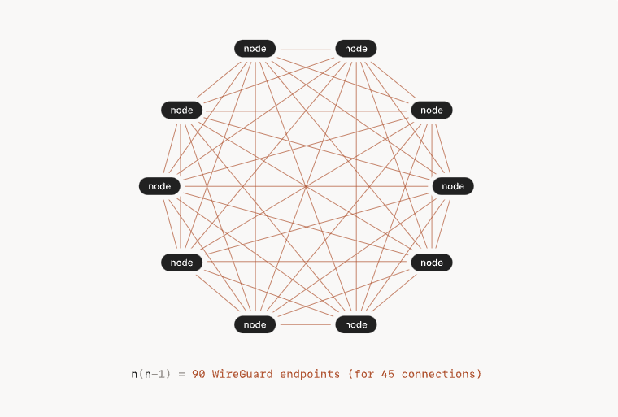
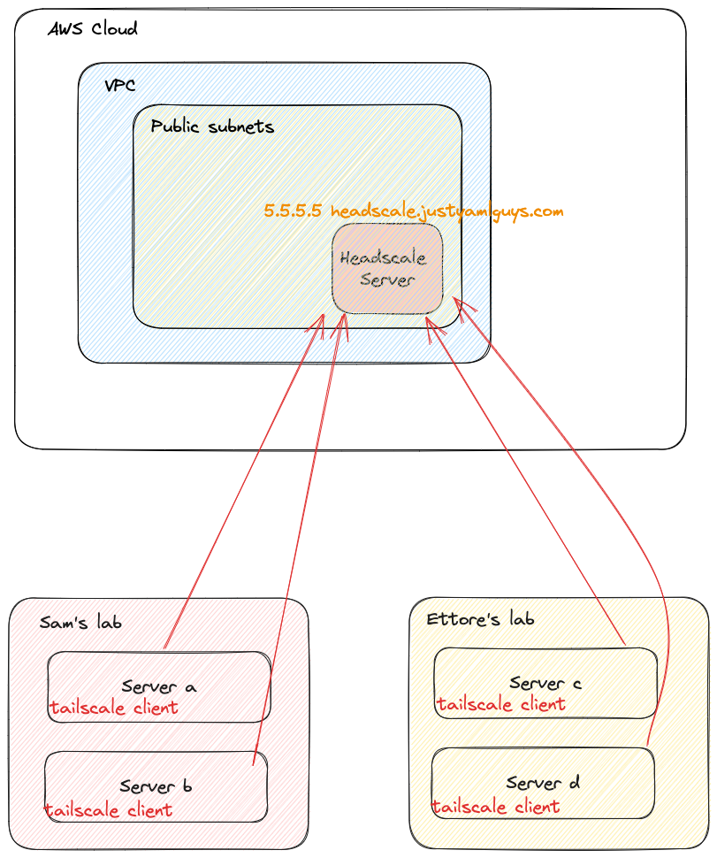
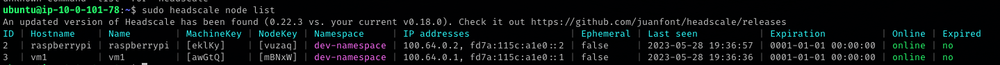
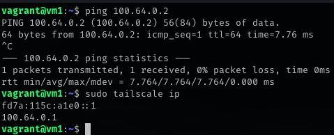

## **0 Updates on my homelab journey**


As you may have read in my previous article, I was looking for someone to keep me company on this very long journey.
And guess what? I found someone!
After talking to about twenty people on Reddit and scheduling a few calls, I finally set up the team.

The project officially started on May 9th at 18:10, with this email

>Hello and welcome everyone! Our journey has finally begun.
>You should have access to two Google Docs
>- HERE the guidelines and the code of conduct
>- HERE will put to a vote the messaging platforms that we will use to communicate. Our conversations will continue on the >platform we choose in this document
>You are all editors, you can modify and propose new ideas, I will be happy to discuss them with you.
>This is just a draft, I am not the owner of this project. We would have an equal relationship throughout the duration of >the trip.
>See you on the other side :)


We are spread over 4 different timezones ranging from the east of the USA to Australia, the collaboration mode will therefore be asynchronous.


## **1 Sharing our homelabs: the problem**

As I said, we are in different timezones and the setup of our homelab is not the classic installation of Linux on a couple of VMs at home. 
The initial idea was to share my homelab with others by installing a VPN server in my homelab and giving others access. 
As people joined the project it became apparent that sharing my homelab wasn't going to be enough.
We needed something that would allow us to share all of our homelabs.


Different VPN servers? One in each lab? 
This approach is pure pain. Each of us would have to generate credentials for accessing our VPN for the whole team.


We would get something like this for each of our homelabs using openVPN


Even with Wireguard the complexity was not manageable. this is what we would have achieved with mesh networks



During the PoC with Wireguard we came across [Tailscale](https://tailscale.com/)

What the hell is that?

Tailscale is a virtual private network (VPN) solution designed for secure network connectivity and access. It aims to simplify and improve VPN connectivity for individuals and organizations by providing a secure and easy-to-use networking solution.

Unlike traditional VPNs that often require complex configuration and management of servers, Tailscale operates as a mesh VPN. It leverages existing trusted infrastructure, such as cloud providers and existing networks, to create secure connections between devices and networks. This approach eliminates the need for server infrastructure and allows for simple, scalable, and secure networking.

Tailscale uses WireGuard, a modern and efficient VPN protocol, as its underlying technology. WireGuard is known for its simplicity, performance, and strong security features. Tailscale takes advantage of WireGuard's capabilities to establish encrypted connections between devices and networks.

With Tailscale, users can securely access resources and services across networks, even when they are geographically distributed. It enables remote access to on-premises infrastructure, cloud resources, or even devices within the same network.

Tailscale also provides features like centralized administration, access controls, and identity-based security policies. It offers a user-friendly interface and integrates well with various operating systems and devices, making it easy to deploy and manage.

Overall, Tailscale aims to provide a user-friendly and secure VPN solution that simplifies network connectivity, enhances productivity, and improves the overall network security posture for individuals and organizations.


### **So what the heck is Tailscale in short?**

Tailscale is different from a traditional VPN as it operates on a mesh network approach. It uses the WireGuard protocol to establish encrypted connections between devices, without the need for centralized VPN servers. This simplifies setup and administration, removing reliance on traditional server-based VPNs. Tailscale leverages existing trusted infrastructure, like cloud providers, for secure connectivity between geographically distributed networks. It offers an intuitive interface, easy implementation, and centralized control for secure remote access to network resources.


At this point we felt like we were done. Tailscale gave us everything we needed. We could have considered the case closed. But then...


We realized we can't use Taiscale for free. At the moment there are 7 of us, almost all with our own homelab. Panic mode [ON]


## **2 The revelation: Headscale**


Tailscale has an open source version called [Headscale](https://github.com/juanfont/headscale). Of course, this open-source version requires some elbow grease for self-hosting.

And we are DevOps. Let's dive in

## **3 Setup Headscale on Ec2 instance via Terraform**

This part is perhaps the most inflated.
We need a server to run our headscale on.

This server must be publicly accessible.

We could have achieved the goal with any cloud provider. We chose Amazon because of the free tier: for a year we won't have spent, when the term of the year expires we will register a new account and through this terraform code we will have all the infrastructure back up in seconds.


```git clone https://github.com/JustYAMLGuys/infra```

Move into ```/cloud``` and you will find this structure

```bash
.
├── .pre-commit-config.yaml
├── .terraform.lock.hcl
├── .tool-versions
├── aws
│   ├── headscale-server
│   │   ├── .terraform.lock.hcl
│   │   ├── go-import-ssh-gh.sh
│   │   ├── import-ssh-key-gh.sh
│   │   ├── main.tf
│   │   ├── output.tf
│   │   ├── provider.tf
│   │   ├── security_group.tf
│   │   └── variables.tf
│   └── middleware
│       ├── .terraform.lock.hcl
│       ├── main.tf
│       ├── output.tf
│       ├── provider.tf
│       └── variables.tf
├── main.tf
├── output.tf
├── provider.tf
└── variables.tf
```


We have foreseen that the middleware part will grow in the future, for this we have created a special module. This module will take care of the provisioning of the whole networking stack (VPC, subnet, Internet Gateway etc


We then have the module that creates the ec2 instance on which we will install headscale, the security groups and the elastic ip address associated with the ec2 instance.


This is what you're going to create using this form


### **3.1 A few tools to make our life easier**

As you can see from the tree of the previous chapter this project contains some dotfiles

**.tool-versions** : is typically used to specify the versions of different tools or dependencies required for that specific project or environment. It is commonly used in development setups, especially with tools that support version managers. We are using it in combination with [**asdf**](https://asdf-vm.com/)

**.envrc** : we are using it in combination with asdf to create a local environment for this project.

**.pre-commit**:  the pre-commit file is a Git hook that is automatically executed before making a commit. Its main purpose is to run scripts, checks, or custom actions before committing changes to the repository. This hook can be used to automate verification processes or ensure that the code in the repository meets specific criteria or standards before being recorded as part of the project's history.

Follow this article to install asdf and envrc on your client -> [How to manage multiple CLI tool versions with ease: direnv + asdf on macOS (SIGHUP)](https://blog.sighup.io/manage-tools-with-ease-direnv-asdf/)

### **3.2 Setup your Terraform's backend**


This time we can't use Terraform Cloud for several reasons:

1. Terraform Cloud in the free version has a limit of users per organization

2. Our workers for the project will need to be local as most of our infrastructure will only be accessible behind VPN

Remember to change these values ​​according to the name of the bucket where you will save the state of the Dynamo table where you will save the state lock

```
terraform {

  backend "s3" {
    bucket         = "terraform-state-jyg"
    key            = "aws/terraform.tfstate"
    region         = "eu-central-1"
    dynamodb_table = "terraform-state-lock-jyg"
  }

  required_providers {
    aws = {
      source  = "hashicorp/aws"
      version = "~> 4.0"
    }
  }

  required_version = ">= 1.0"
}

provider "aws" {
  region = var.region
}
```

### **3.3 Setup your AWS profile**

This time we will use a ```.envrc``` file to store our credentials. You can find an example file called envrc-example, 
Change the values ​​it contains according to your aws account credentials and rename the file ```.envrc```

```bash
export AWS_SECRET_ACCESS_KEY=<YOUR_SECRET_ACCESS_KEY>
export AWS_ACCESS_KEY_ID=<YOUR_ACCESS_KEY_ID>
export region=<YOUR_REGION>
```


### **3.4 Everything is ready, let's provision our infrastructure**

Move into ```infra/cloud``` and run 

```
terraform init
```

```
terraform plan
```

```
terraform apply
```

### **3.5 Bonus point: script to copy ssh key of my teammates directly in ec2 during instance's boostrap (user_data)**

Within the terraform project, at the path ```cloud/aws/headscacale/server```

you will find the bash script that hp used to copy our public keys taken directly from github in the authorized_keys file of our ec2 instance

```bash
#!/bin/bash
# Check if Go is installed
if ! command -v go &> /dev/null; then
    echo "Go is not installed. Installing Go..."

    # Download the Go binary archive
    wget https://golang.org/dl/go1.17.5.linux-amd64.tar.gz

    # Extract the archive
    sudo tar -C /usr/local -xzf go1.17.5.linux-amd64.tar.gz

    # Add Go binaries to the PATH environment variable
    echo 'export PATH=$PATH:/usr/local/go/bin' | sudo tee -a /etc/profile.d/go.sh

    # Reload the profile
    source /etc/profile.d/go.sh

    rm go1.17.5.linux-amd64.tar.gz
    
    echo "Go has been installed."
fi


# Clone the repository
echo "Cloning the repository..."
git clone https://github.com/JustYAMLGuys/utility.git /tmp/app
cd /tmp/app/utility/ssh-key-from-gh/app || exit 1

# Build and run the Go program
echo "Building and running the program..."
sudo -u ubuntu /usr/local/go/bin/go run main.go

# Cleanup: Remove the cloned repository
echo "Cleaning up..."
cd ../..
rm -rf /tmp/app

echo "Script completed successfully."
```


This script takes the list of users of our github organization and for each user fetches the public ssh keys via the API call on the endpoint ```https://api.github.com/users/$ORGANIZATION_NAME/keys```

You can clone the repo and do something similar with your organization or just your account.

### **3.6 Our infrastructure after "terraform apply"**




## **4 Mapping your public IP on your third level domain**

This step is optional, you are not forced to use a domain name in order to reach your headscale server.

For simplicity we have preferred to do so, so that it will be easier for everyone to remember.

This step is very simple, just log into your domain register dashboard and map the public IP address of the ec2 instance to your domain.

For example, we have imported the domain on cloudflare and created a third-level domain


## **5 Ansible: time to configure our headscale server**

We have an Ansible playbook for installing Headscale on our server. You can clone it locally using

```git clone https://github.com/JustYAMLGuys/ansible-roles```


At this point we just have to run the ansible playbook against the public ip address of the ec2 instance to get everything&running!


Edit the ```hosts.ini``` file in ```headscale/development``` with the public ip address of your ec2 instance (you can easily retrieve it from console)

Ans change default vars if you want. If you don't, the playbook will configure your instance with this default value:

```yaml
---
headscale_become: true
headscale_become_user: root

headscale_version: v0.18.0
headscale_binary: headscale_0.18.0_linux_amd64
# yamllint disable-line rule:line-length
headscale_tarball_sha256: eedaff1af1e79b10a2ab7256118600b3b6528604be1c8c32d851a32bf3c48cea

# yamllint disable-line rule:line-length
headscale_download_url: "https://github.com/juanfont/headscale/releases/download/{{ headscale_version }}/{{ headscale_binary }}"

headscale_dir: /srv/headscale
headscale_server_url: http://127.0.0.1:8080
headscale_listen_addr: 0.0.0.0:8080
headscale_nameservers: ['1.1.1.1']
headscale_base_domain: example.org
```

Now move into ```/headscale/development``` and run 

```
make ping
```

to check that everything is ok. If it's not ok, you have problem with your configuration of ansible or I can't reach the ec2 instance.

Now you can finally run 

```
make headacale
```

to install headscale and its dependencies on your server!

Now you just have to wait for the ansible playbook to do its job

[TO DO] Add Magic! Gif


## **6 Create your overlay network and add hosts to it**

Now you can ssh into your instance and interact with your headscale server

1. On the headscale server:

```
sudo headscale namespace create <NAMESPACE>
```

and create a user:

```
sudo headscale users create myfirstuser
```

2. Then, from nodes

```
curl -fsSL https://tailscale.com/install.sh | sh
```

```

sudo tailscale up --login-server=http://<YOUR_DOMAIN>:8080/ --accept-routes
```

3. This will prompt a link on the node

```
http://127.0.0.1:8080/register/nodekey:<xxx>

```

4. On your headscale server run 

```shell
sudo headscale -n $NAMESPACE nodes register --key nodekey:<YOUR_MACHINE_KEY>
```

5. Check your node list to verify that everything is ok! 

```shell
sudo headscale nodes list
```



We can now ping one instance from another on our network overlay



6. To delete a node

```sudo headscale node delete -i [ID]```

## **7 Conclusions**

We then set up our headscale server by automating infrastructure provisioning using terraform and configuration management using ansible.

We solved the problem of sharing our homelabs via headscale and all for 0$, nothing will be billed to your AWS account.

We're in the free tier, baby!


JustYamlGuys guys say hello, see you next time!

## **8 Useful links**

[S3 backend type Terraform](https://developer.hashicorp.com/terraform/language/settings/backends/s3)

[Virtual Private Network](https://en.wikipedia.org/wiki/Virtual_private_network)

[How tailscale works](https://tailscale.com/blog/how-tailscale-works/)

[How NAT traversal works](https://tailscale.com/blog/how-nat-traversal-works/)

[How Ansible works](https://www.ansible.com/overview/how-ansible-works)

[What is asdf](https://asdf-vm.com/)

[What is direnv](https://direnv.net/)

[What is pre-commit](https://pre-commit.com/)
