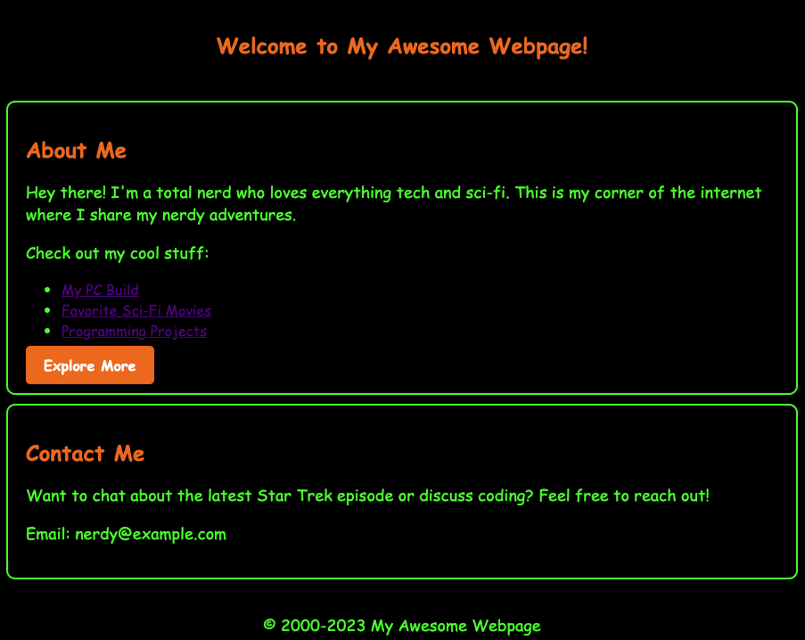

## Day 1: HTML Basics

It's the early 2000s. You're listening to [Super Bon Bon](https://www.youtube.com/watch?v=TRqP52c0OLU) blasting at full volume from your speakers.

There are no social media, no reels, shorts, or similar nonsense. You're feeling bored.

You boot up your Debian 2.2, Potato version, computer. That computer makes a deafening noise, so you decide to turn up the music.

But the speakers are already at full volume. Compulsive Amazon shopping doesn't exist yet; you can't go to that site and buy more powerful speakers.

After 5 minutes, your Debian system has finished bootstrapping, and you can start.

Start doing what? You don't have a goal.

You simply type into the terminal.

``` vi index.html ```

And you begin to write something about yourself within that page.

YouTube doesn't exist, the web isn't filled with documentation. Searching for information is a pain.

After hours spent editing that file, you finally achieve the homepage of your website.

A simple HTML file, something like this:


```
<!DOCTYPE html>
<html lang="en">
<head>
    <meta charset="UTF-8">
    <meta name="viewport" content="width=device-width, initial-scale=1.0">
    <title>My Awesome 2000s Webpage</title>
    <style>
        body {
            background-color: #000;
            color: #00FF00;
            font-family: 'Comic Sans MS', cursive, sans-serif;
            text-align: center;
            margin: 0;
            padding: 0;
        }

        #header {
            background-color: #000;
            color: #00FF00;
            padding: 20px;
        }

        .container {
            background-color: #000;
            color: #00FF00;
            text-align: left;
            padding: 20px;
            border: 2px solid #00FF00;
            border-radius: 10px;
            margin: 10px;
        }

        h1 {
            color: #FF6600;
            font-size: 24px;
        }

        p {
            font-size: 18px;
        }

        .button {
            background-color: #FF6600;
            color: #FFF;
            padding: 10px 20px;
            text-decoration: none;
            border-radius: 5px;
            font-weight: bold;
        }

        .button:hover {
            background-color: #FF3300;
        }

        .footer {
            background-color: #000;
            color: #00FF00;
            padding: 10px;
            text-align: center;
        }
    </style>
</head>
<body>
    <div id="header">
        <h1>Welcome to My Awesome Webpage!</h1>
    </div>
    <div class="container">
        <h1>About Me</h1>
        <p>Hey there! I'm a total nerd who loves everything tech and sci-fi. This is my corner of the internet where I share my nerdy adventures.</p>
        <p>Check out my cool stuff:</p>
        <ul>
            <li><a href="#">My PC Build</a></li>
            <li><a href="#">About me</a></li>
            <li><a href="#">Programming Projects</a></li>
        </ul>
        <a href="#" class="button">Explore More</a>
    </div>
    <div class="container">
        <h1>Contact Me</h1>
        <p>Want to chat about the latest Star Trek episode or discuss coding? Feel free to reach out!</p>
        <p>Email: nerdy@example.com</p>
    </div>
    <div class="footer">
        <p>&copy; 2000-2023 My Awesome Webpage</p>
    </div>
</body>
</html>
```

You manage to view it from your computer, and it has taken you almost the entire afternoon.

This is just a file on your hard disk; there are no version control systems to push it to. It lives there, locally.

You are ecstatic, and FOMO isn't gnawing at you. FOMO doesn't even exist. It's time to close everything.

___

## Day 2: Trying to understand what a web server is

It's been a week since you edited that .html file. You bought a magazine at a store near your house, which explains how to make your website accessible to your friends from anywhere in the world.

The guide mentions that you need a web server, and there's one called Apache. Your thoughts are muddled, and you're not sure where to start. You keep reading, but you don't quite grasp the purpose of all this stuff. It's an unproductive day, so you decide to leave it for now.

___

## Day 3: Webserver I got you!

While chatting with your friend about the HTML page you wrote, you discover that he has also created one. As you talk, it becomes apparent that he has a better understanding of what a web server is, and he offers to explain it to you at your home that afternoon.

He explains:

"A web server is software that manages requests and responses between clients and servers on the Internet. Its main function is to distribute web pages and other web content to users who request them through their web browsers. Here's how a web server works:

Receiving Requests: When a user enters a URL (Uniform Resource Locator) into their web browser and hits Enter, the browser sends an HTTP (Hypertext Transfer Protocol) request to the corresponding web server to fetch the web page associated with the URL. The HTTP request contains information about what the user is looking for and how the server should respond.

Request Processing: The web server receives the HTTP request and begins processing it. This may involve checking the requested URL, verifying access permissions, managing user sessions, and other operations necessary to fulfill the request.

Data Retrieval: If the request requires access to files, such as HTML pages, images, style sheets, or other multimedia content, the web server retrieves this data from its storage or server file systems.

Response Generation: Once the requested data is obtained, the web server generates an HTTP response that includes the data and header information. The header information contains metadata about the response, such as content type, creation date, content length, and more.

Sending the Response: The web server sends the HTTP response to the user's browser over the Internet. The browser receives the response and interprets it to display the requested web page or content."

Now things seem much clearer to you. Your friend even draws a diagram:


Your thoughts are starting to come together; you're understanding how to set up your first website.

Both you and your friend want to delve deeper into how a web server works and begin reading that magazine.

You discover exactly what happens when you make a request to a web server:

You find out that when you make a GET request to the server, you are using the HTTP protocol. Besides GET, you learn that there are other calls known as methods: DELETE, POST, PUT, HEAD, CONNECT, PATCH, TRACE, OPTIONS. You are a bit confused about these methods, but you are clear that you will mainly use GET and POST.

You discover that the HTTP protocol operates "on top" of another protocol called TCP (Transmission Control Protocol). Apparently, TCP allows clients and servers to establish a bidirectional connection.

So, the first thing that happens when you make a GET call to get your index is not an immediate response from the server. First, a TCP connection is established between the client and server. When this TCP connection is established, the server reserves a tiny portion of its memory to create a TCP socket for the client that made the request.

Once a socket is obtained on the server, you have a thread, and this thread will handle your request. Requests can be processed one at a time.

If both friends were to connect to the same server, making the same request, the web server would reserve two TCP sockets for them, handling the requests one at a time but not simultaneously.

Okay, to showcase your website to the world, you need a web server, and you have a rough understanding of how it works. It's time to install it!

You find a guide on how to install Apache, which seems like a good solution to your problem.

Finally, you have your web server up and running.

Now, all that's left is to configure it.

This is the configuration file.

```
DefaultRuntimeDir ${APACHE_RUN_DIR}
PidFile ${APACHE_PID_FILE}
Timeout 300
KeepAlive On
MaxKeepAliveRequests 100
KeepAliveTimeout 5
User ${APACHE_RUN_USER}
Group ${APACHE_RUN_GROUP}
HostnameLookups Off
ErrorLog ${APACHE_LOG_DIR}/error.log
LogLevel warn
IncludeOptional mods-enabled/*.load
IncludeOptional mods-enabled/*.conf
Include ports.conf
<Directory />
        Options FollowSymLinks
        AllowOverride None
        Require all denied
</Directory>

<Directory /usr/share>
        AllowOverride None
        Require all granted
</Directory>

<Directory /var/www/>
        Options Indexes FollowSymLinks
        AllowOverride None
        Require all granted
</Directory>
AccessFileName .htaccess
<FilesMatch "^\.ht">
        Require all denied
</FilesMatch>

LogFormat "%v:%p %h %l %u %t "%r" %>s %O "%{Referer}i" "%{User-Agent}i"" vhost_combined
LogFormat "%h %l %u %t "%r" %>s %O "%{Referer}i" "%{User-Agent}i"" combined
LogFormat "%h %l %u %t "%r" %>s %O" common
LogFormat "%{Referer}i -> %U" referer
LogFormat "%{User-agent}i" agent

IncludeOptional conf-enabled/*.conf
IncludeOptional sites-enabled/*.conf
```

Now, all that's left is to make the first GET request to your website. But to whom should you make it? You don't have a DNS yet.

You discover the existence of localhost. The loopback interface is associated with the IP address 127.0.0.1. This IP address is reserved for loopback testing and is commonly used to access services running on the local machine.

Here you go, you type into your browser's address bar:

http://localhost:80

Yes, you even add the port because you don't know that the default call would have been made to port 80 in HTTP.

You see it.

At this point, only you and your friend can view the site. But you want to share the work you've done with others.
___

## Day 4: First encounter with FTP

You discuss what you've done with an older friend who attends university. He has access to more powerful hardware and a better understanding of computer networks than you do.

He explains that to make your website accessible from the outside, you need to expose it on the Internet, and to be seen on the Internet, you need a public IP address.

In his department, he has something that might be useful for your case: an FTP server that also serves as a web server.

He explains that you can upload the index.html file to the university's server via FTP, and then he will take care of exposing it on the Internet using the web server and one of the university's public IP addresses.

FTP? Public IP addresses? What is he talking about?

He tells you not to worry and that all he needs is your index file inside the university's server.

He provides you with credentials to access the FTP server and explains how to upload the file via FTP.

It seems simple; you just need an FTP client on your computer and to type

```ftp 1.1.1.1```

in your terminal and

```put index.html```

to upload your file to the server.

In a couple of days, you can visit the public IP address he provided to view your web page from your home.

## DAY 5: Discovering TCP/IP

Full of hope, you make a GET request to the public IP address of the FTP server your friend provided. However, you receive no response, and you begin to think you've done something wrong. You log in to FTP again and notice that your index.html file is still where you left it.

In the meantime, you've purchased another magazine that covers computer network topics, and you find some notes that immediately catch your attention: "FTP and HTTP are application layer protocols." FTP and HTTP are the same protocols you encountered during your adventurous journey to expose your web server! You decide to delve deeper and continue reading.

You discover that there are two reference models for computer networks:

ISO/OSI, composed of 7 layers, more theoretical.

TCP/IP, composed of 4 layers, more practical.

You decide to further explore the TCP/IP model.

The layers involved are (from bottom to top):

- Layer 1 Physical: Manages the physical infrastructure that allows computers to communicate with each other on the Internet. It applies to Ethernet cables, wireless networks, network interface cards, drivers in computers, and so on. The network access layer also includes technical infrastructure, like the code that converts digital data into transmittable signals, enabling network connectivity. You think of something related to this layer, like Ethernet cables, for example.

- Layer 2 Network: Controls the flow and routing of traffic to ensure that data is sent quickly and accurately. This layer is also responsible for reassembling data packets at their destination. In cases of heavy traffic, the Internet layer might take longer to send a file but with a lower likelihood of damaging it.

- Layer 3 Transport: The transport layer enables reliable data connections between two communicating devices. It's like sending a secure package: the transport layer breaks down data into packets, acknowledges received packets from the sender, and ensures the receiver acknowledges the received packets.

- Layer 4 Application: It consists of the group of applications that allow users to access the network. For the most part, this translates into email, messaging apps, and cloud storage programs. It's essentially what the end user sees and interacts with while sending and receiving data.

There's also a helpful diagram that makes it easier to understand the actors involved in the TCP/IP model.


## DAY 6: Your Website Is Online!

You make another GET request to the public IP address your friend provided. This request bounces from router to router until you finally receive a response.

There it is. It's your website: 




It took a week, three people, two magazines, and a bit of university hardware were involved, but it was absolutely worth it. You don't have your own domain yet, but you'll work on that. For now, it's just fine.

You organize your thoughts on all the knowledge you've gained from a simple project that saw you self-hosting your website. You've learned a lot, and you think it would be really cool to do this for a living when you grow up.

