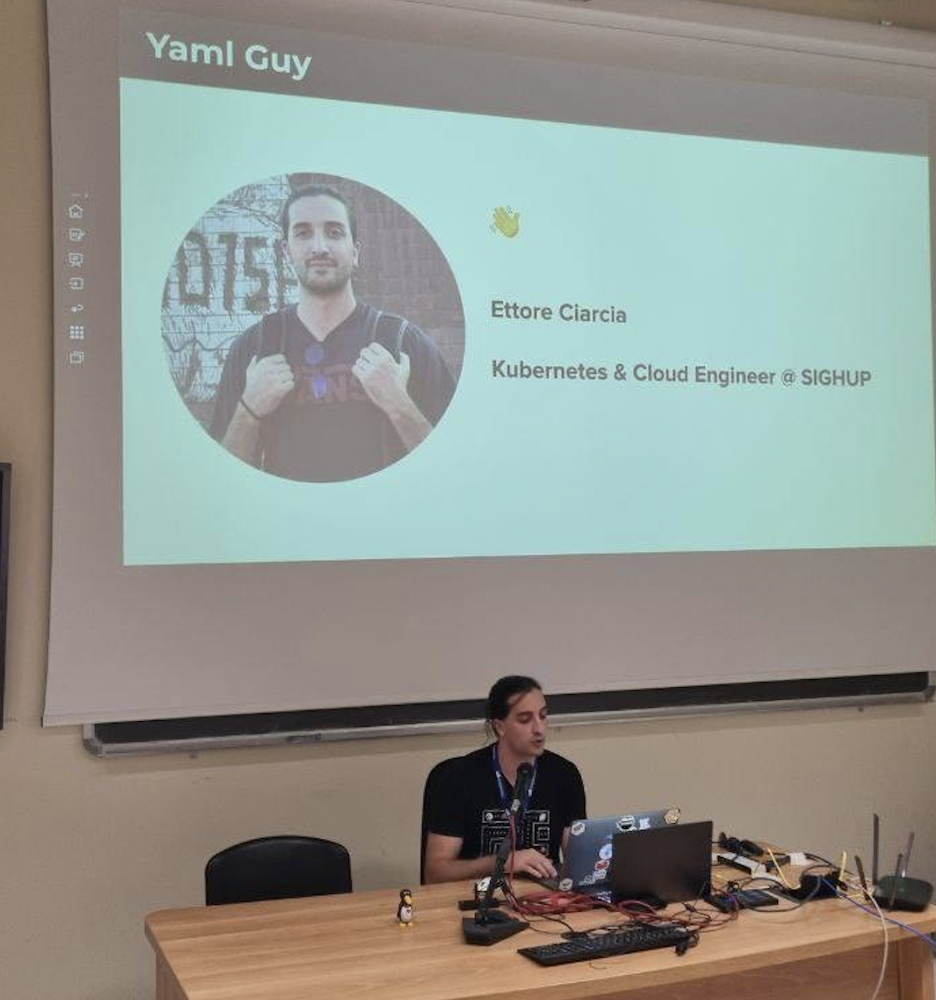
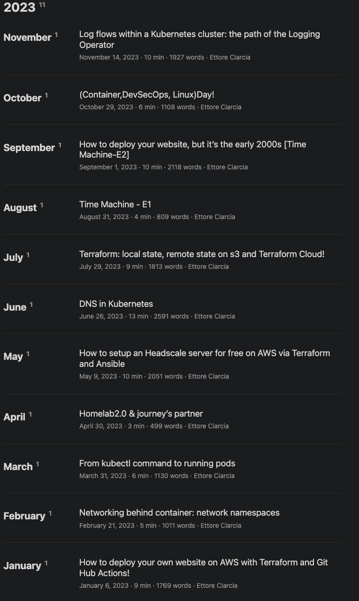

## Let's recap!

The year 2023 has been a very intense year for me. I wouldn't even know where to begin to take stock of the situation; so many things have happened.

Let's start from the beginning!

At the end of 2022, I wrote my first post on this blog. You can find it [here](https://ettoreciarcia.com/posts/00-retrospective-resolutions/). Shortly after, I set up all the automations following the DevOps philosophy to automate as much as possible the builds and releases of the website.

In the article, I talked about the goals I had set for 2022 and outlined the new objectives for 2023.

## What were the goals that I had set to achieve for 2023?

### I want to continue working on the technologies that interest me, trying to go deeper and deeper

I've learned some Golang, set up a few pipelines, but I haven't written my first Kubernetes operator yet 😥

### Certifications

For 2023, I had decided to pursue the following certifications:

1. Certified Kubernetes Administrator [DONE]
2. AWS DevOps Professional (Ended up taking the AWS Solution Architect Associate) [DONE]
3. Terraform Associate Certification [DONE]"

<!--  -->

### Events

One of the goals for 2023 was to participate in more events

Sono stato presente a:

1. AWS Immersion Webinar (Epsilon S.r.l.) as a speaker, where I presented a [talk on Elastic Kubernetes Service](https://www.youtube.com/watch?v=9oAn1c9I078&t=5543s) (30/03/2023).
2. [Golang Meetup Napoli](https://community.cncf.io/events/details/cncf-napoli-presents-how-to-extend-kubernetes-please-welcome-the-operator-pattern/) as an attendee, enjoying a talk on Kubernetes operators by Paolo Patierno and Domenico Francesco Buscino
3. [Kubernetes Community Day Italy](https://community.cncf.io/events/details/cncf-kcd-italy-presents-kubernetes-community-days-italy-2023/) as an attendee.
4. ContainerDay as an attendee.
5. DevSecOps Day as an attendee.
6. Linux Day as a speaker, presenting [a talk titled [Kubernetes, Kubernauts, and Kubeinvaders](https://www.youtube.com/watch?v=1tHkEfbGjgE&t=655s)

### Blog

One of the goals for 2023 was to publish one article per month on this blog. This goal was also achieved, but it took a lot of effort to deliver an article each month. Here is a list of all the articles written in 2023

You can find the complete list at this [link](https://ettoreciarcia.com/archives/)

### Workout

One of the resolutions for 2023 was to resume training after the shoulder injury at the end of 2022. I recovered from that injury in early April and started working out whenever I could. I won't share the typical 'before' and 'after' photos because I'm embarrassed, but I'll try to provide some numbers from the measurements taken by the nutritionist guiding me in this journey

| Date       | Weight (kg)   | Lean Mass (kg) | Lean Mass (%) | Fat Mass (kg) | Fat Mass (%) | Muscle Mass (kg) |
|------------|--------|------------------|-----------------|-------------------|------------------|-----------------------|
| 31/05/2023 | 77,2   | 66,8             | 86,5            | 10,4              | 13,5             | 36,43                 |
| 25/07/2023 | 78,3   | 69,1             | 88,3            | 9,2               | 11,7             | 38,60                 |
| 03/10/2023 | 79,1   | 72,1             | 91,2            | 7,0               | 8,8              | 41,55                 |

I achieved these results without obsessively adhering to the diet and working out when I could. From October onwards, it was really challenging to find time for workouts. Unfortunately, I couldn't take additional measurements for 2023. It would have been nice to do another one in December to see the improvements in the last two months

## Some considerations for 2023

In April 2023, I changed jobs, leaving Epsilon and joining SIGHUP with the goal of gaining more skills in Kubernetes.

Additionally, in 2023, I had the opportunity to participate in some unexpected activities:

1. Joined the SIGHUP On-Call Team: I became part of the on-call team at SIGHUP. Certain critical clients have the option to contact us by phone at any time if something goes wrong. This activity is well-organized, and I am on call for one week per month. Every time a call is received, there is an opportunity to learn something new that goes beyond the technical aspect. A valuable lesson I take away from this activity is: "The day after the incident is more important than the day of the incident. Incidents can happen, but it's how you manage them that makes a difference."

2. Observed an Entire Platform for a Live Streaming Service: I had the chance to see a platform for a live streaming service that achieved numbers I had never seen before. Regarding this experience, I don't have much to say other than I would love to do something similar when I grow up.

## Goals for 2024

### I want to continue exploring Kubernetes and the technologies within the CNCF landscape

Kubernetes is one of those topics where the more I study, the more I feel ignorant. "The broader my expertise in Kubernetes, the larger the perimeter of ignorance about Kubernetes."

While Kubernetes stands as the flagship project of the CNCF, it would be "only" an orchestrator without the CNCF tools that revolve around it.

Here, I venture a prediction: the market surrounding CNCF services will continue to grow in 2024, and some of the early cloud adopters will start bringing back some workloads on-premise to reduce the bills they pay to cloud providers. They will do so by either building their own platforms or relying on platforms constructed by others that can be hosted in their data centers

### Certifications

The certifications I have targeted for this 2024 are

- Certified Kubernetes Security Specialist (CKS)

- Certified Kubernetes Developer (CKD)

- Prometheus Certified Associate (PCA)

### Talks and Events

An event I don't want to miss is the Linux Day in Benevento 2024. I'm uncertain about other events where I'll participate as a speaker or attendee. One thing I would like to do this year is to prepare a talk with a friend!

### Articles on this blog for 2024

Unlike the previous year, I would like to write shorter articles that solve specific use cases, providing readers with more numbers and benchmarks. In essence, I want the reader to take away something tangible from the reading.

### Workout

Here I commit myself; the results I aim to achieve in 2024 are as follows:

| Date       | Weight (kg)   | Lean Mass (kg) | Lean Mass (%) | Fat Mass (kg) | Fat Mass (%) | Muscle Mass (kg) |
|------------|--------|------------------|-----------------|-------------------|------------------|-----------------------|
| 31/12/2024 | 85     | 79               | 86,5            | 7,0               | 7                | 49                    |

Another athletic goal I set for myself is to become more flexible and agile to prevent injuries.

## Conclusions 

In conclusion, 2023 has been a year filled with challenges and successes. I achieved my certification goals, participated in significant events, and embraced new opportunities in my professional journey. The job transition to SIGHUP was a pivotal step in deepening my expertise in Kubernetes, and unexpected activities, such as joining the on-call team, enriched my experience.

For 2024, I aim to further explore CNCF technologies, attend crucial events and prepare engaging talks with friends. 

The goal is also to write more focused articles on use cases, providing readers with meaningful numbers and benchmarks. 

And let's hope that this is the year of Linux on the Desktop
