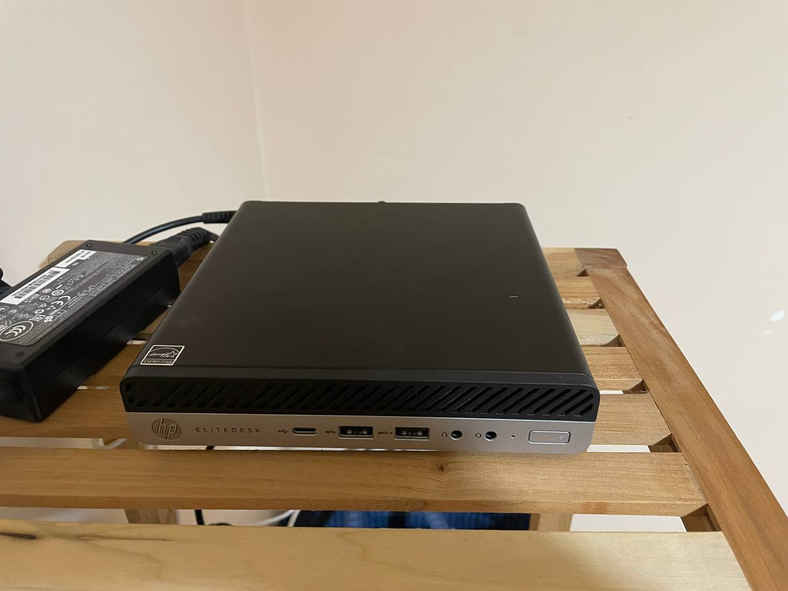
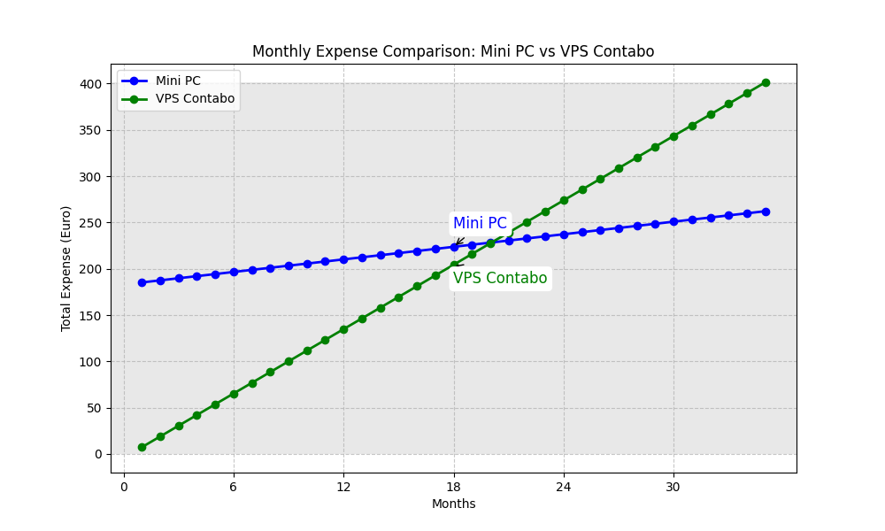

## 0 Intro

A few days ago, the first component of my new homelab arrived. I already had a makeshift homelab set up with mostly old laptops that I no longer used.

However, after spending countless hours on subreddits like [r/homelab](https://www.reddit.com/r/homelab/) or [r/HomeLabPorn](https://www.reddit.com/r/HomeLabPorn/), among many others, the homelab bug got to me, and I decided to build a new one.

For months, I searched for the perfect hardware on numerous websites, and it was genuinely challenging to choose from all those fantastic components. In the end, I realized that the perfect homelab for me should be modular, quiet, and not consume too much power.

Let me explain further:

- **Modularity**: I want my homelab to grow over time based on my needs. I don't want to be stuck with hardware that has performance I don't need. If necessary, I'll expand it gradually.

- **Noise**: This is a factor that many overlook. It's often underestimated by those who have never been close to a running server. Servers can be loud, very loud. For example, I've seen many discussions on homelab forums about servers like the Dell R630 or similar models. Just to give you an idea, this is the noise a Dell R630 makes when powered on (100% fan): [LISTEEEEN](https://youtu.be/N1NgS-V7KUw?t=648)

- **Power Consumption**: My homelab needs to run 24/7, and I don't want to have to sell a kidney to cover the electricity bill. 

The first component was an HP EliteDesk 705 G4 mini PC purchased on eBay, and here is this gem:




For 185 euros, I managed to bring home (actually had it shipped from Germany) a nice mini PC with very low power consumption, featuring the following specifications:

- CPU AMD Ryzen 5 PRO 2400GE (3,20 GHz, 8vCPU)
- 32 GB RAM
- 256 GB SSD

The most significant limitation of my small homelab at the moment is the storage capacity, but for less than 200 euros, I doubt I could have found anything better. As I mentioned, this is just the first component. When I exhaust the resources hosting things on this little server, I'll get more. And when I want to have some fun at the network level, I'll buy a few mini PCs to install PfSense, just to have it all.

For now, the idea is to set up a Kubernetes cluster in my homelab and start running some services on it. Then, I'll establish a VPN server, a DNS server, an internal Git, and pipelines.

I would like to have an entire platform by the end of the year (an ambitious goal, I know).

Enough talking for now, or we'll waste CPU clock cycles; let's start virtualizing!

## 1 Hypervisor

Having chosen the mini-server, I needed a hypervisor that would allow me to virtualize the hardware I had just purchased.

The hypervisor needed to meet the following requirements:

- Be open source
- Have a Terraform-supported provider for VM creation
- Support the clustering of different nodes (for the modularity aspect I mentioned earlier)

### Proxmox VE

Proxmox Virtual Environment (Proxmox VE) is an open-source virtualization solution that integrates the KVM hypervisor, LXC containers, storage functionality, and networking into a single platform.

- Open source
- No license required
- Requires modest resources
- Supports clustering
- No CAPI provider (or at least not at the time of writing this article)

In the end, the choice fell on Proxmox, even though I was on the verge of scrapping everything and opting for ESXi just to have the option of creating clusters with CAPI.


## 2 How I install Proxmox on my mini server

I created a bootable USB stick for Proxmox using [Ventoy](https://www.ventoy.net/en/index.html) and installed it on the mini-server. Done.

A small tip that might save you a lot of time: in the end, I used a slightly older version of Proxmox due to a compatibility issue between the Proxmox provider for Terraform and the latest Proxmox versions.

The problem is documented in the GitHub issues, which you can find here -> [Error: The terraform-provider-proxmox_v2.9.14 plugin crashed! (Proxmox 8.0.4 latest update) #863](https://github.com/Telmate/terraform-provider-proxmox/issues/863) :cry:

I attempted to resolve the issue using other providers recommended by the community, but I had no luck with any of them. In the end, I opted for Proxmox version 7.4, which doesn't present significant issues with the Terraform Telmate provider.

## 3 Proxmox Template

In Proxmox Virtual Environment (Proxmox VE), templates are pre-configured images of operating systems or applications that can be used to quickly create new virtual machines (VMs). These templates simplify the VM deployment process, allowing users to avoid installing an operating system from scratch or manually configuring basic settings.

In my case, I created two templates:

Based on the Rocky Linux 9.3 image
Based on the Ubuntu 22.03 image
The template creation process seemed too prone to errors for my liking; I hadn't clicked so much in an interface since 2019.

If you're unsure where to start with templates in Proxmox, I recommend this [video](https://www.youtube.com/watch?v=MJgIm03Jxdo), where a template is created from scratch using an image with Cloud Init.

## Enable SSL on the Proxmox node

Don't you find it a bit annoying that the connection to Proxmox is not secure?

At this point, we can follow two paths to enable SSL on Proxmox:

1. Generate a self-signed SSL certificate from our internal CA and import the certificate into our browser to access Proxmox via HTTPS
2. Obtain a certificate signed by a public CA

Here, I'll demonstrate the second approach. In my case, with the domain ```ettoreciarcia.com``` registered on Route53, it's straightforward because Proxmox has a plugin for Route53.

All I did was create a new user in my AWS account, to which I associated the following policy:

```json
{
    "Version": "2012-10-17",
    "Statement": [
        {
            "Effect": "Allow",
            "Action": "route53:GetChange",
            "Resource": "arn:aws:route53:::change/*"
        },
        {
            "Effect": "Allow",
            "Action": [
                "route53:ChangeResourceRecordSets",
                "route53:ListResourceRecordSets"
            ],
            "Resource": "arn:aws:route53:::hostedzone/<HOSTED_ZONE_ID"
        },
        {
            "Effect": "Allow",
            "Action": "route53:ListHostedZonesByName",
            "Resource": "*"
        },
        {
            "Effect": "Allow",
            "Action": "route53:ListHostedZones",
            "Resource": "*"
        }
    ]
}
```

Remember to modify the variable HOSTED_ZONE_ID!

So, I created a new user with this policy associated, then generated credentials for programmatic access (AWS_ACCESS_KEY_ID, AWS_SECRET_ACCESS_KEY)

Having done this, the next step is to move to our Proxmox server and select the ACME option to create a user and configure the right plugin from the DNS API list (there are many; if your domain is registered with a different registrar, ensure that the plugin is available).

Once the plugin is configured, go to the node you want to access via HTTPS and navigate to System -> Certificates. Choose DNS as the Challenge and enter the domain for which you are obtaining the certificate (in my case, proxmox.internal.ettoreciarccia.com).

That's it!


## 5 Terraform code

### 5.1 Let's clarify what we aim to create

Before diving into the Terraform code, let's clarify the architecture we are going to create.

The first guest in my homelab will be a Kubernetes cluster, so I need virtual machines to host the control plane, workers, and load balancers. Specifically:

- x3 control planes
- x3 workers
- x2 HA-proxy

The architecture we aim to achieve looks like this


This configuration may change in the future. I would like to deprecate the creation of nodes done via Terraform for Kubernetes clusters in favor of Cluster API. However, at the moment, I have not been able to set up a fully functional cluster using the two Cluster API providers for Proxmox that I have found


Once we have created our virtual machines, we can use an Ansible playbook (such as [Kubespray](https://github.com/kubernetes-sigs/kubespray)) to install our preferred Kubernetes distribution. As I mentioned, I am not a fan of this approach and Ansible in general. I will try to steer away from VM configuration via Ansible as soon as possible.

### 5.2 Remote state on S3 and locking with DynamoDB

For this project, I will be working alone, but I still want to simulate an environment as close as possible to what I would set up if the infrastructure were critical, especially when the cost of doing so is very close to free.

I don't want the state of my Terraform code to reside in the repository; I prefer to have it on an S3 bucket in the cloud. And while we're at it, let's also add state locking through a DynamoDB Table.

Here is the Terraform code to configure remote state and locking with DynamoDB:

```HCL
terraform {

  required_version = ">= 0.13"
  required_providers {
    proxmox = {
      source  = "Telmate/proxmox"
      version = "2.9.14"
    }

  }


  backend "s3" {
    bucket = "terraform-state-project-ciarcia"
    key    = "internal-proxmox.tfstate"
    region = "eu-west-1"
    dynamodb_table = "terraformstate_lock_internal"
  }
}
```

To interact with the DynamoDB table and S3 bucket, we need a policy that grants the necessary permissions (please, avoid using Administrator Access). 

The policy is as follows:

```json
{
    "Version": "2012-10-17",
    "Statement": [
      {
        "Effect": "Allow",
        "Action": "s3:ListBucket",
        "Resource": "arn:aws:s3:::${STATE_BUCKET}"
      },
      {
        "Effect": "Allow",
        "Action": ["s3:GetObject", "s3:PutObject", "s3:DeleteObject"],
        "Resource": "arn:aws:s3:::${PATH_TO_YOUR_KEY}"
      },
      {
        "Effect": "Allow",
        "Action": [
          "dynamodb:DescribeTable",
          "dynamodb:GetItem",
          "dynamodb:PutItem",
          "dynamodb:DeleteItem"
        ],
        "Resource": "arn:aws:dynamodb:*:*:table/${DYNAMODB_TABLE}"
      }
      
    ]
  }
```


Remember to properly populate the values:

- STATE_BUCKET
- PATH_TO_YOUR_KEY
- DYNAMODB_TABLE

Once you have created the policy, all that's left is to associate it with an account and then create an access key for programmatic access!

### 5.3 Managing secrets and environment variables

But what are the secrets for this Terraform project? For now, we are simply creating virtual machines that don't have a password; access is provided through SSH.

The SSH key is not in the Terraform project; it was added during the template creation phase with Cloud Init for Rocky Linux 9.

The other credentials we need to be concerned about are those used to connect the Terraform provider to the Proxmox APIs. On this, I'd like to share a few thoughts.

I've seen many configurations where people put the credentials directly into the Terraform code. I understand that it might be convenient for a repository that only you have access to, but it's still not a good practice. And I want this homelab to be a little gem, so let's do things properly!

The secrets we need to protect for interacting with Proxmox are as follows:

- PM_API_TOKEN_ID
- PM_API_TOKEN_SECRET

Quelli che invece dobbiamo proteggere per l'account AWS sono 

- AWS_ACCESS_KEY_ID
- AWS_SECRET_ACCESS_KEY

How do we protect the secrets? By default, we don't push them to a version control system (VCS), or if we absolutely must, we should push them in a way that makes them unreadable for unauthorized users.

In this case, I created a file called  ```.envrc``` and I'm using the [direnv](https://direnv.net) project, which automatically loads the environment variables from this file when I navigate to the project folder.

To prevent these secrets from being accidentally pushed to Git, I added the ```.envrc``` file to the project's ```.gitignore```

### 5.4 Terraform Code

The Terraform code used for provisioning the architecture I mentioned earlier can be found at this [link](https://github.com/ettoreciarcia/homelab3.0/releases/tag/v0.0.1)


I preferred creating separate modules for each virtual machine I will host to reduce the number of lines of HCL I have to write. This made the configuration less flexible, but in case I need a customized VM, I would write ad hoc HCL code for that VM.

Let’s initialize our project as usual:

```bash
terraform init
``` 

and proceed with the plan

```bash
terraform fmt && terraform validate && terraform plan -out=terraform.plan
``` 

Then apply our changes

```bash
terraform apply
``` 


If you are a fan of Makefiles, in the Terraform project, you will find one to execute these commands. :heart:

Regarding the assignment of IP addresses to virtual machines, I am currently assigning them in the Terraform code and have not made them configurable (I will do so in the future).

I am not entirely satisfied with this configuration for two reasons:

The homelab VMs are on the same network as my LAN.
After each apply, I have to print the Terraform output to properly configure records in my DNS server.
I would like to automate this part in the future; perhaps I can find a DNS server that supports creating records through API calls. In that case, I might no longer hardcode the IP addresses in the HCL code but use automation that takes the output and creates the correct records so that they can be resolved within my local network.

To retrieve the output of the just-created resources, you can use the command:

```bash 
terraform output
``` 

And there we go, we're done!

In Proxmox, we will have our beautiful virtual machines.


The creation of these resources will change in the future, and everything will be managed by a pipeline. I am following the philosophy of 'make it work, then make it beautiful' :heart:


## 6 Cost

Let's talk about money! Recently, the costs of all VPSs in the Cloud have increased. One of the best deals I found was the one on Contabo, which offered a VPS with 6 vCPU, 16 GB RAM, 400 GB of storage, and a public IP address for a modest amount of 11.60 euros, including VAT. However, for the first month, I would have to pay a setup fee of 7.32 euros.

The annual cost for such a VPS is 18.91 euros for the first month and 11.59 euros per month for the following eleven months, totaling 146.4 euros.

The mini PC I purchased cost me 183 euros, including shipping fees, but we also need to consider operational costs (electricity, potential maintenance).

If you want to skip reading everything that follows, I'll try to summarize it below with a table:

| Specs            | Mini PC                      | VPS Contabo                   |
|-----------------------------|------------------------------|-------------------------------|
| RAM                         | 32 GB                        | 16 GB                         |
| vCPU                        | 8                            | 6                             |
| Storage                       | 256 GB                       | 400 GB                        |
| Upfront Cost(Euro)        | 183                          | 7.32                          |
| Monthly Cost(Euro)        | 2.26                         | 11.50                         |


### 6.1 Detailed costs

I tracked the kilowatt-hours (kWh) with a power consumption meter, and the result after 24 hours and 40 minutes was 0.407 kWh.


For simplicity, we will round the hours to 24 to obtain daily consumption with a 5% error. If we want to be precise, we should calculate the consumption per minute and see how much we consumed in 24 hours. Are we being meticulous? Yes, we are being meticulous.

0,407 KWH / (60min*24)+41min => 0,407KWh/1481 min =>  0,00027 for minute 


To calculate daily consumption, we multiply the obtained value by the number of minutes in a day, which we know is 1440:

1440min * 0,00027KWh = 0,389 KWh (daily consumption)

In a month, we consume

0,389 KWh * 30 days = 11,67 KWh

The cost of 1 KWh on my utility bill is 0.194 euros, so the monthly cost of the mini PC in terms of power consumption is approximately 2.26 euros.

Let's plot two graphs to visualize the expenses of the mini PC and a VPS from Contabo. Considering the Y-axis as the total expense and the X-axis as the months.

The function describing the trend of expenses for the mini PC is as follows:

```g(x) = 183 + 2.26x```

The one describing the trend of expenses for the VPS on Contabo is:

```h(x)= 7.32 + 11.59x```




(Chart created in Python using the matplotlib and numpy libraries.")

If I use the mini PC for more than 18.5 months, the expense I made will be a smart investment.

The calculations I made do not take into account any potential increases in electricity costs, increases in the VPS's cost, or potential failures of the mini PC. And let's remember that in this comparison, we are comparing two servers with different hardware.

I hope the mini PC doesn't fail before 18 months! :skull:


## 7 Conclusions 


In this article, we've seen how to create virtual machines on Proxmox using Terraform as an Infrastructure as Code (IaC) tool. I would have liked to cover many other topics while writing this article, but I'll leave them for the future.

Once we've created the VMs to host Kubernetes, the next step is to configure those nodes, and then we'll have our Kubernetes-compatible APIs ready for all the configurations we might need. Perhaps that will be the topic of the next article!

We can even create other Kubernetes clusters within our Kubernetes cluster, but to do that, we need a Kubernetes cluster that wasn't created on a Kubernetes cluster because it lacks the Kubernetes cluster needed to create it. Confusing, isn't it?


If these were your first steps with Proxmox, I hope the article was comprehensive. In case you encounter any issues, feel free to reach out to me via email or LinkedIn. I'll be happy to help you! :smile:

## 8 Useful Links

- [Proxmox: Trusted certificates via Let’s Encrypt (ACME)](https://pve.proxmox.com/wiki/Certificate_Management)

- [Create a template in Promox](https://www.youtube.com/watch?v=MJgIm03Jxdo)

- [Mini PC Specs](https://support.hp.com/it-it/document/c06119996)

- [Bootable USB Solution: Ventoy](https://www.ventoy.net/en/index.html)