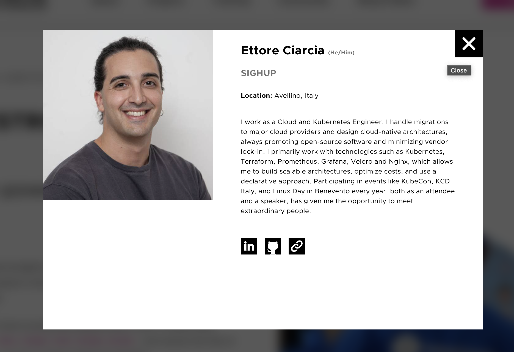

## 0 Premise

{}
Talking about certifications in this field is always very divisive.
So, let me start with a premise: certifications do not make someone a guru. I know highly skilled people who don’t have a single certification, and people who don’t even know how to write in a terminal who have many certifications.
{}


## 1 Kubestronaut? What the heck is that?

It's a recognition from the CNCF for those who successfully obtain all Kubernetes-related certifications ([CKA](https://training.linuxfoundation.org/certification/certified-kubernetes-administrator-cka/), [CKAD](https://training.linuxfoundation.org/certification/certified-kubernetes-application-developer-ckad/), [CKS](https://training.linuxfoundation.org/certification/certified-kubernetes-security-specialist/), [KCNA](https://training.linuxfoundation.org/certification/kubernetes-cloud-native-associate/), [KCSA](https://training.linuxfoundation.org/certification/kubernetes-and-cloud-native-security-associate-kcsa/)).

In my case, I achieved it on July 16th. My face is even on the [CNCF website](https://www.cncf.io/training/kubestronaut/?_sft_lf-country=it&p=ettore-ciarcia) now



## 2 Benefits

Below are the benefits for Kubestronauts:

1. An exclusive Kubestronaut hoodie (it's really cool, check it out at this [link](https://www.cncf.io/training/kubestronaut/))

2. The Kubestronaut Credly badge

3. Access to a private Slack channel and mailing list

4. A coupon for 50% off Linux Foundation certifications every year

5. A 25% discount for three CNCF events per year. (This might seem like a small discount, but tickets for KubeCon Paris in 2024 cost around 500 euros, so you could save about 125 euros with this discount)

## 3 My starting point


When the Kubestronaut program was announced at KubeCon Paris in 2024, the only certification I had was the CKA, which I obtained in April 2023. So, I needed four more certifications to complete them all.

I have about 3 years of experience with Kubernetes, so I wasn't starting from scratch.

## 4 Study Material

Preparation for becoming a Kubestronaut can vary based on your experience with Kubernetes. In my case, I already had substantial experience using Kubernetes, so I focused on studying the topics I hadn’t encountered before to prepare for the CKS and completed the relevant sessions on killer.sh for each exam.

Whenever you purchase a Kubernetes certification from the Linux Foundation website, you gain access to two free labs on killer.sh, which allow you to practice before the exam. I find these practice sessions essential, especially for familiarizing yourself with the environment you’ll use during the certification.

Additionally, for each certification purchased, you are entitled to a free retake.

### 4.1 Courses and simulations I recommend

I haven't personally completed these courses in their entirety. I only looked at some topics I wasn’t familiar with while preparing for the CKS. However, they seemed very valuable:

1. The courses by [Mumshad Mannambeth](https://www.udemy.com/user/mumshad-mannambeth/). You can find them on both KodeKloud and Udemy.

2. Complete the practice exams on [killer.sh](killer.sh) that are provided with the purchase of the certification

3. Complete the scenarios on [KillerCoda](https://killercoda.com/). There are about 200 scenarios you can use to practice before the certification.

## 4 My experience with PSI Secure Browser and environment checks

When you schedule your certification, you'll have the option to choose a time slot. There must be at least 24 hours between scheduling the exam and taking it, you cannot book an exam in the evening for the following morning.

On the day of the exam, you'll go to your Linux Portal and click on "Take Exam," which will initiate the download of the PSI Secure Browser. In the following minutes, you'll upload your identification documents onto the platform and wait for the proctor to supervise your exam.

The rules regarding the environment in which you'll take the exam are very strict, and during this phase, the proctor will ask you to show everything in the room (floors, chairs, desks, anything).

You obviously cannot wear smartwatches or headphones. Any device beyond the computer from which you'll take the exam is prohibited, as are external monitors.

My experience with PSI Secure Browser is quite disheartening:

1. In all the certifications, I experienced high latency in the terminal of the desktop environment where I was working. The latency made consulting the documentation a real nightmare.

2. Keyboard shortcuts for copy and paste didn’t work. Every time, I had to select the text I wanted to copy using the mouse, right-click, select copy, right-click again, and choose paste. What a nightmare.

3. I took all the certifications on a 13" Mac, and just to give you an idea, this is what I saw during the exam (I was forced to reduce the browser font to at least 60% or else it was impossible for me to scroll through the documentation). The screenshot was taken during one of the simulations on killer.sh, this isn’t the PSI screen, but the layout was the same.


## 5 My experience with each individual certification

In the following lines, I will share my experience with each individual certification. I’ll also provide the materials that I wished I had found online and for free while preparing for the certifications. Let's get started!

### 5.1 Certified Kubernetes Administrator (CKA)

This is certainly one of the most well-known Kubernetes certifications. It is designed for those who will be managing the Kubernetes cluster (etcd, kube-apiserver, kubelet, controller manager, scheduler).

Here are the questions that a colleague who recently took the exam received. It’s been over a year since my CKA exam, so I don’t remember them anymore
Thanks to [Marco Ferraioli](https://paranoiasystem.com/about/)

1. Write to a file which pod with label X consumed the most CPU
2. Create an ingress to expose an already existing service
3. Modify a deployment to expose port 80 and create a NodePort service
4. Backup etcd and restore from an existing backup
5. Scale a deployment
6. Create a sidecar container with a custom volume
7. Upgrade only the control plane from 1.30.0 to 1.31.1
8. Create a multi-container pod
9. Create a PersistentVolume (PV)
10. Create a pod with a PersistentVolumeClaim (PVC) and then scale the PVC from 10Mi to 70Mi
11. Fix a not ready node
12. Create a NetworkPolicy to allow outbound traffic only to another namespace on a specific port and allow inbound traffic from another namespace on a different specific port
13. Create a ClusterRole and grant the privileges of that ClusterRole to a ServiceAccount
14. Save the ERROR logs of pod X to a file
15. Write to a file the number of nodes that do not have the NoSchedule taint
16. Drain a node: Evict workloads from a node and ensure that no new pods can be scheduled on it.

I’m sharing my experience with the CKA here.

[CKA-simulation](/killersh-simulations/CKA.html)

### 5.2 Certified Kubernetes Application Developer (CKAD)

By far, the easiest certification among those in lab mode. Below are the topics covered:

I don’t have specific advice for this certification. These are the questions I received in the simulation on killer.sh.

[CKAD-simulation](/killersh-simulations/CKAD.html)


### 5.3 Kubernetes and Cloud Native Associate (KCNA)

In this case, I don’t have any simulations to recommend. Among the two quiz-based certifications, this one is definitely the easier. If you've passed the CKAD, this will be a breeze!


### 5.4 Kubernetes and Cloud Native Security Associate (KCSA)

For this certification, I had limited study material. I took it in June 2024, and there were no online courses available since the certification had been launched just a few months prior.

Checking the [securiy](https://kubernetes.io/docs/concepts/security/) section of the official documentation can be helpful. Make sure to delve into all the topics on that list, and if you find references to external sources, be sure to read them.

I don’t have any simulations to share for this certification.

### 5.5 Certified Kubernetes Security Specialist (CKS)

Among all the certifications I completed, this one was the most “nerve-wracking” for me. Many people find it difficult, but for me, the right description is "nerve-wracking."

This was the certification where I had to navigate the Kubernetes documentation the most, and from my 13” screen, navigating the documentation was a nightmare.

To give you an idea of the questions you might encounter, here’s my simulation on killer.sh:


[CKS-simulation](/killersh-simulations/CKS.html)

Here are the questions I received during the actual exam:

1. Export the username and password of an existing secret into two files. Create and mount the secret as a volume inside a pod.
2. Create an AppArmor profile on a node and create a pod that uses that profile 
3. Network policy that blocks all traffic
4. Network policy to allow inbound traffic within a namespace only from pods in namespace A and from all pods with a certain label
5. Improve the security of an API server by removing anonymous login and adding the NodeSelector plugin
6. CIS benchmark for contrlplane and ETCD node
7. Launch a pod as user 30000 and with a read-only file system, deny privilege escalation
8. Create a role and role binding + add permissions to a certain existing role
9. Create a service account that does not automount a token
10. Sandbox Gvisor
11. Improve the security of a Docker image and a Deployment
12. Change the encryption protocol versions for etcd and the control plane
13. Audit policy 
14. Image Webhook Policy
15. Create a new policy with Falco
16. Scan vulnerabilities with TRIVY for images that had HIGH and CRITICAL severity

## 6 Tips & Tricks

Here’s a roundup of tips for the certifications:

1. Learn to use vi, at least the basic commands.
2. If the question asks you to create a pod, don’t navigate the documentation. Just use ```k run [pod_name] --image=[image_name] --dry-run=client -o yaml > pod.yml```
3. In the terminal, you have the option to use kubectl autocomplete—make. Use it
4. Aliases for kubectl are already set. Time is short, don’t type```kubectl``` but ```k```
5. There will be questions where you'll need to work on static pods. Make sure to create a backup copy of those files before modifying them. Also, ensure that you remove them from the directory.```/etc/kubernetes/manifest```, You will put them back once the modifications are complete. This way, you ensure that the static pod comes up with the correct configuration.
6. Make sure to switch the context you’re working on between questions. If you perform a task in the wrong context, you risk not only losing points for that question but also affecting subsequent questions that rely on the context now having an extra resource.
7. If you need to create a deployment, don’t navigate the documentation. Use ```k create deployment [deployment_name] --image=[image_name] --replicas=[replicas_number] --dry-run=client -o yaml > deployment.yml ```
8. If you don’t remember which flags to pass to a certain command, use the kubectl helper with: ```kubectl <command> --help```
9. If you absolutely must use the documentation, try not to read it in its entirety. Use "find" to search for keywords instead.
10. If you’re testing the permissions of a service account or a role, use ]kubectl auth can-i](https://kubernetes.io/docs/reference/kubectl/generated/kubectl_auth/kubectl_auth_can-i/)

## 7 Here’s the path I recommend for the certifications:

First, we need to distinguish between two categories:

1. CKA, CKAD, and CKS are lab-based exams with 16 questions to complete in 120 minutes.

2. KCNA and KCSA are quiz-based exams with 60 questions to complete in 90 minutes.

Here are the certifications listed in increasing order of difficulty among those with lab-based exams:

1. CKAD 

2. CKA

3. CKS

Here’s the order of difficulty for the quiz-based certifications:

1. KCNA

2. KCSA

## 8 Costs

The cost of each certification at the time of writing this article is as follows:

CKAD: 395$

CKA: 395$

CKS: 395$

KCNA: 250$

KCSA: 250$

For a total cost of **$1,685**

Pursuing these certifications can be quite expensive if your company does not cover the costs.

However, you might find online coupons that can save you between 20% and 40% on the total cost of the certifications.

Additionally, there are bundles available that allow you to save further if you purchase more than one certification.


For example, if you want to become a Kubestronaut and don’t have any of the certifications, you can take the courses with [this bundle](https://training.linuxfoundation.org/certification/kubestronaut-bundle/)


For finding coupons, I recommend this [GitHub project](https://github.com/techiescamp/linux-foundation-coupon) which tracks the latest active coupons.

By applying the coupon found on that site today, you can save this amount


To recap:

Total Cost of Individual Certifications: **1685$**

Total Cost for the Bundle with All Certifications: **1495$**

Cost for All Certifications After Applying the Coupon: **1196$**

Want to save money? The way to go is bundles + coupons!

## 9 Conclusions

In this article, we’ve taken a tour of the Kubernetes certification landscape. I hope this material will be helpful if you decide to pursue these certifications.

If you still have any questions, don’t hesitate to reach out to me. I’m always available on LinkedIn or via email at ettoreciarcia.tech@gmail.com.

Happy studying!
