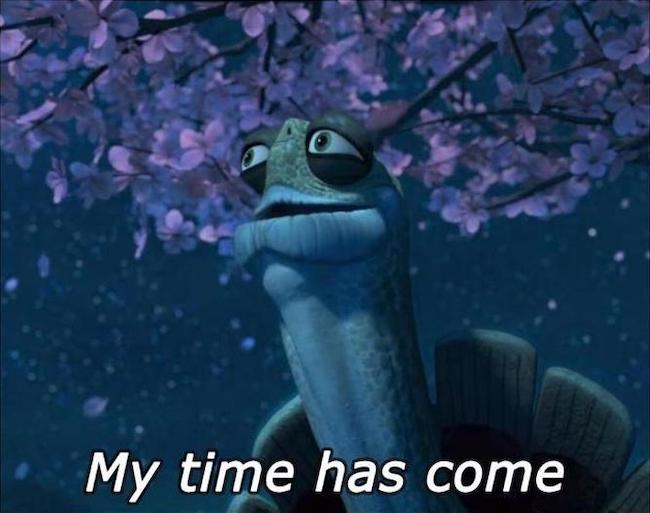
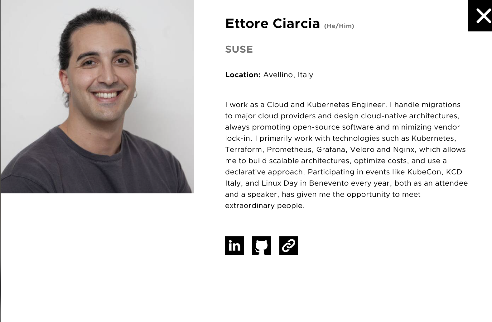
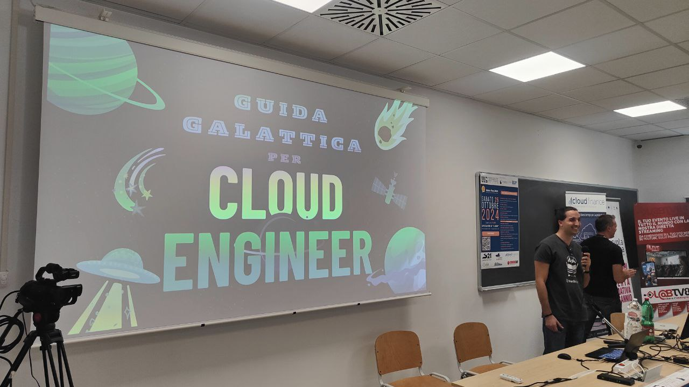

## Intro

This blog has been standing for two years and has never gone down.
If I were a Site Reliability Engineer, this would definitely be one of those metrics I'd brag about to my colleagues. Maintaining 100% uptime on my site... well, it's not that hard considering the site runs on an S3 bucket!

A lot happened this year.

In this post, I’ll review the goals I set for 2024 and publicly commit to my objectives for 2025.

##  Overview of 2024 objectives

### Special Mention: I Joined SUSE

In November 2024, I left SIGHUP. It was a great company, but in March 2024, it was announced that the company had been acquired by Reevo, an Italian cloud provider. The acquisition was scheduled to be completed by January 2025.

Meanwhile, things started to change within the company. New tools, new objectives, and a wave of resignations shaped the months that followed. Within six months of the acquisition announcement, SIGHUP was no longer the SIGHUP I knew, it had become a branch of a much larger organization.

When I realized where SIGHUP was going after the acquisition, I knew my time there was over

All kudos to SIGHUP and the amazing colleagues I found there, it was a fantastic company! 🚀

I began responding to the LinkedIn recruiters who had been reaching out. I had a few conversations with Italian recruiters and even went through some technical interviews with Italian companies but ultimately declined their offers. I think it's safe to say I’m officially out of the Italian job market.

I was also tired of working for small companies. While it was exciting to thrive in chaos and constantly chase emergencies, I now want something different.

This led me to interview at SUSE, and I accepted their offer. SUSE checks all the boxes for the kind of company where I could see myself staying for years to come. It represents many firsts for me:

1. First large company
2. First international company
3. First company with a globally recognized product

One thing worth emphasizing: SUSE is not an Italian company.

I’m part of a team of incredibly skilled individuals. Some of them have been doing this job since before I was born, others have written books. Every conversation leaves me feeling like I know a fraction of what they do.

That means I’m in the right place.

### Kubernetes Deep Dive
I think I achieved this goal, even though I was admittedly a bit vague about it. 2024 was my year of Kubernetes and CNCF-related projects.

I significantly deepened my Kubernetes knowledge, gaining more hands-on experience with it in production environments. I’ve seen it deployed in every conceivable scenario: on-premises, in cloud provider environments, and even in my homelab with various distributions.

I also did a deep dive into CNCF landscape tools related to Kubernetes, such as: Prometheus, Grafana, Loki, Tempo, Velero, Cilium, Calico, MinIO
Most of these are part of the Fury stack by SIGHUP.

### Certifications

For 2024, my certification goals were:

- CKS
- CKAD
- PCA

Things took an unexpected turn. At the Paris KubeCon in March 2024, the CNCF announced a new certification program, which included:

- CKA (already earned)
- CKAD (already planned)
- CKS (already planned)
- KCNA
- KCSA

Those who earned all the certifications would be recognized as Kubestronaut and receive several perks:

- A Kubestronaut jacket
- A Credly badge
- Access to private Kubestronaut Slack channels and mailing lists
- Coupons for 50% off five certifications per year (for personal or shared use)
- 20% off three CNCF events per year

So, between June and July, I sprinted to earn all the required certifications:

- CKAD (June)
- KCNA (June)
- KCSA (June)
- CKS (July)

By mid-July, I officially became a Kubestronaut. If you don’t believe me, you can find my face on the CNCF website!

### Talks and Events

I also achieved my event-related goal. My initial aim was modest: to speak at the Linux Day in Benevento.

However, I had the opportunity to participate in many more events throughout the year:

- IDI (Incontro DevOps Italia)
- KubeCon Paris 2024
- KCD Italy
- Kubernetes Presentation at Reevo Tech Hero(speaker)
- Kubernetes Course (speaker)
- Container Day
- DevSecOps Day
- Linux Day 2024 (speaker)

Oh, and I’ve got plenty of new T-shirts to show for it!

### Blog Posts

I fell off the wagon in August. I managed to stay consistent until July, with my last post being about becoming a Kubestronaut.

I had planned to write 12 posts but only managed 8. Shame on me. My goal for 2025 is to regain consistency in publishing articles.

The blog has proven invaluable for networking (several people reached out after reading my posts) and job opportunities. Of the 100+ people who contacted me to discuss potential roles, 3 explicitly mentioned my blog. And let me tell you, those 3 were quality opportunities—big money offers. I turned them down because they weren’t full remote.

This year, I even turned down a 100k offer that didn’t include full remote work. I think it’s official now: either they come with a ridiculous offer, or there’s no way I’ll accept anything less than full remote.

### Workout

I also set fitness goals for 2024, only to injure myself for the third consecutive year—this time, my right knee.

Despite the injury, I managed to train regularly. However, I didn’t hit any of the targets I set for myself.

The pleasant surprise of 2024 was discovering running. Over the past few months, I’ve started running, and it’s been a great way to clear my mind.

## 2025

### Improve My English

As mentioned earlier, I now work in a company that is no longer Italian. All communications are conducted in English, and all my colleagues are English speakers. While I can understand and make myself understood, my current level doesn’t allow me to joke around with colleagues.

This gap needs to be closed—they deserve to know how funny I am in my native language!

### Yes, Kubernetes again

In 2025, I’ll continue working in the world of Kubernetes and CNCF. I also plan to dedicate some time to revisiting the fundamentals: Linux and Networking. There’s so much I want to explore in greater depth.

### Complete SUSE’s Certification Track
For 2025, I’ve set a certification goal similar to 2024:

- SUSE Certified Deployment Specialist in Rancher Manager 2.7 & 2.8 for Rancher Prime (already completed)
- SUSE Certified Administrator (SCA) in Rancher Manager 2.7 & 2.8 for Rancher Prime
- SUSE Certified Administrator in Longhorn
- SUSE Certified Deployment Specialist in Rancher Kubernetes Engine 2
- SUSE Certified Administrator in SUSE NeuVector 5
- Prometheus Certified Associate (PCA)

After these, who knows? I might even consider completing the CNCF certification track by tackling the non-Kubernetes-related ones!

### Talk and Events

This year, I think I’ll have fewer opportunities to attend tech events. I’d love to present something again at the Linux Day in Benevento and maybe at another event somewhere in Italy. I hope to have enough time to prepare something interesting!

## Conclusions

2024 was a year of immense growth, both personally and professionally. From transitioning to a global role at SUSE, achieving the prestigious Kubestronaut certification, and deepening my Kubernetes expertise, to expanding my participation in tech events, it’s been a fulfilling journey. While there were a few missed goals, like consistent blogging and fitness targets, the year was marked by significant achievements and exciting new directions.

Looking ahead to 2025, I’m excited to build on this momentum. Improving my English fluency, refining my technical fundamentals, completing SUSE certifications, and continuing my engagement with the tech community are at the top of my list.

And once again, this year, I’ve made my public commitment.

“So’ fiducioso, ma c’ho l’ansia.”
