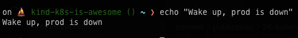
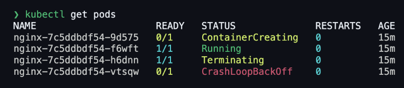
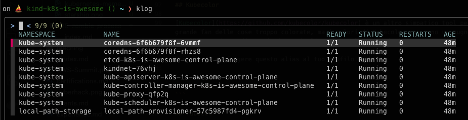
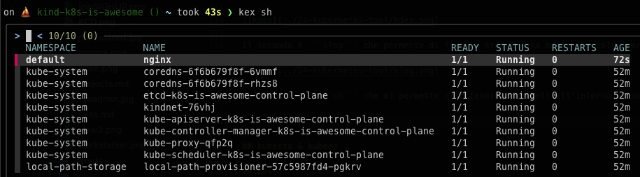
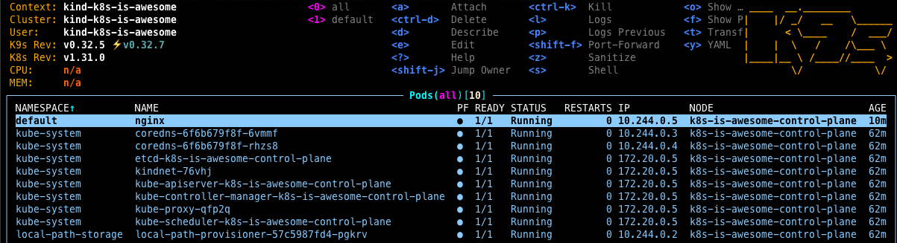
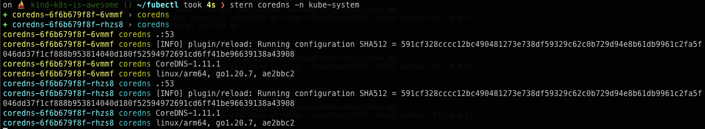

## Intro

A few days ago, a colleague sent me this meme:


I laughed. A lot.

As someone who works with Kubernetes every day, I understand that it can be a real pain. But if we have to deal with it daily, why not at least use a terminal setup that helps us work faster and suffer less?

Here’s a list of tools I recommend to enhance your Kubernetes workflow and make your daily battle with clusters a bit easier.

## Starship configuration for Kubernetes

[Starship](https://starship.rs/) is an awesome and highly customizable prompt written in Rust. I started using it after uninstalling Powerlevel10k, which was making my terminal too slow. Among the many customizations Starship offers, there’s a Kubernetes module that I find particularly usefu

Here’s my configuration (also available in the official documentation):

```toml
# ~/.config/starship.toml

[kubernetes]
format = 'on [⛵ ($user on )($cluster in )$context \($namespace\)](dimmed green) '
disabled = false
```

I’ve slightly modified mine by removing the user and context to keep the terminal output cleaner and more concise.

Final result



## Kubecolor

[Kubecolor](https://github.com/kubecolor/kubecolor) is a handy tool that adds color to Kubernetes command outputs. While I’m not a big fan of overly colorful interfaces, Kubecolor’s subtle coloring improves readability without being overwhelming.

I use the default settings without any special configurations.

To make it your default, add this alias to your ```.bashrc or``` ```.zshrc```



Ricorda di aggiungere questo alias al tuo profilo bash/zsh

```
alias kubectl="kubecolor"
```

## Fubectl

[Fubectl](https://github.com/kubermatic/fubectl) is one of those tools I discovered late and regret not knowing sooner. It provides useful aliases and introduces two incredibly handy commands

```kdes```: Lets you interactively choose a pod for kubectl describe, similar to k9s.


```klog```: Allows you to quickly view logs for a specific pod



```kex``` sh: Provides a quick way to access a shell inside a container



### Important Note: Fixing Fubectl on Zsh

To get Fubectl working correctly with Zsh, I had to modify my shell configuration. If you’re using Zsh, you might need to do the same. Here are the necessary changes

```shell
#complete -o default -F __start_kubectl k # line removed

autoload -Uz compinit && compinit # line added
autoload -Uz bashcompinit && bashcompinit #line added
complete -o default -F __start_kubectl k #line added
```

## k9s

[K9s](https://github.com/derailed/k9s) provides a powerful terminal UI for managing Kubernetes clusters. If you want a more interactive experience inside your terminal, this is the tool for you.



## Kubectl autocomplete

While not exactly a tool, enabling autocompletion for kubectl can significantly improve your efficiency. If you’re using Fubectl, no additional configuration is needed.

To set up autocompletion manually, follow the [official documentation](https://kubernetes.io/docs/reference/kubectl/quick-reference/#kubectl-autocomplete)

## Stern

[Stern](https://github.com/stern/stern) is an excellent troubleshooting tool that allows you to view logs from multiple pods simultaneously. This is incredibly useful when debugging issues across multiple replicas.

To install it on macOS, run:

```shell
brew install stern
```



## Aliases for Faster Kubernetes Commands

Aliases can save you a lot of typing and improve your workflow. If you’re using Fubectl, you already have many aliases available. Otherwise, you can add the following to your ```.zshrc``` or ```.bashrc```:

```shell
alias k="kubectl"  
alias kg="kubectl get"  
alias kd="kubectl describe"  
alias kdel="kubectl delete"  
alias ke="kubectl edit" 
alias kl="kubectl logs"  
alias kex="kubectl exec -it"  
alias kr="kubectl rollout restart"  
alias kgp="kubectl get pods"  
alias kgd="kubectl get deploy"  
alias kgn="kubectl get nodes"  
alias kgno="kubectl get nodes -o wide"  
alias ksys="kubectl get pods -n kube-system"  
alias kall="kubectl get all"  
```

## Conclusions


That's all, folks! Now go take care of your clusters and stop wasting time on my stupid site.

May uptime be with you! 