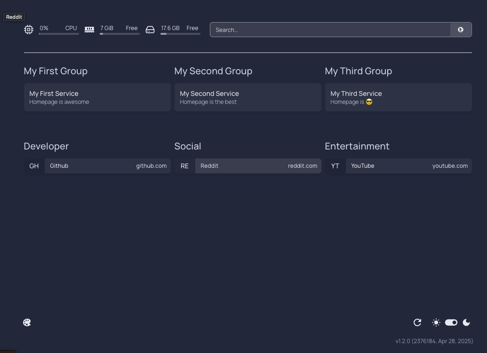
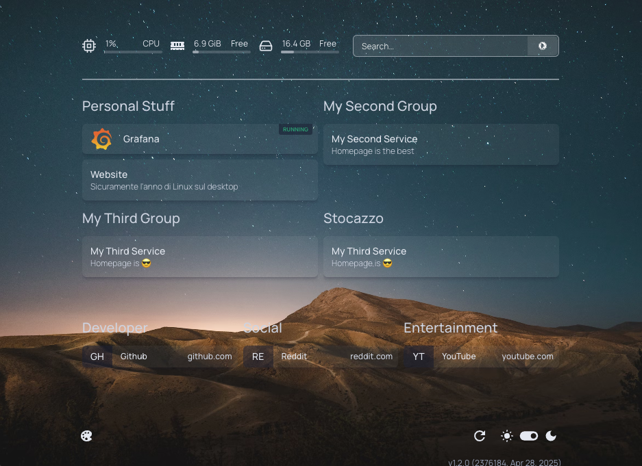
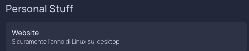
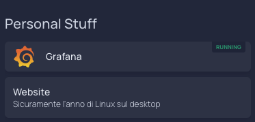
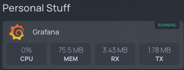
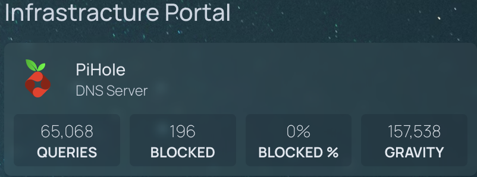
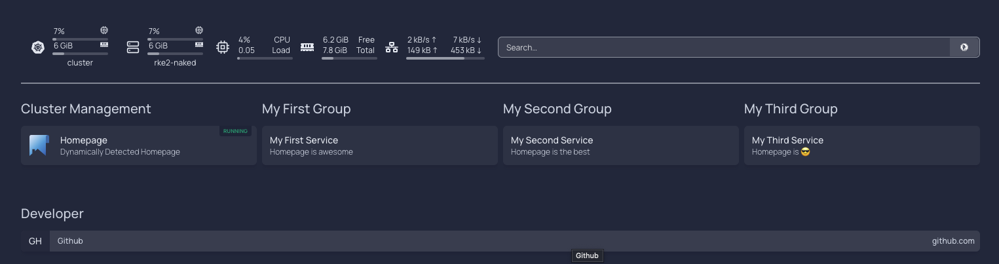
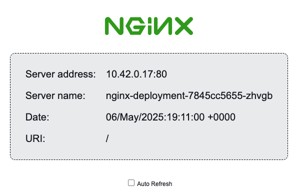
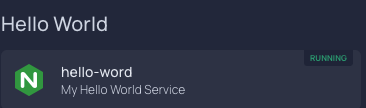

## A Quick Update

I've started writing technical articles for an Italian YouTube channel with over 100,000 subscribers.

Naturally, the channel focuses on the Open Source world, and I think I'll mainly be writing articles about homelabs and the Cloud Native Computing Foundation landscape.

So here's the first video I contributed to!

## 0. How Hard Is It to Manage a Homelab With Too Many Endpoints?

Managing a homelab is more complex than it seems. Think about it: NAS, Plex Server, Portainer, Grafana, Home Assistant, Pi-hole… and every service has its own IP, port, and web interface!

At first, everything's fine. You remember it all by heart. Then you add a few VMs, a dozen containers, and suddenly you're chasing 20 URLs.

Moral of the story: the bigger your homelab gets, the more essential it becomes to have a centralized access point for organizing and reaching all your services.

## What Is Homepage?

What if I told you there's a tool built exactly to solve this problem?

It's called Homepage: a minimal, open-source, fully customizable dashboard.

But it's not just a list of links—Homepage can monitor container statuses, display real-time stats, categorize your apps, and integrate dynamic data.

The best part? It's all configured via a simple YAML file.

Let’s see how to configure Homepage in your homelab.

## Demo

### Setting Up Homepage in Docker

In your terminal, run: 

```shell
mkdir homepage
cd homepage
mkdir homepage-data
```

Let’s use a standard docker-compose setup:

```yaml
services:
  homepage:
    image: ghcr.io/gethomepage/homepage:latest
    container_name: homepage
    environment:
      HOMEPAGE_ALLOWED_HOSTS: "*"
    ports:
      - 3000:3000
    volumes:
      - ./homepage-data:/app/config
      - /var/run/docker.sock:/var/run/docker.sock:ro
    restart: unless-stopped
```


Now just run

```shell
docker compose up -d
```

To start your Homepage container!

You can confirm it’s running:

```shell
root@homepage:/home/hecha/homepage# docker ps 
CONTAINER ID   IMAGE                                 COMMAND                  CREATED          STATUS                    PORTS                                         NAMES
beadcccb8d75   ghcr.io/gethomepage/homepage:latest   "docker-entrypoint.s…"   54 seconds ago   Up 52 seconds (healthy)   0.0.0.0:3000->3000/tcp, [::]:3000->3000/tcp   homepage
```

Now access Homepage at port 3000




### Customizations

#### Example 1: Change the Dashboard Title


```shell
cd homepage-data
vi settings.yaml
```

```shell
---
# For configuration options and examples, please see:
# https://gethomepage.dev/latest/configs/settings


title: "Morro's dashboard"

providers:
  openweathermap: openweathermapapikey
  weatherapi: weatherapiapikey

```

More customization examples can be found at this [link](https://gethomepage.dev/configs/settings/)


#### Example 2: Background Image

Add this line to settings.yaml


```
background: https://images.unsplash.com/photo-1502790671504-542ad42d5189?auto=format&fit=crop&w=2560&q=80
```

to the file  ```settings.yaml```

and we get




#### Example 3: Background Opacity and Filters


```
background:
  image: https://images.unsplash.com/photo-1502790671504-542ad42d5189?auto=format&fit=crop&w=2560&q=80
  blur: xl          
  saturate: 50     
  brightness: 25   
  opacity: 40      
```


#### Example 4: How to add a service manually

Want to modify the list of accessible services?

```shell
vi services.yaml
```

```shell
# For configuration options and examples, please see:
# https://gethomepage.dev/configs/services/

- Personal Stuff:
    - Website:
        href: https://morrolinux.it
        description: "Sicuramente l'anno di Linux sul desktop"

- My Second Group:
    - My Second Service:
        href: http://localhost/
        description: Homepage is the best

- My Third Group:
    - My Third Service:
        href: http://localhost/
        description: Homepage is 😎
```


Result:




### Autodiscovery via container's labels

So far, these are features that every launcher has.

But where Homepage really shines is in the autodiscovery of our containers via annotations.

```yaml

services:

  grafana:
      image: grafana/grafana:latest
      container_name: grafana
      ports:
        - "3001:3000"
      volumes:
        - grafana-storage:/var/lib/grafana
      environment:
        - GF_SECURITY_ADMIN_USER=morrolinux
        - GF_SECURITY_ADMIN_PASSWORD=linuxmorro
      labels:
        - homepage.group=Personal Stuff        #annotazioni da aggiungere
        - homepage.name=Grafana                #annotazioni da aggiungere
        - homepage.icon=grafana                #annotazioni da aggiungere
        - homepage.href=http://localhost:3001  #annotazioni da aggiungere
      restart: unless-stopped

volumes:
  grafana-storage:
```

This works because Homepage has read access to the Docker socket.

You’ll also need to enable the Docker provider in docker.yaml:

```
---
# For configuration options and examples, please see:
# https://gethomepage.dev/configs/docker/

# my-docker:
#   host: 127.0.0.1
#   port: 2375

my-docker:
  socket: /var/run/docker.sock
```


### Let's add this label to our container

For testing porpose I'm using a container running Grafana

```shell
docker compose -f grafana-compose.yaml up -d
```


```shell
root@homepage:/home/hecha/homepage# docker ps 
CONTAINER ID   IMAGE                                 COMMAND                  CREATED         STATUS                    PORTS                                         NAMES
126a7276ff7e   grafana/grafana:latest                "/run.sh"                3 seconds ago   Up 2 seconds              0.0.0.0:3001->3000/tcp, [::]:3001->3000/tcp   grafana
3fa9d42e18f1   ghcr.io/gethomepage/homepage:latest   "docker-entrypoint.s…"   42 hours ago    Up 12 minutes (healthy)   0.0.0.0:3000->3000/tcp, [::]:3000->3000/tcp   homepage
``` 



### Container stats

By adding the following line to your ```settings.yaml``` file

```
showStats: true
```

you'll be able to view the resource usage of individual containers.



### Cool Feature: Widgets

You might be thinking, “Yeah Morro, yet another dashboard that lets us click on our services from a single panel.”

But here's the coolest part: Widgets.

We’re not just talking about colorful buttons—Homepage supports dynamic widgets that can:

- Give you an overview of your Proxmox cluster
- Show how many queries Pi-hole is filtering
- Monitor the status of your Docker stack

You can find the full list of currently available widgets at this [link](https://gethomepage.dev/widgets/).


### Widget Customization Example: Pi-hole

Let’s take a look at an example using a widget like Pi-hole

```shell
    - PiHole:
        href: http://dns.internal.ettoreciarcia.com:8085/admin
        icon: pi-hole.png
        description: DNS Server
        widget:
            type: pihole
            url: http://pihole:80
            key: eheh voleviii
```

[oscura il tuo token lol]

The final result looks like this:



## Setting Up Homepage with Kubernetes

You already have a Kubernetes cluster and you're thinking:
“Nice, but I don’t use Docker Compose anymore—it’s outdated! I use Kubernetes.”

You’ll need the following:

1. A metrics server (included by default in RKE2)
2. An Ingress Controller (I’m using nginx, also included by default in RKE2)


```
on ⛵ default () morrolinux/homepage-docker-k8s on  develop [!⇡] ❯ k get nodes
NAME         STATUS   ROLES                       AGE     VERSION
rke2-naked   Ready    control-plane,etcd,master   3m34s   v1.32.4+rke2r1
```


Steps:

1. Create a ServiceAccount for Homepage
2. Create a secret for the SA
3. Create the configmap with our Homepage config
4. Create ClusterRole and Binding
5. Deploy Homepage
6. Expose via Service
7. Publish via Ingress


We can now apply our manifest:

```shell
k apply -f kubernetes/manifests.yaml
serviceaccount/homepage created
secret/homepage created
configmap/homepage created
clusterrole.rbac.authorization.k8s.io/homepage created
clusterrolebinding.rbac.authorization.k8s.io/homepage created
deployment.apps/homepage created
service/homepage created
ingress.networking.k8s.io/homepage created
```

Anche check if our Deployment is ok: 
```shell
on ⛵ default () homepage-docker-k8s/kubernetes on  develop [!?⇡] ❯ k get pods
NAME                        READY   STATUS    RESTARTS   AGE
homepage-664fd549d4-p449p   1/1     Running   0          2m50s
```

Per visualizzare la nostra dashboard





### Autodiscovery via labels in Kubernetes

Once again, we can use the autodiscovery feature, just like in Docker, this time using annotations on new Ingress resources.

[Here I’ll use a demo service; you can replace it with the Postgres instance running inside your cluster.]

This time I won’t share the configuration files as usual! You can find them on [MorroLinux's Patreon](https://www.patreon.com/Morrolinux)!


```shell
on ⛵ default () homepage-docker-k8s/kubernetes on  develop [!?⇡] ❯ k apply -f test.yaml
namespace/hello-world created
deployment.apps/nginx-deployment created
service/nginx-service created
ingress.networking.k8s.io/nginx-ingress created
```

Verifichiamo il nuovo ingress

```shell
on ⛵ default () homepage-docker-k8s/kubernetes on  develop [!?⇡] ❯ k get ingress -A
NAMESPACE     NAME            CLASS   HOSTS                       ADDRESS        PORTS   AGE
default       homepage        nginx   homepage.morrolinux.it      192.168.0.32   80      16m
hello-world   nginx-ingress   nginx   hello-world.morrolinux.it   192.168.0.32   80      2m2s
```




Thanks to the annotations configured on the Ingress, you should also see this endpoint show up in Homepage:



