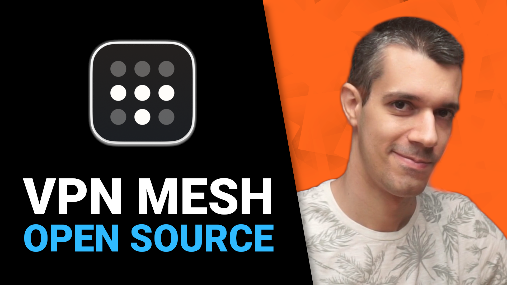
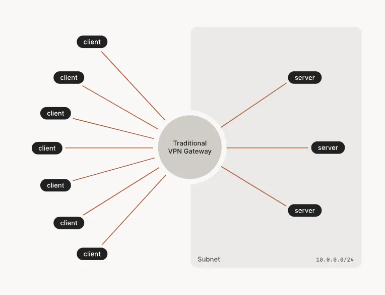
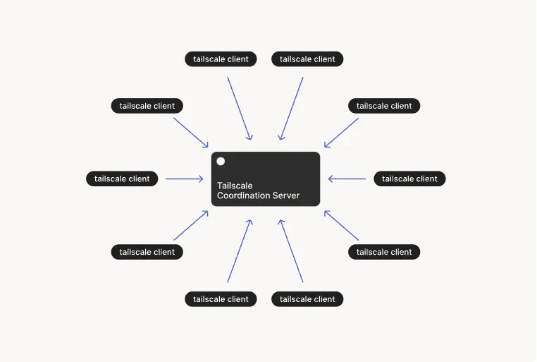
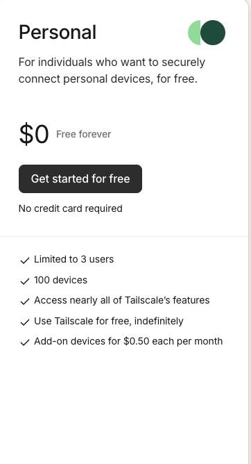
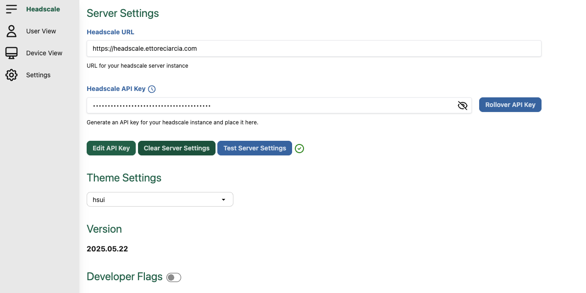
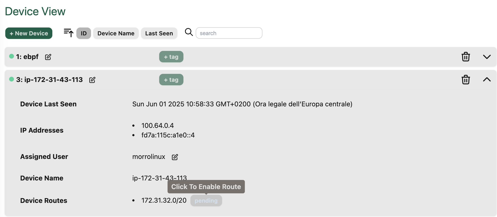
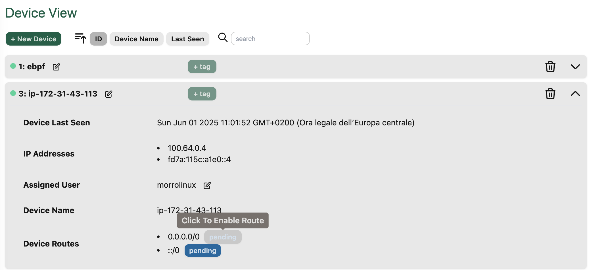

## Intro

This article is based on the technical script written for Morrolinux's YouTube channel. You can find the video here [La VPN Open Source che buca le reti: letteralmente](https://www.youtube.com/watch?v=QMwHKCcOgGQ&t=583s)



I previously wrote a similar article in the past about Tailscale and Headscale: [How to setup an Headscale server for free on AWS via Terraform and Ansible](https://ettoreciarcia.com/publication/08-network-overlay/). 

You can think of this one as an updated and improved version of that (which, by the way, is still one of the most read posts on my blog).

The main differences are:

1. Dropped Ansible in favor of a simpler container setup
2. Added a web UI to mimic the Tailscale experience as closely as possible
3. No provisioning modules for AWS infrastructure this time (got lazy, sorry)

## 2. What is Tailscale (recap)

It's service built on top of WireGuard that automates the boring stuff: VPN setup, key management, and network configuration... but there's more!

Tailscale eliminates the need for port forwarding. You install the client, log in (Google/Github/Microsoft supported), and boom, the device joins your private network.

Here's a quick explanation of how it works


## 3. Traditional VPN vs Mesh VPN

In a traditional "hub-and-spoke" VPN setup, all devices connect to a central hub. All communication passes through it. Think of it like a switchboard,  everything must go through the same point, creating a bottleneck.



Tailscale, instead, allows devices to talk directly to each other. This is faster, more resilient, and doesn't depend on a single server.

This is called a "Mesh VPN."




Technically, there is still a central server, but it doesn't carry traffic, it only coordinates connections using NAT traversal techniques like STUN and fallback relays via DERP ((Designated Encrypted Relay for Packets))

The result is a VPN that behaves like a local LAN, most devices communicate peer-to-peer.

## 4. Headscale: The Open Source Tailscale Server

But here's the catch:

The traffic is peer-to-peer, but the coordination server? It's proprietary and hosted by Tailscale.

Also, free Tailscale accounts are limited  (up to 3 users per network, then you pay).



This is where Headscale enters the scene: a self-hosted implementation of Tailscale's coordination server.

Same client (Tailscale), but the server is under your control.

## 5. Headscale Setup on Your VPS

With open-source, there's no out-of-the-box solution. Let’s walk through the setup


### Container Setup


```shell
mkdir -p ./headscale/{config,lib,run}
wget -O ./headscale/config/config.yaml https://raw.githubusercontent.com/juanfont/headscale/v0.26.0/config-example.yaml
cd ./headscale
```


Edit config.yaml

```shell
server_url: http://0.0.0.0:8080 #REDACTED
listen_addr: 0.0.0.0:8080 #REDACTED
```

Here is a minimal docker compose setup: 

```shell
services:
  headscale:
    image: docker.io/headscale/headscale:latest
    restart: unless-stopped
    container_name: headscale
    ports:
      - "0.0.0.0:8080:8080"
      - "0.0.0.0:9090:9090"
    volumes:
      - ./config:/etc/headscale
      - ./lib:/var/lib/headscale
      - ./run:/var/run/headscale
    command: serve
```

Start the container

```shell
docker compose up -d
```


```shell
root@homepage:/home/hecha/headscale# docker ps | grep headscale                                                                           headscale-ui
8d38a661d60d   headscale/headscale:latest                  "/ko-app/headscale s…"   12 seconds ago   Up 11 seconds            0.0.0.0:8080->8080/tcp, 0.0.0.0:9090->9090/tcp
```

We can create our first user: 

```shell
docker exec -it headscale headscale users create morrolinux
```

### Add a domain (optional)

Remember to map the domain's public IP address to your DNS record

### Add Hosts to the Headscale Network

Install the Tailscale CLI. On [this page](https://tailscale.com/kb/1031/install-linux) you will find installation steps for different OS

In my case:

```shell
curl -fsSL https://pkgs.tailscale.com/stable/debian/bookworm.noarmor.gpg | sudo tee /usr/share/keyrings/tailscale-archive-keyring.gpg >/dev/null
curl -fsSL https://pkgs.tailscale.com/stable/debian/bookworm.tailscale-keyring.list | sudo tee /etc/apt/sources.list.d/tailscale.list

sudo apt-get update
sudo apt-get install tailscale
```


How can we add hosts to our Headscale's network?

```shell
tailscale up --login-server http://headscale.ettoreciarcia.com:8080
```

This command will print out machine key id

```shell
root@ebpf:/home/hecha# tailscale up --login-server http://headscale.morrolinux.it:8080

To authenticate, visit:

	http://0.0.0.0:8080/register/VuW7vroFGIPClakw5tqNfHA8
```

In that case, our machine key id is VuW7vroFGIPClakw5tqNfHA8

From our Headscale server: 

```shell
docker exec -it headscale headscale nodes register --user morrolinux --key <YOUR_MACHINE_KEY>
```

Done!

```shell
root@ip-172-31-43-142:/home/ubuntu/headscale# docker exec -it headscale headscale nodes register --user morrolinux --key VuW7vroFGIPClakw5tqNfHA8
Node ebpf registered
```

To have a list of registered nodes within the network we can launch this command from our Headscale server

```shell
root@ip-172-31-43-142:/home/ubuntu/headscale# docker exec -it headscale headscale nodes list
ID | Hostname | Name | MachineKey | NodeKey | User       | IP addresses                  | Ephemeral | Last seen           | Expiration | Connected | Expired
1  | ebpf     | ebpf | [z+JGI]    | [XOSzE] | morrolinux | 100.64.0.1, fd7a:115c:a1e0::1 | false     | 2025-05-31 22:17:19 | N/A        | online    | no
```


Which provides us with interesting information such as the hostname of the client that connected, username used for login, date of last access, whether that node is currently connected to the network or not and whether its token has expired.

## 6. Add a GUI to Headscale

CLI is fine, but why not use a UI?

Use [headscale-ui](https://github.com/gurucomputing/headscale-ui) + Caddy as reverse proxy


```yaml
services:
  headscale:
    image: docker.io/headscale/headscale:latest
    restart: unless-stopped
    container_name: headscale
    ports:
      - "0.0.0.0:8080:8080"
      - "0.0.0.0:9090:9090"
    volumes:
      - ./config:/etc/headscale
      - ./lib:/var/lib/headscale
      - ./run:/var/run/headscale
    command: serve
  headscale-ui:
    image: ghcr.io/gurucomputing/headscale-ui:latest
    container_name: headscale-ui
    restart: unless-stopped
    environment:
      - HTTP_PORT=8080
    ports:
      - "8081:8080"  # UI access from outside if not using reverse proxy
  caddy:
    image: caddy:alpine
    container_name: caddy
    restart: unless-stopped
    ports:
      - "80:80"
      - "443:443"
    volumes:
      - ./Caddyfile:/etc/caddy/Caddyfile
      - caddy_data:/data
      - caddy_config:/config

volumes:
  caddy_data:
  caddy_config:
```

Caddyfile: 

```yaml
https://headscale.morrolinux.it {
	reverse_proxy /web* http://headscale-ui:8080
	reverse_proxy * http://headscale:8080
}
```

Start the containers with: 

```shell
docker compose up -d
```


```shell
root@ip-172-31-43-142:/home/ubuntu/headscale# docker ps | grep headscale-ui
580a292c0fbc   ghcr.io/gurucomputing/headscale-ui:latest   "/bin/sh -c '/bin/sh…"   5 minutes ago    Up 5 minutes    443/tcp, 0.0.0.0:8081->8080/tcp, [::]:8081->8080/tcp   headscale-ui
```




Generate an API key for UI login:

```shell
docker exec -it headscale headscale apikeys create
```


## 7. Subnet node router & Exit node

### 7.1 Subnet router

One of the limitations of mesh VPNs like Tailscale is that every device needs to have the client installed in order to join the network.

But what if you want to access a device where you can't install a client?

That’s where a 'subnet router' comes in: a device that bridges your Tailscale network with a local subnet, exposing other devices that can’t run the client.

It’s basically saying:
“Hey, if you want to talk to 192.168.42.10 (the printer), just ask me — I’ll take you there.”

```shell
echo 1 > /proc/sys/net/ipv4/ip_forward
```

Then we run Tailscale with the following command:

```shell
tailscale login --login-server http://headscale.morrolinux.it:8080 --advertise-routes=192.168.42.0/24
```

And at this point, the route will appear in the control panel of our headscale UI.
All you need to do is approve it, and all devices on the tailscale network will be able to see and reach that subnet.



### 7.2 Exit node

Another fairly common use case: imagine you are traveling, connected to a public Wi-Fi, perhaps that of a hotel or an airport.
The connection works, but it is insecure, traced and limited.
And you would like to surf as if you were at home, behind your fiber, perhaps accessing services that only work from there (such as NAS or streaming Italian TV).

Here: this is the use case for an "exit node".

Technically it is the same thing as a subnet router, but to reach the entire Internet.
In practice, you surf, but all the traffic passes through that node, which acts as an exit door to the world.
Effectively, it works like a classic full-tunnel VPN

To configure it, just use this configuration on our exit node during registration

```shell
tailscale up --advertise-exit-node
```

At this point the other devices in the tailnet will see that machine as a possible exit. Just enable the use of the exit node on the client

```shell
tailscale up --exit-node=<TAILNET_EXIT_NODE_IP>
```


All we have to do is approve the exit node from our GUI




## 8. Conclusions

So… why not just use plain WireGuard?

If you're only connecting one or two machines and can easily configure port forwarding, then sure WireGuard plus a dynamic DNS service might be all you need.

But if you're dealing with:

multiple devices scattered across different networks,

networks where port forwarding isn’t an option (like CG-NAT or 4G/5G),

or you just want something that works out of the box and keeps maintenance low, then Headscale is a game changer.

You get the performance and security of WireGuard, but with a modern, flexible, peer-to-peer overlay that’s easy to set up, easy to scale, and with Headscale, totally under your control.
