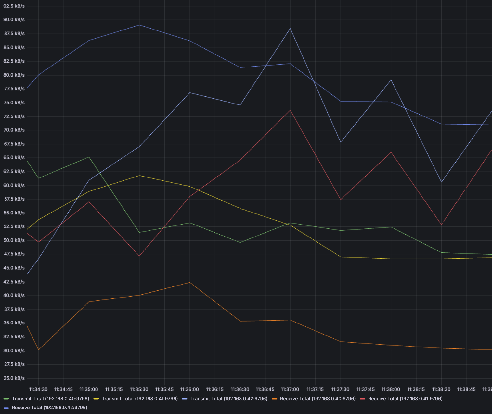
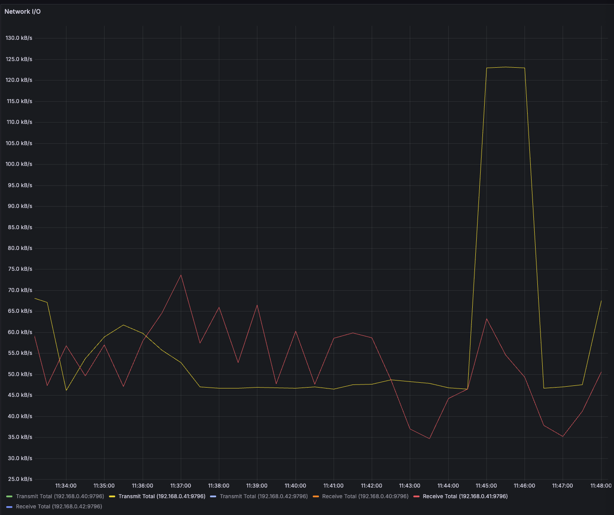
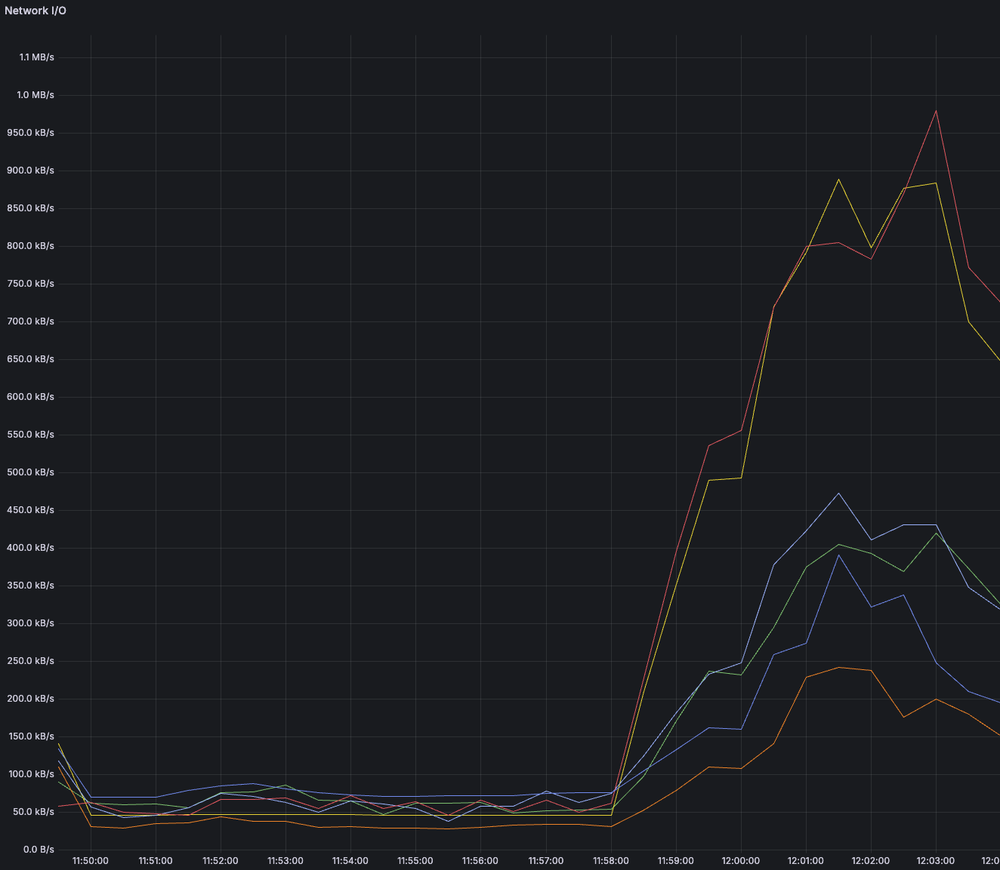
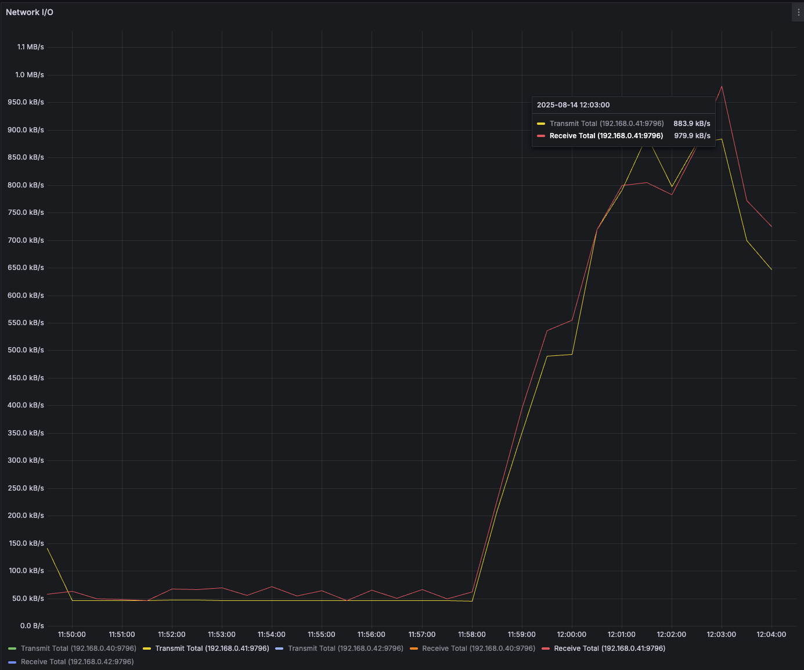

## Intro

In our lab, we run a Kubernetes cluster with three worker nodes, fully on-premises, without access to a managed cloud load balancer.
Like many on-prem setups, this means that Kubernetes LoadBalancer type services can’t automatically get an IP from a cloud provider

To bridge this gap, we rely on [MetalLB](https://metallb.io/): an open-source load balancer implementation for bare metal clusters.

In our case, MetalLB is configured in ARP (Layer 2) mode:

- 3 physical/VM nodes form the Kubernetes cluster
- Each node runs a speaker pod from the MetalLB DaemonSet
- An IP address pool is defined to assign external IPs to LoadBalancer services
- When a service is created, MetalLB picks an IP from the pool and “announces” it at Layer 2 using ARP replies

The idea is straightforward: clients on the same LAN can reach the service using that external IP, without any special router configuration.
However, Layer 2 mode has a subtle limitation: the IP is always tied to one node at a time, meaning all inbound traffic for that service first lands there before Kubernetes routes it internally.

In this benchmark, we wanted to see how this behavior impacts traffic distribution across nodes when the LoadBalancer points to a Deployment with one replica per node.

## How MetalLB Handles LoadBalancer Services

Our cluster:

```shell
on ⛵ default () experiments/metallb on  main [!] took 5s ❯ kubectl get nodes -o wide
NAME    STATUS   ROLES                              AGE    VERSION          INTERNAL-IP    EXTERNAL-IP   OS-IMAGE                         KERNEL-VERSION   CONTAINER-RUNTIME
sun01   Ready    control-plane,etcd,master,worker   7d1h   v1.32.6+rke2r1   192.168.0.40   <none>        Debian GNU/Linux 12 (bookworm)   6.1.0-37-amd64   containerd://2.0.5-k3s1
sun02   Ready    control-plane,etcd,master,worker   7d1h   v1.32.6+rke2r1   192.168.0.41   <none>        Debian GNU/Linux 12 (bookworm)   6.1.0-38-amd64   containerd://2.0.5-k3s1
sun03   Ready    control-plane,etcd,master,worker   7d1h   v1.32.6+rke2r1   192.168.0.42   <none>        Debian GNU/Linux 12 (bookworm)   6.1.0-37-amd64   containerd://2.0.5-k3s1
```

Once the cluster and MetalLB are in place, exposing a service is straightforward. First, we create a Deployment with three pod replicas, one per node, running a simple web server:

```shell
kubectl create deployment hello-world --image=nginx:alpine --replicas=3
```

Setup  MetalLB inside our kubernetes cluster:

```shell
helm install \
  metallb oci://registry.suse.com/edge/charts/metallb \
  --namespace metallb-system \
  --create-namespace

while ! kubectl wait --for condition=ready -n metallb-system $(kubectl get\
 pods -n metallb-system -l app.kubernetes.io/component=controller -o name)\
 --timeout=10s; do
 sleep 2
done
```

Then we create the resource related to MetalLB

```shell
apiVersion: metallb.io/v1beta1
kind: IPAddressPool
metadata:
  name: ip-pool
  namespace: metallb-system
spec:
  addresses:
  - 192.168.0.50/32
  - 192.168.0.51/32
---
apiVersion: metallb.io/v1beta1
kind: L2Advertisement
metadata:
  name: ip-pool-l2-adv
  namespace: metallb-system
spec:
  ipAddressPools:
  - ip-pool
```

Next, we expose these pods with a LoadBalancer-type service so that they can be accessed from outside the cluster on port 80:

```shell
kubectl expose deployment hello-world --type=LoadBalancer --port=80 --target-port=80 --dry-run=client -oyaml
```

This command will generate a Kubernetes manifest:

```shell
apiVersion: v1
kind: Service
metadata:
  creationTimestamp: null
  labels:
    app: hello-world
  name: hello-world
spec:
  ports:
  - port: 80
    protocol: TCP
    targetPort: 80
  selector:
    app: hello-world
  type: LoadBalancer
status:
  loadBalancer: {}
```

We create the Deployment and the service for a few reasons:

1. Simulate real traffic: Multiple replicas across nodes let us observe how traffic is distributed internally
2. Test MetalLB behavior: The LoadBalancer service lets MetalLB assign an external IP and handle ARP announcements
3. Measure bottlenecks: With a known number of replicas and predictable endpoints, we can benchmark traffic concentration on the node that currently “owns” the service IP.


When a LoadBalancer service is created, MetalLB performs the magic at Layer 2:

1. A speaker on each node monitors ARP requests on the local network
2. When a client tries to reach the service IP, the speakers respond with the MAC address of the node chosen to handle the traffic
3. The result is a “virtual IP” experience: clients send traffic to the service IP, and it is routed to the chosen node

Before checking the ARP table, we need to generate some traffic to the service so that the table is populated. A simple way to do this is with curl:

```shell
curl http://<SERVICE_IP>
```

After that, you can verify the ARP mapping locally:

```shell
❯ arp -a
? (192.168.0.40) at bc:24:11:8:93:c6 on en0 ifscope [ethernet]
? (192.168.0.41) at bc:24:11:34:5:10 on en0 ifscope [ethernet]
? (192.168.0.42) at bc:24:11:75:7c:19 on en0 ifscope [ethernet]
? (192.168.0.50) at bc:24:11:34:5:10 on en0 ifscope [ethernet]
```

In this example, .50 is the load balancer service IP, which currently maps to the MAC of node .41. If node .41 goes down, MetalLB automatically fails over to another node.

This setup works well for single services with moderate traffic, but as we’ll see in the benchmark, traffic concentration on a single node can create a bottleneck.

## Benchmark

### Cluster at rest

Before generating any traffic, our Kubernetes cluster is completely idle, with three nodes (.40, .41, .42) each hosting a replica of the hello-world deployment. The LoadBalancer service is already created via MetalLB in ARP mode, but no requests are flowing yet.

```shell
on ⛵ default () experiments/metallb on  main [!] ❯ kubectl get pods -o wide
NAME                                READY   STATUS    RESTARTS       AGE     IP             NODE    NOMINATED NODE   READINESS GATES
hello-world-59998fdff-28xj7         1/1     Running   6 (22m ago)    6d23h   10.42.16.66    sun03   <none>           <none>
hello-world-59998fdff-jjszr         1/1     Running   6 (22m ago)    6d23h   10.42.120.80   sun01   <none>           <none>
hello-world-59998fdff-xh8nj         1/1     Running   7 (22m ago)    6d23h   10.42.60.197   sun02   <none>           <none>
```

The traffic on the Kubernetes cluster nodes is as follows (Network I/O dashboard taken from Grafana)



The metric we are most interested in in this case is the one for the node whose MAC address matches the MAC address of the virtual IP created with MetalLB, that is, the node 192.168.0.41.



The yellow line represents the total kB/s transmitted, and the red line represents those received

### Stress Testing the LoadBalancer

To evaluate how MetalLB handles traffic under load, we generate a controlled and reproducible stress test against the LoadBalancer service. This allows us to observe the traffic distribution across cluster nodes and identify potential bottlenecks.

We used a simple Bash script to stress the LoadBalancer service by issuing repeated HTTP requests to the exposed IP:

```shell
#!/bin/bash

LB_IP="192.168.0.50" 
THREADS=10
REQUESTS_PER_THREAD=1000

echo "Starting stress test on $LB_IP with $THREADS threads..."

for i in $(seq 1 $THREADS); do
  (
    for j in $(seq 1 $REQUESTS_PER_THREAD); do
      curl -s http://$LB_IP > /dev/null
      sleep 0.01 
    done
  ) &
done

wait
echo "Stress test completed."
```

This generates consistent traffic on the LoadBalancer, making it possible to observe traffic distribution across nodes in a reproducible way.

Let's run our script!

Once the stress test was running, we monitored network traffic across nodes using the Network I/O dashboard in Grafana 



For our specific node




From our observations:

- Node .40 maintained relatively low traffic around 0.3–0.4 Mb/s
- Node .41 consistently showed higher traffic, peaking at about 1.0 Mb/s
- Node .42 was similar to .40, around 0.3–0.4 Mb/s

These numbers show that the node currently owning the LoadBalancer IP (node .41) handled significantly more network traffic than the others. While we cannot conclusively state that the node itself is a bottleneck, the Layer 2 ARP-based assignment concentrates traffic on a single node. Under higher traffic conditions this could create a network-level bottleneck on that node, potentially limiting throughput across the cluster

The traffic speeds shown in the charts (0.3–1.0 Mb/s) are intentionally low, as the test was designed as a demonstration in a lab environment.
In production scenarios or under real workloads, the throughput differences between the “speaker” node and the others can be much more significant, especially if the service exposes high-bandwidth applications or handles persistent traffic.

## Extending LoadBalancer Services

It’s also possible to create a second LoadBalancer-type service to expose other deployments. In this case, MetalLB assigns a new virtual IP and starts responding to ARP requests for that IP using the MAC address of a different node in the cluster. For example:

```shell
kubectl expose deployment hello-world --name second-load-balancer --type=LoadBalancer --port=80 --target-port=80
```

After hitting the new service IP with curl:

```shell
curl 192.168.0.51
```

the ARP table shows:

```shell
on ⛵ default () experiments/metallb on  main ❯ arp -a
? (192.168.0.40) at bc:24:11:8:93:c6 on en0 ifscope [ethernet]
? (192.168.0.41) at bc:24:11:34:5:10 on en0 ifscope [ethernet]
? (192.168.0.42) at bc:24:11:75:7c:19 on en0 ifscope [ethernet]
? (192.168.0.50) at bc:24:11:34:5:10 on en0 ifscope [ethernet]
? (192.168.0.51) at bc:24:11:8:93:c6 on en0 ifscope [ethernet]
```

Notice how .51 is now mapped to a different node’s MAC (.40), demonstrating that ARP-based load balancing spreads traffic across nodes when multiple services are exposed. This can help reduce the risk of a single-node network bottleneck when scaling out multiple LoadBalancer services in ARP mode.

## Conclusions

ARP mode in MetalLB offers a very simple and reliable way to expose LoadBalancer services in on-prem Kubernetes clusters. However, by design, each service IP is always tied to a single node at any given time. This means that every inbound connection is first routed through that node before being forwarded to the target pod, no matter where that pod actually runs. While failover to another node is seamless in case of failure, the traffic itself is never shared across multiple nodes for the same IP.

In small environments or for low-traffic services, this behavior is rarely a problem. In fact, for homelabs, demo setups, or internal applications, ARP mode is often the most straightforward choice

There are alternatives worth considering when scaling up. Running MetalLB in BGP mode allows multiple nodes to advertise the same IP! 

## Useful links

[MetalLB Project](https://metallb.io/)

[Address Resolution Protocol (ARP)](https://wiki.wireshark.org/AddressResolutionProtocol)