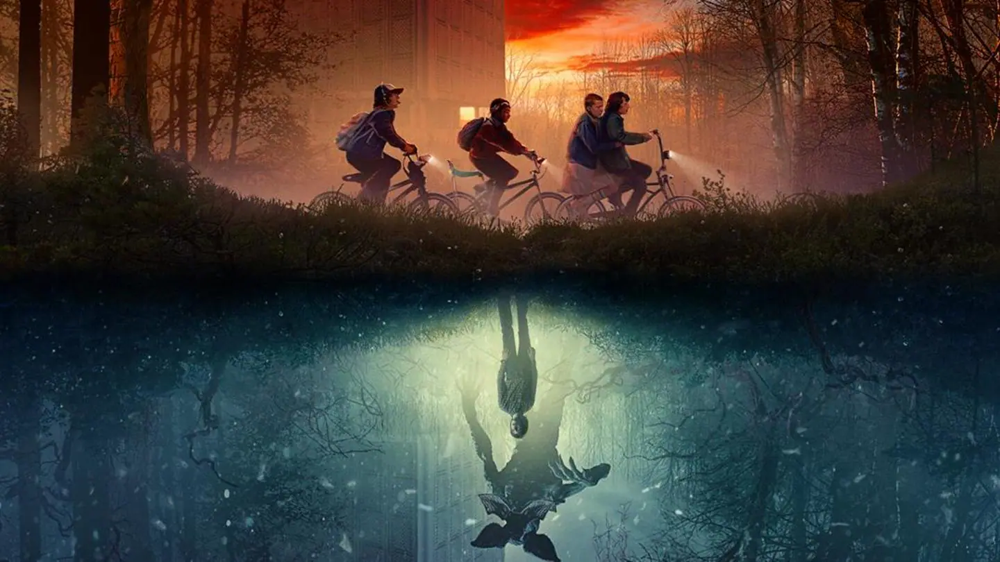
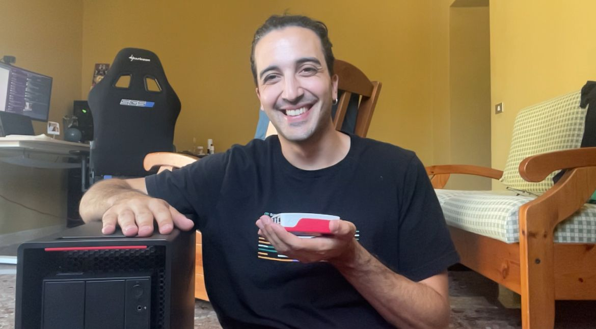

## 0 Intro

A note to the reader: I am writing this on January 1st, 2026, half an hour after watching the last episode of the last season of Stranger Things, a show that has been with me from 2016 until today.

I remember clearly the moment I started watching Stranger Things.
July 2016. I was preparing for my Computer Architecture I exam.
I was in Venticano, my hometown, not in Naples, where my university was.

It is strange how some memories stick with almost photographic precision. The place, the time, even the mood. It is as if my brain decided that this moment was important.

Over the last few days, I have been thinking about how much my life has changed in the past ten years, since that first episode. From the outside, it might look like I am the same person, sitting at the same desk, looking at the same monitor.
(Actually, there are more monitors now. I am becoming bourgeois.)

But under the surface, everything has changed. I have changed.

Ten years ago, I felt lost and uncertain, with no real idea of what my future would be. Or maybe not. Maybe everyone feels a little lost at twenty. Perhaps I was just as lost as anyone else, but I felt it more intensely.

Today, that feeling is gone. Not because I have all the answers, because some bastard probably does, but because I have learned to live with the questions. I have stopped seeing uncertainty as a personal failure and started seeing it as a normal condition, almost a necessary one.

This is where it makes sense to start when looking back at 2025.

I will remember 2025 as the year I fought the most, in every arena. Over the years, I have struggled to let go of many issues that remained in my personal Upside Down, the limbo of unresolved matters.

I fought for the respect owed to the truth against people who cannot deal with it.

But I did not only fight. I also achieved many goals.

First and foremost, I have not lost my mind, and that is the biggest achievement. One day, you might see me on the street wearing a tin foil hat shouting that the end of the world is near, but today is not that day.

## 1 Contentment at Work

For the first time, I do not want to change companies.
Who would have thought it? I am simply happy where I am. I am calm.
I never imagined I would reach this point. But here I am, and I feel good.

Some highlights:

SUSE sent me a fully loaded server to reproduce scenarios for clients using our technologies

For the first time, I traveled to the United States. It was a reward for my team taking first place in a three-day internal CTF, and it gave me the opportunity to visit the US for the first time and attend KubeCon North America. It was an incredible experience.

Some photos from my trip to the US

## 2 I started investing

At the end of 2023, I began learning a bit about personal finance: ETFs, bonds, savings accounts, pension funds. 

Thanks, Professor Coletti.

In 2024, I opened my first savings account. By the end of 2025, I have:

- A savings account

- A brokerage account

- A category pension fund

- A private pension fund

Things are going quite well. By taking advantage of the tax deductions from pension funds, I am saving money that will be credited to me with next year’s tax return. My ETF investments are also performing well. My systematic investment plan continues to grow, and I will keep it growing until I have a clearer picture of the future. The core of my investments is currently in bond ETFs with a fixed maturity. I am satisfied with the returns this year. 

Taking Paolo Coletti’s course ["Educati e Finanziati"](https://www.youtube.com/watch?v=cSlr2I1GGiw&list=PLfuzpc-H8qcdetz_Zwc5ILnbiG6eek_T8) turned out to be an excellent investment.

## 3 This Website is Skyrocketing

When I bought the domain ettoreciarcia.com, I didn’t even have a blog. It was just a simple showcase website.

Then I started writing articles about things I encountered at work or topics I was studying for one reason or another. The feedback I received was very positive, and the site turned out to be a small but effective way to meet people and access new professional opportunities.

So far, the two best job offers I have received measured by total compensation came from people who discovered me through the site. I know this because they told me explicitly.

Who knows how many others reached out after seeing the site but didn’t mention it?

The numbers are growing. Some technical articles get a decent number of views, at least for me.

Then there are personal articles like this one, which barely get noticed, but I guess that’s part of the game :)

Looking at the numbers coldly, the site quadrupled its views from 2024 to 2025. Not bad.

## 4 Road to Golden Kubestronaut

At the moment, I am four certifications away from becoming a Golden Kubestronaut. 2025 was also a year full of certifications.

I am doing this because the Golden Kubestronaut title never expires, which means I will not have to renew certifications once they expire.

## 5 I resumed my university studies

After leaving them on hold for years, I finally restarted my studies. I have not taken exams yet because the enrollment procedure is not fully completed, but I plan to resume soon. Maybe this will finally be the time I close this chapter of my life.

## 6 Goals for 2026

I will keep moving forward, studying the topics I am passionate about, and continuing to fight in every arena for what I believe is right.

## 7 Conclusions

I do not know exactly what 2026 will look like. There will be new questions, new battles, and probably a few new messes to clean up. But that no longer scares me.

Ten years ago, I was trying to understand who I was and where I was going. Today, I am still doing that, just with more patience and a clearer sense of direction.

I am no longer chasing certainty. I am learning how to move forward even when things are not fully defined.

For now, that is enough.

See you next year.